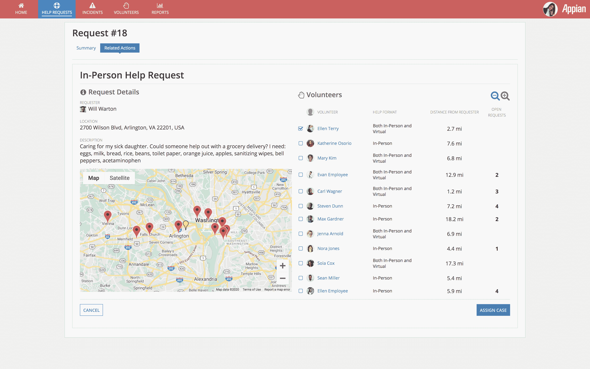

# 新冠肺炎·疫情:Appian 提供免费的人力资源应用

> 原文：<https://devops.com/covid-19-pandemic-appian-offers-free-hr-app/>

Appian 是一家用于构建应用程序的低代码平台提供商，它决定提供一款免费应用程序，帮助拥有 1000 名或 1000 名以上员工的组织跟踪源自新冠肺炎疫情的医疗事故。

主要为人力资源(HR)专业人员设计的[新冠肺炎响应管理](https://www.appian.com/news/news-item/appian-offers-free-application-to-manage-covid-19-response/)应用程序旨在按地理位置和部门跟踪所有员工的健康和工作状态，包括他们的旅行历史。

Appian 首席执行官 Matt Calkins 表示，虽然 Appian 之前已应客户要求为客户开发了少量应用程序，但该公司决定利用其专业知识提供一款免费应用程序，以帮助组织在新冠肺炎疫情期间保持业务连续性，在可预见的未来，这将迫使员工在 T2 远程工作。他说，组织可以通过 Appian 提供的云服务访问新冠肺炎响应管理应用程序，也可以自己下载并安装。

Calkins 指出，高度监管行业中仍需要遵守个人身份信息相关规则(PII)的组织可能希望在本地数据中心运行新冠肺炎响应管理应用程序。该应用程序的基于云的实例运行在一个已经被认证符合健康保险便携性和责任法案(HIPAA)的环境中。

卡尔金斯说，新冠肺炎响应管理应用程序的设计是在不到两个小时内设置和配置。由于该应用程序是使用低代码工具构建的，因此新冠肺炎响应管理应用程序可以使用该公司的同名低代码平台进行高度定制，因此随着危机的继续发展，组织将能够以他们认为最合适的方式扩展该应用程序。

不幸的是，数百万人可能会感染新冠肺炎冠状病毒或无法工作，因为他们需要照顾在未来几周和几个月生病的亲人。随着各组织竞相实施业务连续性计划，他们中的许多人可能会发现，他们现有的人力资源应用程序并不是为帮助管理高度分散的员工而设计的，这可能需要在很少通知的情况下进行扩充。Calkins 指出，新冠肺炎响应管理应用程序提供了一种除其他人力资源职能外的人才管理方式。

Appian 应用程序还旨在使人力资源团队能够作为中心，组织可以围绕它建立在线社区，员工可以使用这些社区进行互动并提供相互支持。例如，员工可以互相联系，自愿抽出时间代表可能被隔离的员工去购物。

随着新冠肺炎疫情的加剧，许多组织显然正在进入未知领域。劳动力可能会急剧减少或增加取决于垂直。在某些情况下，临时工的数量可能会激增。无论结果如何，大多数组织都需要能够尽可能灵活地应对未来挑战的应用程序。在某些情况下，组织可能有适当的人力资源应用程序，使他们能够实现这一目标。然而，在大多数情况下，他们可能不会。

— [迈克·维扎德](https://devops.com/author/mike-vizard/)