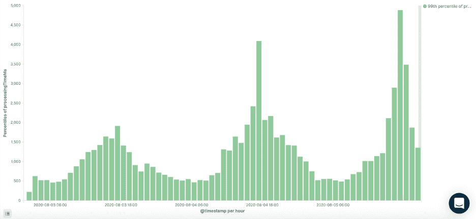
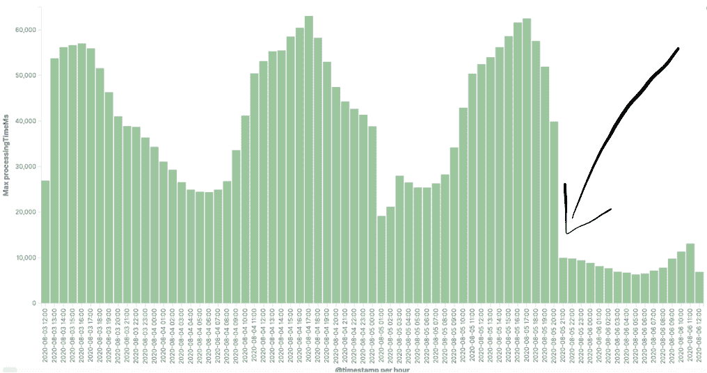
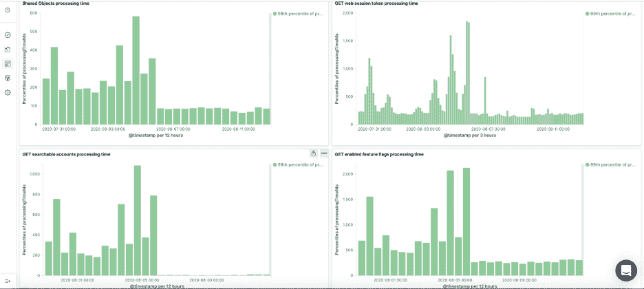

# 利用开源可观察性解决生产性能问题

> 原文：<https://devops.com/cracking-production-performance-issues-with-open-source-observability/>

我想分享一个最近关于我们组织 Logz.io 的案例研究，它遇到了一个非常严重的性能问题，其解决方案是代码的一个小变化，但对我们平台中的所有 HTTP 端点产生了巨大的影响。

在其他主题中，我将涉及:

*   我们如何调查并找到根本原因。
*   日志、指标和跟踪结合在一起，以获得更好的[可观察性](https://devops.com/?s=observability)。
*   作为一个追踪工具，Jaeger 如何轻松地可视化我们的潜在瓶颈。
*   如何关联日志和跟踪？

## **表演:我们的叫醒电话**

有些人可能会说我们是可观察性方面的专家，主要是在记录方面；毕竟，这是我们的工作。一旦我们遇到任何性能问题，我们应该会毫不犹豫地立即修复它。

这在某些用例中可能是正确的，例如当有很少的慢速端点时，通过日志识别根本原因是很容易的。但是在实践中，当情况更复杂时，日志是不够的。我们稍后会看到这一点。

在我们的案例中，报告了性能问题，尤其是在高峰使用时间——当地时间下午 2 点到 7 点，欧盟和美国客户的时间重叠。

我们使用自己的产品，就像任何其他客户一样，所以我们在内部 Slack 频道上看到，员工在同一时期经历了更长的延迟。

## 使用日志、指标和跟踪时更好的可观察性

为了将用户的抱怨和实际的监控数据联系起来，我们通常会检查可观察性的三个主要支柱:日志、指标和跟踪数据。让我们仔细看看在这个案例中我们是如何使用它们的:

### 日志

我们的日志分析产品建立在开源的 ELK 栈之上。

我们在访问日志中使用一个定制字段 **processingTime** (处理一个后端端点所花费的时间)，然后在 Kibana 中将它可视化。这种更好的情况可以识别在高峰时间花费比预期更多时间的可疑端点。我们可以在下面的示例中看到，在下午 2 点到 7 点的时间段内，一个端点持续花费更多时间(毫秒)。

除了每个可疑请求的处理时间之外，我们还看到对处理用户会话令牌的微服务的请求数量的增长。同样，我们注意到在同样的高峰时段有非常高的请求负载。

### 韵律学

我们的 metrics 产品建立在开源的基础上。在我们的后端基础设施仪表板中，我们发现写入我们的分布式数据库(Galera)的事务提交大小出现一致的峰值。这些峰值*与上述周一至周四的相同峰值时间*相关联。显然，这可能看起来很有道理，因为这些是我们客户的高峰时间，但我们稍后会看到为什么它会让我们怀疑。

此外，在同一时期，我们的数据库集群面临着巨大的复制延迟:

 

### **分布式跟踪**

最后但同样重要的是，我们的追踪产品建立在开源的 Jaeger 之上。我们通过过滤掉耗时不到 5 秒的请求来检查高延迟模式。同样，在高峰时段，慢速请求会更多地出现。

每种类型的数据表示都有自己的好处，所以使用 Logz.io 可以很容易地关联所有数据，并在它们之间导航以找到性能瓶颈。

关联日志、指标和跟踪的必备特性之一是使用 **trace-id** 公共标记。或者，作为替代，另一个公共标签如 **request-id** 在我们所有的微服务中匹配这些请求。

### **性能调查与耶格一起深潜**

正如我们已经讨论过的，我们的目标是找到在高峰时段使我们的应用程序比平时慢的原因。我们需要跟踪我们的应用程序流，找出性能瓶颈在哪里。更重要的是，我们可以跟踪我们是如何到达那里的，也就是说，找到将我们引向可疑的缓慢跨度的请求流。随着现代基于微服务的应用的蓬勃发展，通过添加任何所需代码块之前和之后的专用日志来手动跟踪变得更加困难。此外，由于不需要的日志行，它使代码变得混乱和不清楚。

就我们而言，耶格让我们的生活变得轻松多了。特别是对于公司中不完全熟悉所有相关组件的新开发人员来说，通过在更改任何代码之前识别长期运行的跨度*，更容易理解业务流程(这需要更多的时间)。*

因此，如果我们能够指出代码中性能瓶颈的确切位置，那么立刻修复它将会非常容易。然而，我们的情况有点不同。事实上，后端的每个端点在发出搜索请求时都处于高峰时间:

Peak hours trace

通常对于慢速搜索查询，怀疑会落在数据库上，在这种情况下是 Elasticsearch。因此，我们将来自 **POST /services/query** 请求的上述跨度与我们的日志相关联，并意识到实际的 Elasticsearch 查询只需要 15 毫秒！所以，我们可以排除这种可能性。

需要强调的是，在非高峰时段，这些微服务最多需要 10 毫秒:

Off-hours trace

正如我们所看到的，这看起来与我们之前展示的例子大相径庭！那么，为什么它在高峰时间表现得如此糟糕呢？

## 性能问题的根源:我们找到了！

在执行搜索请求时，我们在所有相关的端点上都遇到了几乎相同的缓慢模式。因此，我们相当有信心，这一切的根本原因一定是在我们的核心缓存组件之一。换句话说，太多的请求被交付给我们的内部微服务(它从数据库中为用户会话令牌对象提供服务)，而不是直接从缓存中获取它。

这个假设也符合上面的场景，因为更活跃的用户意味着对每个用户会话令牌的更多**选择**和**更新**查询，正好与我们在图表中看到的延迟峰值同时发生。

从那里，找到最佳解决方案是非常简单的，修复只需要两行代码！这是一个改变我们的会话令牌缓存回收策略配置的问题。

### Boommmm

这类修复最令人兴奋的部分是看到所有图形如何立即改变。当我们将修复发布到生产环境中时，数据库的读写流量以及许多请求的高延迟都消失了。这种影响在我们的应用仪表盘中非常明显:

我们可以看到事务提交的总大小在部署后立即下降。

此外，我们看到对有问题的服务的请求总数减少了 80%以上！

最重要的是，我们一部署修复程序，所有受影响的终端的延迟都下降了:

作为最后一击，我们等待着从客户那里听到任何积极的反馈。而且我们不用等很久——我们马上就得到了高分。

## 摘要

我们还有很长的路要走，才能完全装备我们的系统，但即使我们到目前为止所做的一切，我们也看到了努力的回报。我们对我们的系统有了一个非常酷和有意义的看法，这使我们更好地了解我们的业务流程，更重要的是，在我们的情况下，快速识别任何瓶颈。

我们已经从正在进行的追踪收养之旅中学到了一些值得分享的技巧:

*   跨度和日志之间的关联是*必须具备的*。这样做的最佳实践是使用一个唯一的标识符，比如 **trace-id** ，或者在它丢失的情况下使用 **request-id** 。当您更希望通过一次点击来端到端地检查一个完整的请求时，它会带来很多价值，它会将您移动到相应的日志页面，反之亦然。使用 Logz.io，您将获得开箱即用的日志跟踪关联，这为我们简化了事情。
*   如果您的应用程序是多租户的，并且您想要更好地查看特定客户的踪迹，我建议您添加自定义标记，如 **customerId** 或 **userId** 。
*   如果您想要更好地调整跟踪，可以考虑为应用程序逻辑的重要部分添加自定义跨度。不要只包装每个端点，这是很容易做到的。例如，如果我们怀疑数据库中有一个缓慢的查询，我们可以很容易地为一个自定义范围添加代码，该范围将只测量这一部分，然后它将在父事务范围下可视化，这样我们就可以看到比较其他范围花费了多少时间。

Logz.io 让我们的旅程更加顺畅——在一个整合的平台中拥有日志、指标和跟踪，无需自己安装和维护，并且具有内置的相关性。