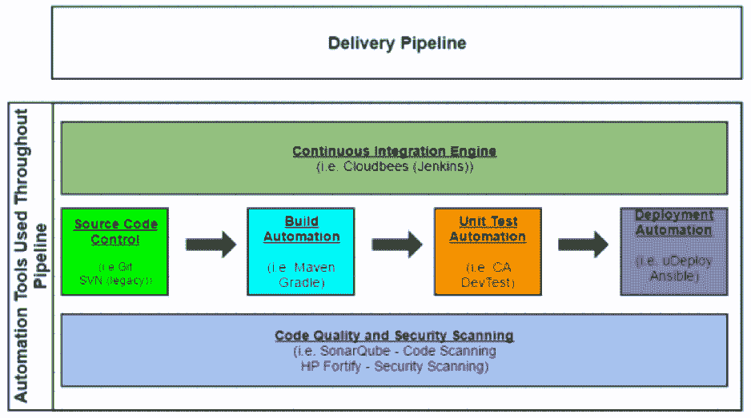
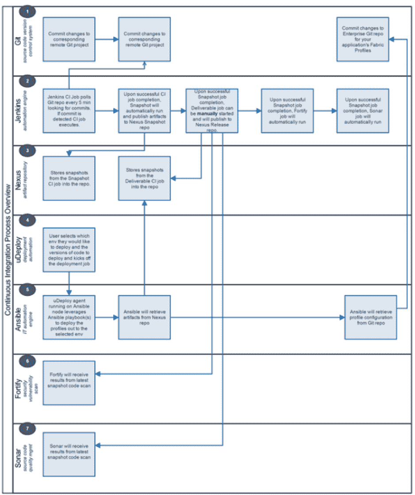

# 创建持续集成交付管道

> 原文：<https://devops.com/creating-continuous-integration-delivery-pipeline/>

本文将提供一个在持续集成中使用的交付管道的例子，以及在软件开发生命周期(SDLC)中自动构建、测试和部署代码的 DevOps 工具。

## 背景

如今，去任何地方都不可能不听说 DevOps。简而言之，DevOps 是改善开发组织和运营组织之间的沟通和协作的努力——因此有了“DevOps”这个术语主要的焦点是提高软件开发领域的效率、质量和上市速度。

今天，您可能还会听到和看到很多关于持续集成和持续交付/部署的内容。这两者之间当然有区别，但是为了简单起见，这篇博客主要是分解这个过程的不同阶段。通过这种方式，您可以获得基础知识，并在您的组织中启动交付管道。交付管道可以被分解成几个主要的工作或阶段，如下所述。

在我看来——现在还是尽量保持简单——这些阶段可以分为以下几个部分:

1.  源代码控制(管理)
2.  构建自动化
3.  单元测试自动化(这里也可能包括集成测试)
4.  部署自动化
5.  监控–不包括在本讨论中，可以随时添加

我在下面的图 1 中概述了这些阶段的进展。让我们更详细地回顾一下每个阶段。

**

*图 1–持续集成交付管道示例*

## 源代码控制(管理)

### 背景

源代码管理，或者说源代码控制，当然不是一个新的话题。这已经存在了几十年，并随着时间的推移而演变。简而言之，一个组织将其代码存储在源代码控制系统或存储库中，这样就可以对其进行跟踪、维护、版本控制和审计。开发人员不应该将代码存储在他们的笔记本电脑或虚拟机上，并相信这足以管理代码。

### 可能的工具

1.  Git 可能是最广泛使用的供应链管理系统。这是一个开源系统。
2.  颠覆(SVN) 已经存在了相当一段时间。它也是一个开源系统，在许多组织中被大量使用，但是 Git 受到了更多的推动。

Git 和 Subversion 的对比可以在[这里](https://git.wiki.kernel.org/index.php/GitSvnComparison)找到。

## 构建自动化

### 背景

一旦源代码管理系统就位并被开发团队积极使用，团队将需要能够编译和构建他们的代码。这可能是整个持续集成事件链的第一步——这是开始行动的第一步。在组织考虑将代码部署到测试和生产环境中之前，需要干净地构建代码。

### 可能的工具

1.  Gradle 是一个开源的构建自动化系统，被包括网飞、谷歌和 LinkedIn 在内的顶级公司所使用。
2.  Maven 是另一个开源的构建自动化系统。

Gradle 和 Maven 对比可以在[这里](https://gradle.org/maven_vs_gradle/)和[这里](https://devops.com/2015/03/27/puzzle-gradle-maven/)找到。

## 单元测试自动化

### 背景

开发人员对他们的代码进行单元测试，以确保他们正在构建的功能按预期运行。在理想的情况下，开发团队应该保存这些单元测试，这样它们就可以被重用并放入回归测试床。

### 可能的工具

有很多工具可以帮助开发人员对他们的代码进行单元测试。这些工具很多都是开源的，可以免费使用。

1.  JUnit 是一个广泛使用的开源单元测试框架。
2.  CA DevTest 允许单元测试的自动化，以及一些其他的附加功能，比如服务虚拟化。

## 部署自动化

### 背景

在流程的最后阶段，交付团队需要将他们的代码/应用程序部署到各种测试环境中，当然还有生产环境中。为了减少部署过程中的错误和开销，同时加快上市速度，这一步骤可以通过各种工具和方法实现自动化。

### 可能的工具

1.  IBM Urbancode uDeploy 允许用户对流程进行建模，并协调他们的部署。然后，可以在组织的所有环境中重复这一过程，并根据需要针对每个环境进行调整。
2.  Ansible 是一个开源的 IT 自动化工具。它可以用于从配置管理到产品安装到应用程序部署的所有事情。这个工具正在 DevOps 社区中迅速获得认可和支持。

## 结论

这只是对公司开始持续集成和 DevOps 世界的快速概述。图 2 是一个示例，展示了从将代码提交给 repo 到将代码部署到环境中的整个流程，有助于正确看待问题。在生产过程中，很容易看到这些工具是如何相互作用的。

**

*图 2–持续集成流程图*

## 关于作者/塞斯·加尼翁

塞斯·加尼翁是一名中间件/基础设施/ DevOps 架构师，在该领域拥有超过 12 年的经验。请访问[sethgagnon.com](http://www.sethgagnon.com/)获取更多相关文章。在 [LinkedIn](https://urldefense.proofpoint.com/v2/url?u=https-3A__www.linkedin.com_in_sethgagnon&d=DQMGaQ&c=WlnXFIBCT3pmNh_w8hYeLw&r=vTsYUMKH9YjBDA8EXOC2GgUO0BHHExCbL1dfVYT2bFM&m=fYCGFZYIZ4NifCwaSNsB1Dj1Retr4k_qY-py9a4dQk4&s=970zIYqvOpgtewwJs2tPE21GVG0yRZ0rxoMKrfs-wNc&e=) 和 [Twitter](https://www.twitter.com/sethgagnon) 上与他联系。