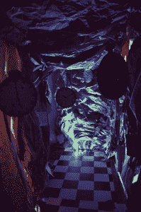
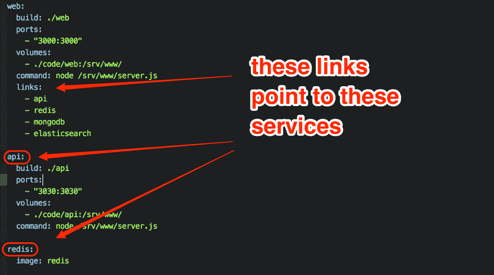
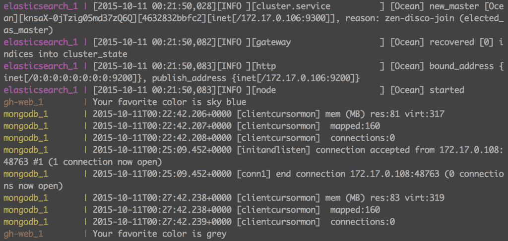
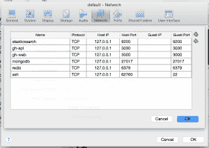

# 使用 Docker Compose 创建开发环境

> 原文：<https://devops.com/creating-dev-environments-docker-compose/>

[](https://devops.com/wp-content/uploads/2015/10/down-the-rabbit-hole.png)The Slack notification popped up on my phone at 2pm Friday afternoon. “*Argh. This is never good*” I thought to myself. The message said “*do you know anything about [Vagrant](https://www.vagrantup.com/)?*”. It was from a client of mine and I knew their environment well enough to know that this question was going to go down a rabbit hole the likes of which would leave Lewis Carroll awestruck. To compound matters, I was in the middle of nowhere, halfway between Las Vegas and Phoenix. I found a place to pull off, overlooking a vast, expansive maze of canyons and riverbeds leading nowhere and everywhere at once. I thought to myself “*how fitting*” as I started to reply on my phone.When launching a startup, there is no rule other than “find out what the
customer is willing to pay for, then build it”. My client, Roger, had nailed it. His next message confirmed this as I read “*I’ve been beating my head against a wall for two days trying to get this Vagrant image running. I’ve got new developers starting next week and need to get them a dev environment setup*”. Roger had just discovered startup rule #2: “nothing can prepare you for the panic of success”. His current environment was very solid: running in [AWS](https://aws.amazon.com/), everything was deployed via [OpsWorks](https://aws.amazon.com/opsworks/) to both staging and production environments. It works great… if you’re the only one in staging. It wasn’t going to support multiple developers changing code simultaneously, so he was looking at Vagrant for a solution. Each developer needed [mongodb](https://www.mongodb.org/), [elasticsearch](https://www.elastic.co/), [redis](http://redis.io/), and two [node.js](https://nodejs.org/en/) servers: one for the api and one for the web ui. Vagrant images are great, but I’ve often found them to be most valuable when hand-curated, like craft beer. They are also difficult to share as it requires shuttling large vm images around between developers.After reviewing the error logs, I could tell he was facing issues with security permissions between the vagrant image and the host OS. I decided I wanted to try something different. I wanted to try building it out using [Docker](https://www.docker.com/) containers. I had a feeling I could accomplish the same results with Docker, plus the added benefits of the entire environment being stored as config files in a git repo. Small, concise, version controlled, portable… I was liking this idea more and more. I sold him on the idea as well as buying enough time to get back to civilization where I could work on the idea (though the overlooking view was pretty inspirational).Back at the office, I broke open my laptop. I was familiar enough with Docker, but had a suspicion that [Compose](https://docs.docker.com/compose/) would help me tie the disparate pieces together. I started with the node.js servers. It was easy enough to kickstart them using a Dockerfile. (NOTE: I could have done this in compose as well, but had a feeling that I would want some extra flexibility later so I created separate Dockerfiles for them.)

> ```
> FROM: node:latestEXPOSE 3000
> ```

Next, I created the docker-compose.yml file to define the environment. I was able to define all of the containers (minus my previously created node.js servers) using images from [Docker Hub](https://hub.docker.com/).

```
web:  build: ./web  ports:    - “3000:3000"  volumes:    - ./code/web:/srv/www  command: node /srv/www/server.jsapi:  build: ./api  ports:    - "3000:3000"  volumes:    - ./code/api:/srv/www  command: node /srv/www/server.jsredis:  image: redismongodb:  image: tutum/mongodb  ports:    - "27017:27017"  environment:    MONGODB_PASS: passwordelasticsearch:image: elasticsearchports:- "9200:9200"- "9300:9300"
```

Once this was done, I created links in the web container. This creates environment variables and hostfile entries in the web container, allowing the web container to access the elasticsearch container via the hostname “elasticsearch”, and the mongodb container via the hostname “mongodb”, etc…

```
  links:    - api    - redis    - mongodb    - elasticsearch
```

[](https://devops.com/wp-content/uploads/2015/10/links.png)The environment was complete, and I brought it up with the “docker-compose up” command. The added benefit of this environment is that the docker-compose terminal window maintains a steady stream of logs from all of the containers in a central window. This allows the developer to view the logs realtime, without having to hunt for them.[](https://devops.com/wp-content/uploads/2015/10/logs.png)The only real stumbling block was in the use of VirtualBox. I created the environment on OS X. Since OS X can’t run Docker natively, it all runs in a VirtualBox machine on my workstation. This meant that I needed to go into VirtualBox and setup port forwarding for the required ports (3000, 3030, 27017, 9200, 9300,6379) so that I can access the services locally.Including time spent learning the basics of Compose, the entire environment was up in 2 hours. By using Docker, Roger’s new developers will be able to clone the config from a repo and be up and running in minutes regardless of whether they are developing on OS X, Windows, or Linux. Future additions to the repo can be shared by all by continuing to update the repo.Interested in trying it out for yourself? All the code described can be found in my git repo at [https://github.com/rekibnikufesin/docker-compose](https://github.com/rekibnikufesin/docker-compose). Be sure to let me know your thoughts in the comments or via twitter [@wfbutton](https://twitter.com/wfbutton)!