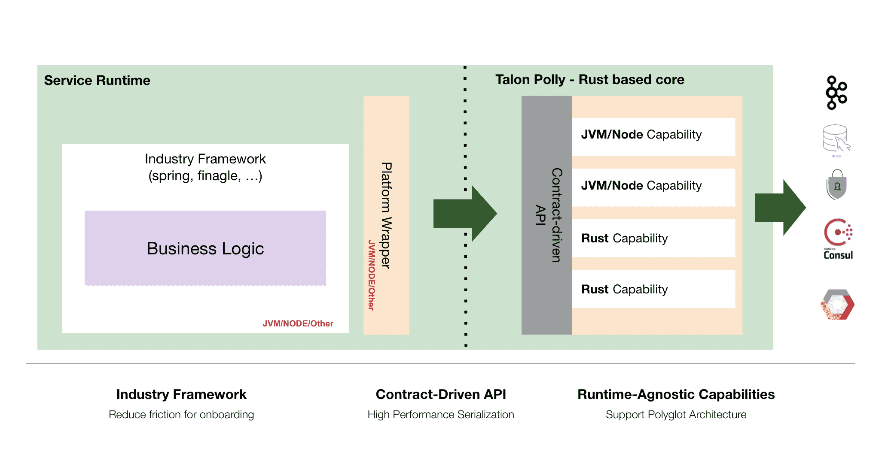

# Credit Karma 期待开源分布式应用平台

> 原文：<https://devops.com/credit-karma-looks-to-open-source-distributed-app-platform/>

[Credit Karma](https://engineering.creditkarma.com/how-we-revolutionized-the-frontend-technologies-at-credit-karma) 推出了一个名为 Talon Polly 的应用平台，可以更简单地在多个运行时环境中部署微服务。

Credit Karma 的首席软件工程师 Richard Pounder 表示，这家消费者金融服务提供商预计明年将把 Talon Polly 作为一个开源项目。

Pounder 用 Rust 编程语言写道，Credit Karma 创建了 Talon Polly，为其开发者提供一个构建和部署应用程序的语言无关平台。Talon Polly 可以作为一个使用容器的边车来部署，也可以作为一个在软件环境中运行的进程来部署。

Pounder 说，虽然不缺乏构建和部署软件的框架，但 Talon Polly 旨在使开发团队更容易使用多个应用程序重用代码和组件，例如，使用框架中包含的基于合同的库。他指出，这种方法还使 Credit Karma 能够确保在这些应用环境中实施一套通用的安全策略。

Pounder 说，最终目标是使开发人员能够花更多的时间编写业务逻辑，而不是掌握为特定应用环境创建的多种应用开发框架的细微差别。

目前还不清楚其他框架会在多大程度上解决 Talon Polly 的相同问题。其他需要部署使用多种编程语言构建的分布式应用程序的组织很可能面临类似的挑战。云计算原生计算基金会(CNCF)也采用了 [Dapr](https://containerjournal.com/features/cncf-embraces-dapr-to-simplify-building-distributed-apps/) ，这是一组由微软创建的应用编程接口([API](https://devops.com/?s=APIs)，它们被部署为容器侧柜，以简化分布式应用的构建，作为一个孵化项目。

无论采用何种方法，基于分布式微服务的应用的兴起都给开发运维团队带来了巨大的管理挑战。每个微服务都是由不同的开发团队构建的，出于各种原因，他们更喜欢一种编程语言。考虑到微服务之间存在的所有依赖性，在分布式计算环境中部署和更新这些微服务需要更复杂的工作流编排。

当然，目前还不清楚基于微服务的应用程序会在多大程度上取代传统的单片应用程序。大多数新应用都是使用微服务构建的，以使应用更具弹性。然而，在现有 IT 环境中运行的遗留单片应用程序的数量意味着，基于微服务的应用程序可能需要数年才能超越它们。因此，DevOps 团队将在这个十年的后五年管理整体服务和微服务的混合。

矛盾的是，虽然基于微服务的应用更具弹性，因为在出现中断时可以重新路由对服务的调用，但随着分布式微服务之间的依赖性增加，整体应用环境变得更加复杂。因此，许多组织选择使用微服务来构建应用程序，仅当需要一定级别的弹性，或者已经确定可能由多个应用程序使用的功能更容易通过具有自己的 API 的微服务来访问时。

无论如何，未来的问题不在于是否会采用微服务，而在于采用的程度和应用的数量。