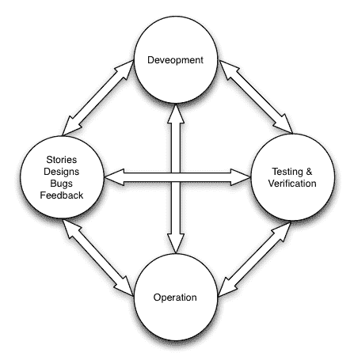

# 将开发和运营结合在一起的关键第一步

> 原文：<https://devops.com/critical-first-step-bringing-dev-ops-together/>

我们都想向客户交付优秀的软件。我们现在比以往任何时候都更加意识到这样做所需的所有活动的相互关联性。敏捷运动开启了这一进程，但是直到 DevOps 的出现，Ops 才被认为是全局的一部分。在这篇文章中，我将解释敏捷组织可以采取的有效的第一步，以完成这幅图画，并将 ops 更完整地引入产品开发过程。

交付优秀的软件从产品定义开始，从最初的故事和设计开始，进入开发、验证和测试，进入生产，然后以客户反馈和错误的形式返回。事实上，反馈路径代表了刚才提到的所有活动的传递闭包，如下图所示。敏捷认识到反馈回路在优秀产品开发中的重要性。敏捷还意识到，为了正确的信息流动，必须打破壁垒。格言“完成意味着测试”出现了，它表明产品所有者没有完成一个故事，不能认为它结束了，直到它已经被测试和验证。这代表了项目管理、开发和质量保证职能的整合。一大步，但还差一步。操作仍然没有被认为是构建优秀软件的关键部分，并且对于反馈循环不会止于测试这一事实也没有太多的了解。DevOps 已经认识到了这种不足，并得出了合理的结论——“完成意味着生产”。

产品开发是一个循环，运营是这个循环的重要组成部分。在描述如何整合循环的所有部分时，让我们从最自然的开始说起；产品定义。产品定义活动产生故事、设计、功能验收标准(A.C .)和优先级。在这一阶段，我们不会生产出成品所需的所有产品，但也足以让我们运转。对于流行的敏捷方法，比如 Scrum，这不仅仅是由产品所有者完成的，而是在故事梳理会议、设计评审和冲刺计划中与开发和测试一起完成的。在这些会议中，开发人员、质量保证人员和产品人员交流和协商故事，评论设计，并充实验收标准。通过这种方式，故事、设计和验收标准得到了改进，每个人都了解了正在建造的东西；他们也开始投入其中。一个故事可能是这样的(略):

> 故事:博客管理员可以改变用户角色，这样就可以有效地管理用户
> 
> A.c:当给定的博客管理员从权限下拉菜单
> 中选择一个权限方案时，他登录到
> 和用户配置文件
> 中，然后用户权限被更新并存储在数据库中

这是一个伟大的开端，但还不够。如果我们想变得优秀，我们就必须使它现代化一点，并加入一些 DevOps 香料。

将 ops 有效地引入循环的第一步是在故事和验收标准梳理会议、设计评审和冲刺计划会议中包括负责实际操作软件的人。关键的一点是，当团队协商与故事相关的验收标准时，运营部有责任确保我们为每个故事或功能添加成功和失败指标、初始警报值和任何操作功能，例如有效操作功能所需的切断开关。因此，现在一个故事将在 A.C .中包含如下内容(接受标准)。

> 给定操作 X 失败
> ，那么将通过指标馈送发送指标操作-x:失败

我们还将改变我们对“完成”的定义，以确保在我们达到 ops 驱动的验收标准之前，故事不会结束。例如:我们可以看到我们在 A.C .中定义的指标显示在 ops 仪表板上。这样做有很多好处，比如那些不幸随叫随到的人会参与到这个故事整理中，并且当他们在生产中第一次遇到这些指标的问题时，他们会确切地知道这些指标意味着什么。此外，他们将知道他们可以拉动或要求拉动什么操作杠杆。

这第一步代表了从产品定义到开发，到 QA，到运营的连接。仔细想想，这种联系是非常自然和直观的。作为一个真正的 DevOps 组织和开发运营卓越的产品需要更多，但将产品定义与运营联系起来，正如我们所做的那样，提供了一个很好的立足点，可以进一步充实内容。祝你好运。如果你有任何问题，请留言，我会尽我所能回复。