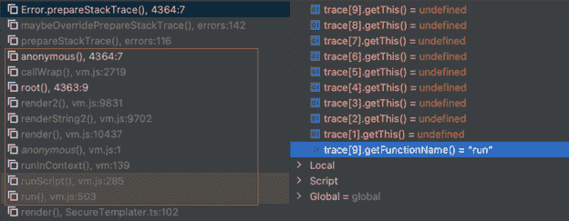

# 开源后台平台发现严重漏洞

> 原文：<https://devops.com/critical-vulnerability-discovered-in-open-source-backstage-platform/>

Oxeye 今天披露，它在用于构建开发者门户的开源后台软件中发现了一个[严重漏洞。Backstage 最初由 Spotify 创建。](https://www.oxeye.io/press-releases/oxeye-warns-of-sandbreak-vm2-vulnerability-with-cvss-score-of-10)

对 [Backstage](https://devops.com/solving-the-speed-paradox-with-open-source-paas/) 平台的 1.5.1 更新修复了一个沙盒逃逸漏洞，该漏洞可通过第三方 Scaffolder 插件发生，该插件可用于执行未经验证的远程代码执行(RCE)。

Oxeye 首席技术官 Ron Vider 表示，Oxeye 与 Spotify 合作，负责任地披露了这一问题，并在漏洞披露前创建了一个补丁，Spotify 给出了 9.8 分的严重性评级。

Backstage 目前正在云计算原生计算基金会(CNCF)的支持下得到发展，但已经被美国航空公司、网飞、Splunk、Fidelity Investments、Epic Games 和 Palo Alto Networks 等组织以及 Spotify 广泛使用。

该漏洞是潜在的基于模板的攻击的另一个例子，通过该攻击，可以操纵运行外壳命令以将恶意软件注入应用程序开发环境。

一般来说，尽可能地将逻辑与表示层分离可以大大减少最危险的基于模板的攻击。

Vider 表示，Oxyeye 正在将其漏洞研究集中在云原生平台上，如 Backstage，这些平台通常用于构建基于微服务架构的现代应用程序。目前还不清楚组织在多大程度上已经从构建应用程序的单一方法中脱离出来，但很明显，现在有更大比例的应用程序是使用微服务构建的。

当然，网络犯罪分子将这些平台作为破坏软件供应链的持续努力的一部分，希望他们注入的恶意软件能够找到进入多个下游应用程序的途径。反过来，这些攻击正说服更多的组织采用 DevSecOps 最佳实践，以更好地确保其软件供应链的完整性。面临的挑战是，许多攻击都是针对开源软件项目的，这些项目并不总是有足够的资源在零日漏洞被披露的情况下快速开发补丁。

虽然不可能知道网络犯罪分子已经在多大程度上利用 DevOps 平台中的漏洞，但在一系列备受瞩目的违规事件发生后，网络安全审查的级别已经大幅提高。拜登政府甚至发布了一项行政命令，要求联邦机构更好地保护他们的软件供应链。因此，DevOps 团队应该预计在未来几个月将会有更多的 DevOps 平台漏洞披露，这些漏洞将需要立即修补。

不管你喜不喜欢，软件供应链将变得更加安全。唯一有待确定的是，随着更多漏洞在用于构建它们的 DevOps 平台中被发现，将会经历的痛苦程度。