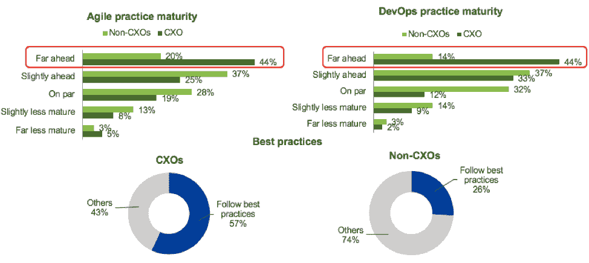
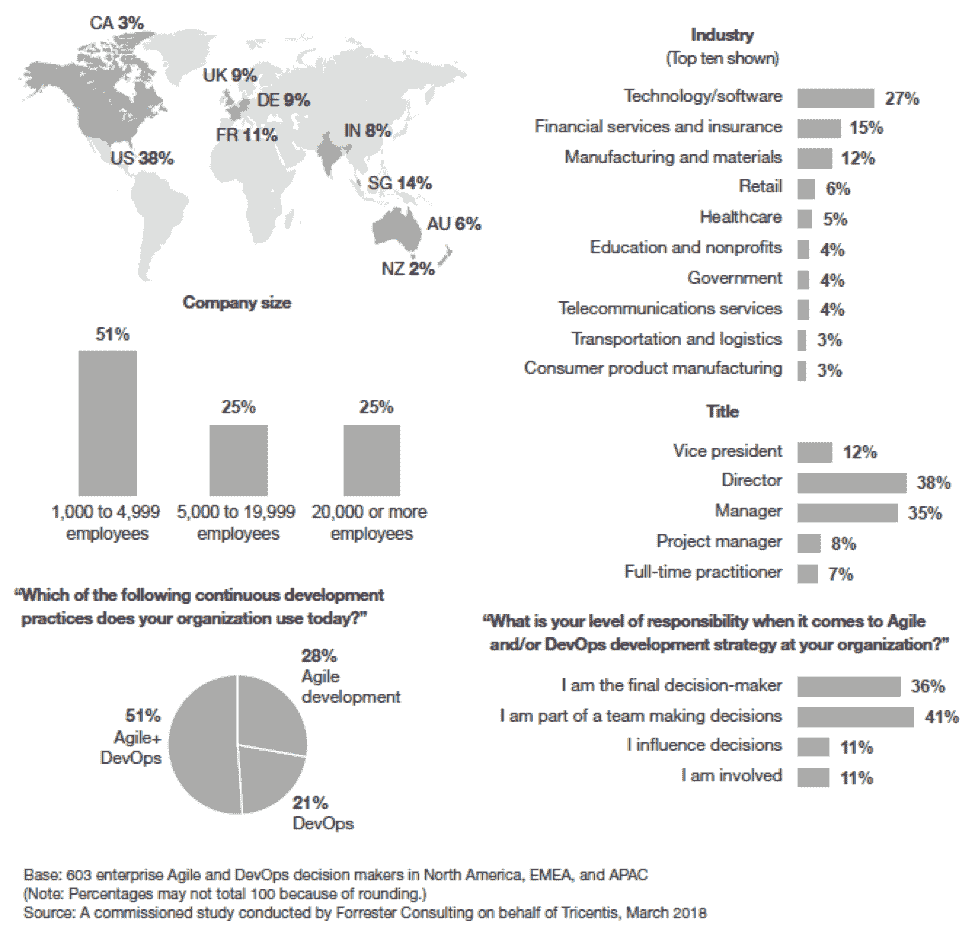

# CXOs 高估了 DevOps 和持续测试成熟度

> 原文：<https://devops.com/cxos-overestimating-devops-and-continuous-testing-maturity/>

***需要更多的工作来实现连续测试，Forrester 报告显示***

Forrester 最近完成了一个有趣的新研究项目，探索是什么将 DevOps 领先者与 DevOps 落后者区分开来。在分析了从负责公司开发运维策略的 603 家全球企业受访者处收集的数据后，Forrester 了解到，拥有最成熟开发运维实践的公司在几个关键方面有所不同:

1.  分配适当的测试预算，重点提升他们的测试技能。
2.  实施连续测试以满足发布频率的需求并支持连续交付。
3.  将测试人员作为集成交付团队的一部分。
4.  自动化端到端功能测试。
5.  将测试转移到开发生命周期的早期。

遵循这五个最佳实践的公司将测试视为获得速度和效率的方法，而不是交付速度的瓶颈。

这并不十分令人惊讶。一方面，[一项又一项研究](https://www.tricentis.com/blog/continuous-testing-surveys/)表明，测试是加速应用交付的头号瓶颈。另一方面，[我们已经亲眼目睹了](https://www.tricentis.com/resources/continuous-testing-devops/)致力于测试转型的组织如何成功地从瀑布式的手工测试流程转变为集成到 CI/CD 管道中的自动化连续测试。

然而，让我们措手不及的是 cxo 对他们的持续测试、DevOps 和敏捷成熟度的过高估计。

根据该报告，只有 26%的非 cxo 表示他们的组织遵循了所有这五项最佳实践，但 57%的 cxo 认为他们做到了。根据该报告:

> 虽然大多数敏捷和/或 DevOps 公司已经实施了这五个核心测试实践中的一些，但很少有人真正实施了所有这些实践——只有大约四分之一的受访者表示他们部分或完全同意所有五个最佳实践陈述。
> 
> 这是一个重要的区别。虽然许多 cxo 和高层决策者认为他们走在了前面，但我们的研究表明，与同行相比，只有一小部分遵循这些最佳实践的公司拥有更先进的敏捷和 DevOps 实践——他们的行为和态度支持这一论断。

此外，cxo 还报告了比非 cxo 更高水平的敏捷和开发运维成熟度。

对于 DevOps 专业人员来说，好消息是 cxo 是您的拥护者:他们相信您做得很好！坏消息是，在某些时候，您需要告诉他们当前流程中存在的差距。您还需要收集和分享一些您自己的数据，以证明实际采用这五个经过验证的最佳实践将帮助您提高交付速度，同时降低业务风险。

## 详细的报告结果

这只是 Forrester 副总裁兼首席分析师迭戈·洛·朱迪切领导的研究项目中许多有趣的发现之一。

作为高层次的总结，该研究发现了以下几点:

*   对业务风险的理解是 DevOps 和敏捷成熟度最重要的决定因素。
*   专家主要关注上下文度量(例如，需求覆盖)，而其他人关注“计数”度量(例如，测试的数量)。
*   专家更有可能测量端到端事务的用户体验，而其他人则依赖于特定于应用程序或特定于团队的指标。

完整的报告中提供了详细的结果和分析:“ [Forrester Research:是什么将 DevOps +敏捷领导者与落后者区分开来？](https://www.tricentis.com/resources/forrester-devops/)

## 报告方法

在这项研究中，Forrester 对北美、欧洲和亚太地区的 603 家企业组织进行了一项在线调查，以评估当前的软件测试实践和调查开发期间跟踪的指标。调查参与者包括决策者和负责其组织的敏捷和/或 DevOps 开发战略的个人贡献者。向参与者提供的问题询问了他们公司对软件开发自动化、风险管理和测试实践的态度，以及他们在软件开发生命周期中跟踪和评估的度量标准。

辛西娅·邓洛普