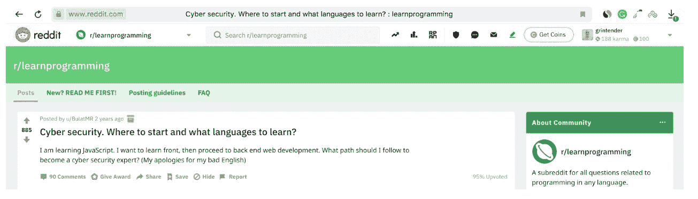
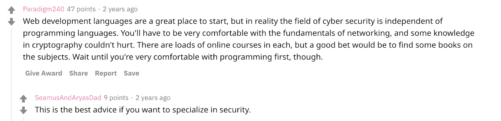
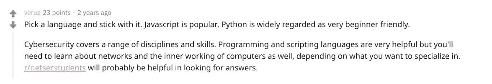
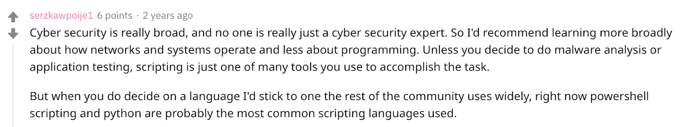
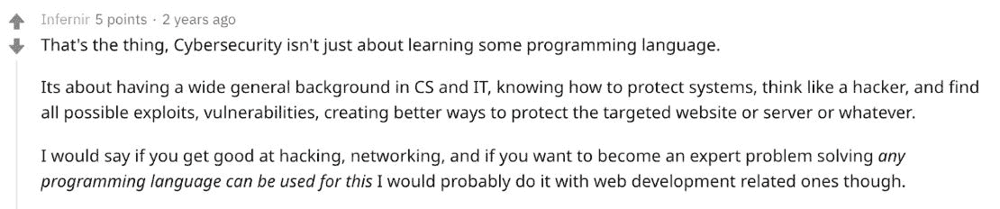

# 2020 年最佳:网络安全:什么编程语言更适合你的职业生涯？

> 原文：<https://devops.com/cybersecurity-what-programming-language-is-better-for-your-career/>

随着 2020 年的临近，我们 DevOps.com 想要突出今年最受欢迎的五篇文章。以下是我们 2020 年最佳系列的第二部。

作为一名开发新手，你可能正在考虑学习一门编程语言，开始一份美妙的职业生涯。

其实 Reddit 上的这个问题启发了整篇文章:

Source: [Reddit.](https://www.reddit.com/r/learnprogramming/comments/7ax7pj/cyber_security_where_to_start_and_what_languages/)

事实是，编程语言代表了其作者的某些哲学，并且是为某些类型的问题量身定制的，也就是说，没有“最好的编程语言”这种东西

Source: [Reddit.](https://www.reddit.com/r/learnprogramming/comments/7ax7pj/cyber_security_where_to_start_and_what_languages/dpdmnlf/)

## 每个工具都有它的时间和地点

在这篇文章中，我根据流行程度、用法、需求和易学性来描述主要的编程语言。

每种语言都有市场需求和潜在的薪资范围。这些都与具体的个人目标和以前的编程经验有关。

## 在潜水之前，你应该问自己什么问题？

*   你想从事什么样的项目？ 如果职业灵活性是优先考虑的，那么学习 Python 或 C++将让你能够与不同类型的编程打交道。如果你热衷于 web 开发，学习 JavaScript 或 PHP 是一个明智的选择。
*   你有多少经验？如果你没有以前的编程经验，你不会想换一种高级编程语言，比如 Rust。如果你是一门语言的新手，你会希望从更高的水平开始，并且要有直觉。
*   你的职业目标是什么？你想成为一名自由职业者，是为现有公司工作还是为初创公司工作？你在努力做好你现在的工作吗？

如果你打算在大型科技公司找份工作，学习他们使用的编程语言，例如，美国国家航空航天局、谷歌和脸书使用 Python。

许多编程语言都有相似的语法和品质——所以如果你学习其中一种，其他的会更容易。你知道的语言越多，你的职业生涯和发展项目就越灵活。

在下面的列表中，我们将看看最常用的最佳和最流行的编程语言，包括 web 开发、移动开发、游戏开发等等。

Source: [Reddit.](https://www.reddit.com/r/learnprogramming/comments/7ax7pj/cyber_security_where_to_start_and_what_languages/dpdj5sa/)

## **开始职业生涯的五大编程语言**

**Java**

如果你正在寻找一种在各种情况下都有用的通用语言，它可能是最好的编程语言。 至于选择学习哪种编程语言，对于正在考虑学习 Java 的人来说，有很多资源可以参考。 Java 于 1995 年发布，这使其成为最古老的编程语言之一。它可用于各种平台和操作系统，包括 Microsoft Windows、macOS、Linux 和 Solaris。

这意味着 Java 开发人员总会有工作，这使得它(可能)成为最好的编程语言。

研究表明，Java 开发人员的年薪预计在 8 万到 13 万美元之间。 如果你正在考虑学习你的第一门编程语言，可以考虑参加一个在线课程，比如 [CodeGym](http://codegym.cc/) 。本课程包含 40 个级别的游戏课程，将教你开始用 Java 编程所需的所有基础知识。它很容易理解——即使你没有编程经验——并且值得一试。

它也最适合用于后端 web 开发、移动开发和桌面应用程序。

**JavaScript**

这种编程语言可以在多种平台上工作。因此，它非常适合将通过各种设备和浏览器访问的网站。它适用于任何设计网站的人，这些网站具有效果、互动功能、动画和弹出窗口——的标准功能，几乎是当今任何品牌网站的标准功能。 如果你想在创造性的环境中工作，给用户增加更多的体验，这是一门需要学习的编码语言。

JavaScript 是网络上排名第一的语言。jQuery、Angular 和 React JS 等框架的发展使得 JavaScript 更加流行。

如果你就是离不开互联网，学习 JavaScript 宜早不宜迟。 我认为这个 [JavaScript 大师班](https://www.udemy.com/course/the-complete-javascript-course/2F) 是一个极好的起点。关于更便宜的选择，请看这个免费 JavaScript 课程列表。

它也最适合用于前端和后端 web 开发

**学习 PHP**

PHP — 另一种古老的语言，大约在 1995 年与 Java 同时首次出现在编程的舞台上。它是一种通用语言，从 web 早期开始就广泛用于 web 开发。

不像其他语言，使用 HTML 可能会很棘手，PHP 可以直接构建到 HTML 代码块中。开始和结束指令用于进入和退出 PHP，非常容易使用。PHP 虽然不像 Python 或者 Java 那么流行，但是因为简单，可以成为一门适合学习的语言。这对初学者来说很方便，你可以在开始你的 PHP 课程几个小时后编写你的第一个脚本。

再次强调，PHP 的流行和广泛使用意味着工作机会相对容易找到。一个普通的 PHP 开发人员预计每年可以赚 8 万美元左右。然而，作为一名自由职业者，有潜力赚得更多。

参加一门 [高级 PHP 课程](https://www.bitdegree.org/course/learn-php) ，它会教你找到你的第一份程序员工作所需要知道的一切。不管你是在学习你的第一语言，还是一名经验丰富的开发人员正在寻找最好的编程语言来添加到你的简历中 — PHP 都是一个很好的选择！

最适合用于后端 web 开发。

**Python**

Source: [Reddit.](https://www.reddit.com/r/learnprogramming/comments/7ax7pj/cyber_security_where_to_start_and_what_languages/dpdlytr/)

Python 是迈向更高级编程语言的有用一步。Python 提供了高度的网站可读性，被 Reddit、Google 甚至 NASA 等公司使用。

它被视为不需要太多先验知识的入门级编程。对于相对较新的专业人士来说，帮助那些希望扩大其在互联网上的存在而不必求助于高级专业人士的小企业可能是理想的。 Python 是一种相对简单的编程语言，如果你已经有编程经验的话，非常容易掌握。如果你已经是一名开发人员，并且想快速增加你的简历，这是最好的学习方法之一。

Python 上的代码被设计成可读的。它使用了大量的空格，这使得在你学习它的时候，它是一种非常容易学习的语言。

Python 最有用的特性之一是它与数据分析系统和科学应用程序的兼容性。它是科学界的一种流行语言，经常被研究人员用来编写程序。

一个普通的 Python 开发者每年可以赚 10 万美元。但是，工资增长空间不大。

如果你认为 Python 是推进你职业生涯的最佳编程语言，考虑注册一个 BitDegree 课程。 [Python 基础课程](https://www.bitdegree.org/course/python-basics) 包括开始用 Python 编写程序所需的一切，包含不到四个小时的授课材料。

它最适合用于后端 web 开发、桌面应用程序和数据分析。

**C#**

C#是另一种基于 C 的面向对象的通用语言。它被认为是构建微软平台本地应用程序的合适编程语言。微软最初开发它是作为其。NET 框架来构建 Windows 应用程序。 C#使用类似于 C++等其他语言的语法。因此，如果你来自不同的 C 族语言，就很容易掌握它。

C#不仅是开发微软应用的合适语言，也是移动设备开发者在 Xamarin 平台上构建跨平台应用的语言。此外，任何对虚拟现实开发感兴趣的人都应该考虑学习 C#，因为它是使用流行的 Unity 游戏引擎构建 3D 和 2D 视频游戏的推荐语言，该引擎生产了市场上三分之一的最佳游戏。

如果移动应用开发或虚拟现实是你的业务，考虑学习 C#。许多移动设备开发人员使用 C#在 Xamarin 平台上创建跨平台的应用程序。 虽然对初学者来说不是最方便的编程语言。

如果你对以上任何一个领域感兴趣，请看“ [学习做游戏时的代码——Udemy 的 C#](https://www.udemy.com/course/unitycourse/) 中的完整 Unity 开发者”一节我看到有超过 20 万的学生注册了这门课程，这表明了它的受欢迎程度。

最适合用于手机和游戏开发。

## 有哪些最好学的编程语言？

Source: [Reddit.](https://www.reddit.com/r/learnprogramming/comments/7ax7pj/cyber_security_where_to_start_and_what_languages/dpdskmw/)

正如开头提到的，没有最好的编程语言可以学习。最适合你的语言将取决于你的经验、你目前的知识和学习一门新语言的理由。

虽然有很多选择，但你应该能够根据你想从中学习的内容来缩小你的语言选择范围。

记得考虑以下几点:

*   编程经验，因为有些语言，比如 Python 和 Java，更适合没做过编程的初学者。
*   你想用这种语言做什么。不同的语言用于不同的事情。
*   你有多少时间？有些语言比其他语言要求更高。

根据你的兴趣和你想从事的软件开发类型做出选择。这里简单总结一下:

*   外部 web 开发:JavaScript。
*   内部 web 开发:JavaScript，Java，Python，PHP。
*   移动开发:Java，C#。
*   游戏开发:C#。
*   桌面应用:Java 和 Python。

## **总而言之**

编程和开发者社区正以前所未有的速度发展。

各种新的编程语言正在出现，它们适合不同类别的开发人员(初学者和专家)以及其他应用程序(web 应用程序、移动应用程序、游戏开发、分布式系统等)。).

这个列表仅仅触及了现有编程语言的表面。然而，一个简单的事实是，有了正确的编码技能，您将完全准备好提供有价值的技术支持，并成为任何组织的资产。

-[鲍罗丁](https://devops.com/author/dmitrii-borodin/)米律