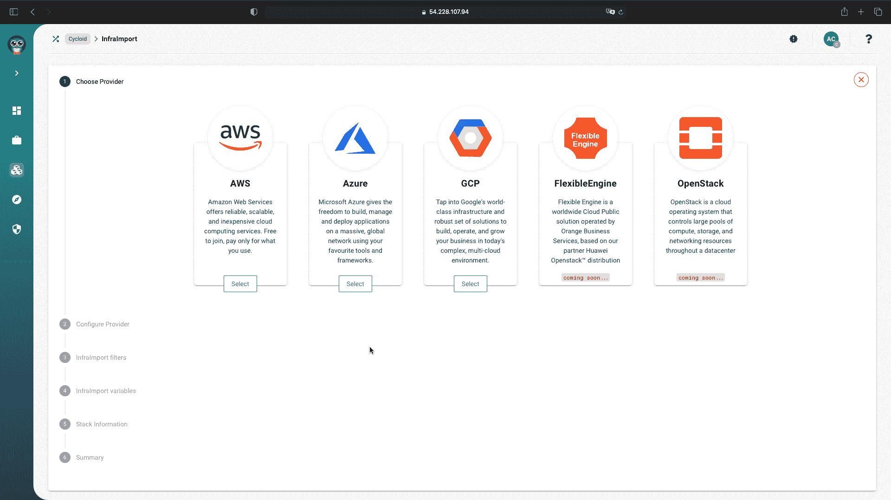

# 摆线工具可以逆向工程提供的 IaC

> 原文：<https://devops.com/cycloid-tool-can-reverse-engineer-provisioned-iac/>

摆线本周推出了一款工具，可以对用于手动供应云基础设施的代码进行逆向工程。Infra Import 工具是使用开源 Terraform 软件创建更加一致和可靠的代码版本的努力的一部分。

摆线首席执行官 Benjamin Brial 表示 [Infra Import](https://www.cycloid.io/press/cycloid-unveils-infra-import) 基于摆线的开源 TerraCognita 软件，该软件使 IT 团队能够对使用开源 Terraform 工具创建的基础设施即代码(IaC)进行逆向工程。

Infra Import 将该功能扩展到云平台，如亚马逊网络服务(AWS)、微软 Azure、谷歌云平台或采用开源 OpenStack 云平台的 IT 环境，这些平台可能已被手动供应。然后，IT 团队可以基于 Terraform 代码创建一个配置，该配置可以跨多个云使用。

Infra Import 旨在连接到云提供商，然后根据现有部署自动对 Terraform 文件和 IaC 堆栈进行反向工程。Brial 指出，这也确保了使用最新版本的 Terraform 来创建配置代码。这种能力使得 DevOps 团队不再需要跟踪随着 IaC 工具新版本的出现可能需要更新的 Terraform 版本。

同样重要的是，Infra Import 还使新成员加入 DevOps 团队变得更加容易，因为这些工具使用了它们知道可以依赖的有效安全配置。云服务的错误配置是当今 IT 团队面临的最大安全问题之一，原因很简单，因为大多数开发人员缺乏正确配置云服务所需的安全专业知识。

摆线正在推出一套全面的管理工具，补充它创建的轻量级框架，使 DevOps 最佳实践更容易获得。挑战在于许多 IT 组织已经手动调配了云基础架构，而这种方式即使不是完全不安全，也至少是次优的。

云计算环境中普遍存在错误配置，但是大多数组织不准备手动解决这个问题。自动化这些配置的逆向工程是让 IT 团队大规模解决问题的第一步。

目前还不清楚配置问题在多大程度上影响了原本会部署在云中的应用程序的数量。在采用云平台时，安全性总是被列为 IT 领导者最关心的问题。然而，问题不在于平台本身的安全性，而在于在平台上部署应用程序所采用的过程。云服务提供商推广了一种安全责任共享模式，在这种模式下，开发人员负责安全地配置服务，并确保软件环境的整体安全性。问题是，并不是每个开发人员都理解这种共享责任模型的含义，更不用说如何实际保护应用程序工作负载了。

安全问题不太可能会降低应用程序在云中部署的速度。然而，随着遇到更多的云安全问题，将会进行更多的审查。