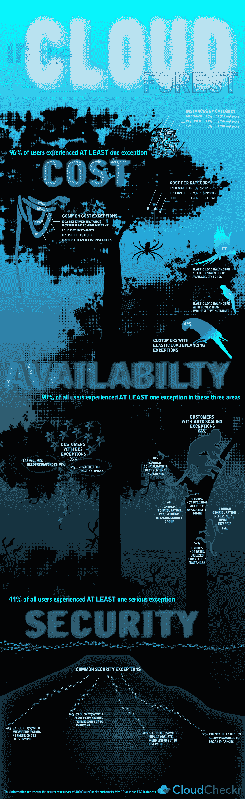

# 来自 CloudCheckrs 用户调查的 AWS 使用情况的数据驱动观察

> 原文：<https://devops.com/data-driven-observations-on-aws-usage-from-cloudcheckrs-user-survey/>

*这是来自 CloudCheckr* 的亚伦·克莱因的[客座博文](https://devops.com/guest-posting-guidelines/ "Guest Posting Guidelines ")

当 AWS 在 3 月份免费提供可信顾问时，我们很受鼓舞。这是对许多人早就知道的事情的含蓄承认:AWS 是复杂的，对于用户来说，有效地供应和控制他们的 AWS 基础设施可能是一个挑战。

我们将 AWS 的发布视为对客户使用情况进行内部调查的机会。我们将 400 个用户帐户的初始评估与 125 个以上的最佳实践检查进行了比较，以确定配置和策略是否正确。我们的最佳实践检查涵盖 3 个关键类别:成本、可用性和安全性。我们将我们的调查局限于拥有 10 个或更多运行 EC2 实例的用户。总的来说，用户运行超过 16，000 个 EC2 实例。

我们惊讶地发现，几乎每个客户(99%)都经历过至少一次严重的异常。除了这个顶级的外卖，我们的主要结论是，控制成本可能会抓住头条新闻，但用户也需要扣上一些可用性和安全性问题。

当考虑可用性时，有很大比例的用户普遍存在严重的配置问题。用户多次未能优化配置自动缩放和 ELB。无法创建足够的 EBS 快照几乎是一个普遍问题。

尽管用户通过了更多的安全检查，但是出现的异常是严重的。许多最常见的安全问题是在 S3 的配置中发现的，其中近五分之一的用户通过设置为每个人的“上传/删除”或“编辑权限”来允许不受约束地访问他们的桶。正如我们在之前的白皮书中解释的那样，任何人使用简单的 bucket finder 工具都可以定位和访问这些 bucket。

除了这些数字，我们还采访了客户，以收集用户对一些更有趣的数据点的定性反馈。

如果这项调查的结果引发了关于你的 AWS 帐户配置如何的问题，CloudCheckr 提供了一个免费的帐户，你可以在几分钟内设置好。只需从您的 AWS 帐户输入只读凭据，CloudCheckr 将在几分钟内评估您的配置和策略:https://app.cloudcheckr.com/LogOn/Registration

**按领域划分的结论**

**基于成本例外的结论:**

如上所述，我们的样本由 16，047 个实例组成。样本组每月在 EC2(及其相关成本)上总共花费 2，254，987 美元，每个客户每月的平均成本为 7516 美元。当然，我们注意到数量和成本之间的不匹配——spot 实例占数量的 8%,但仅占成本的 1.4%。这是因为与按需相比，即时实例的价格要便宜得多。

当我们查看成本异常时，**我们发现 96%的用户至少经历了一次异常**(许多用户经历了多次异常)。总的来说，我们发现采用我们推荐的实例规模和购买类型的用户平均每月能够节省 3974 美元，总计每月 1，192，212 美元。

这表明**价格优化对于依赖原生 AWS 工具的 AWS 用户来说仍然是一大障碍**。用户总是无法优化购买，也无法优化利用率。这些综合问题意味着，普通客户要为资源支付将近两倍的费用，以实现其技术的适当性能。

为了进一步研究这种行为，我们采访了一些客户。我们采访了专门按需购买的客户和使用多种购买类型的客户。

以下是他们的回答(经过总结和整合):

*   现货实例让用户担心——他们普遍担心:“如果价格飙升，我的实例被终止了怎么办？”尽管峰值很少出现，警告是可用的，并且适当的配置可以显著减轻这种“突然终止”的风险，但这种担心仍然存在。
*   为购买保留实例制定成本方案既困难又耗时。进行这种转变的客户已经拼凑了自制的电子表格，作为支持这一业务决策的一种方式。那些没有付出努力的人凭直觉认为不值得花时间。AWS 具有足够的成本效益，为过渡建模所花费的时间和精力是从构建和管理他们的技术中获得的机会成本。
*   在考虑自动伸缩和其他必要配置的同时，匹配按需实例和预留实例之间的配置是非常复杂的。许多人认为这不值得努力。
*   亚马逊自己定期降低价格的过程是购买 RIs 的一个阻碍。对于有 3 年承诺的 RIs 来说尤其如此。事实上，在购买 RI 的客户中，没有人表示希望购买 3 年承诺的 RI。所有人都通过参考 AWS 价格的常规下降以及他们无法准确预测 3 年后的业务需求这一事实来支持他们的决策。

**基于可用性例外的结论:**

我们将我们的用户与我们的可用性最佳实践进行了比较，发现**近 98%的用户至少遇到过一次异常**。我们假设这是由于 AWS 的整体复杂性，并采访了一些用户进行确认。以下是我们从这些采访中发现的情况:

*   用户通常对这些例外感到惊讶。他们认为他们“做了所有正确的事情”，但随后意识到他们低估了 AWS 的复杂性。
*   用户通常不确定为什么需要补救。AWS 的基础架构不断发展，用户很难跟上新服务和增强功能的步伐。
*   AWS 的动态在异常数量中起了很大的作用。用户评论说，他们经常修复异常，在使用一周后，发现出现了新的异常。
*   用户对 AWS 的整体服务水平非常满意。尽管有可能降低整体可用性的例外，用户仍然发现 AWS 提供了巨大的功能优势。

**基于安全异常的结论:**

最后，我们看看安全性。在这里，我们发现 **44%的用户在初始扫描期间至少出现了一个严重的异常**。最严重和最常见的异常发生在 S3 使用和铲斗许可中。鉴于云与数据中心架构的差异，这并不完全令人惊讶。我们就这一领域采访了我们的用户，以下是我们的发现:

*   AWS 管理控制台几乎没有提供帮助 S3 安全的功能。它没有提供监视和控制 S3 库存和使用的友好方式。事实上，我们发现大多数用户在报告库存时都很惊讶。他们通常拥有比预期多 300-500%的存储桶、对象和存储。
*   价格=重要性，S3 通常是用户事后才想到的。因为它非常便宜，所以用户不会像 EC2 和其他更昂贵的服务那样仔细审核它，也很少为 S3 的使用创建和实现正式的策略。通过管理控制台逐一登录每个区域以收集 S3 信息和下载数据所需的时间和精力相对于花费来说是不值得的。
*   考虑到低成本和缺乏正式的策略，团队成员抛出大量的对象和桶，因为他们知道他们可以以最小的成本存储大量的数据。由于用户没有审核他们存储的内容，他们无法确定安全级别。

 **作者简介:**亚伦是 CloudCheckr Inc. (CCI)的联合创始人/首席运营官。他拥有 20 多年的管理经验和远见，负责公司的运营。

Aaron 曾在从小型创业公司到数十亿美元企业的各种组织中担任重要领导职务。Aaron 毕业于 Brandeis 大学，拥有 SUNY 水牛城分校的法学博士学位。

**底层数据汇总**

**成本:任何例外 96%**

总共 16，047 个实例分为以下几类:

*   按需:78% (12，517 个实例)
*   保留:14% (2，247 个实例)
*   现货:8%(1284 例)

采购实例细分如下:

*   点播率:89.7%(2 023 623 美元)
*   保留:8.9%(199，803 美元)
*   现货:1.4%(31561 美元)

我们发现的常见成本例外:

*   空闲 EC2 实例 36%
*   未充分利用的 EC2 实例 84%
*   EC2 保留实例可能匹配错误 17%
*   未使用的弹性 IP 59%

**可用性:任何异常 98%**

这里，按服务分类，是我们发现的常见和严重异常的一些亮点:

**服务类型:异常客户**

**EC2:任何异常 95%**

*   需要快照的 EBS 卷 91%
*   过度利用 EC2 实例 22%

**自动缩放:** **任何异常** **66%**

*   所有 EC2 实例未利用自动缩放组 57%
*   所有不利用多个可用性区域的自动扩展组 34%
*   自动缩放启动配置引用了无效的安全组 22%
*   引用无效 AMI 18%的自动缩放启动配置
*   自动缩放启动配置引用无效密钥对 16%

**ELB:** **任何例外** **42%**

*   不利用多个可用性区域的弹性负载平衡器 37%
*   少于两个健康实例的弹性负载平衡器 21%

**安全:** **任何异常** **46%**

这些是我们发现的最常见的例外情况:

*   EC2 安全组允许访问广泛的 IP 范围 36%
*   将“上传/删除”权限设置为“每个人”的 S3 时段 16%
*   “查看权限”权限设置为“所有人”的 S3 存储桶 24%
*   “编辑权限”设置为“每个人”的 S3 存储桶 14%