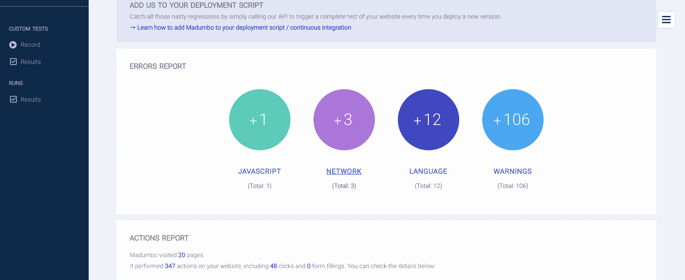

# datadog 收购应用开发测试平台 matumbo

> 原文：<https://devops.com/datadog-acquires-app-dev-testing-platform-madumbo/>

Datadog 宣布，它正在通过收购 Madumbo 将其业务范围从 it 监控扩展到应用程序测试。

Madumdo 首席执行官 Gabriel-James Safar 表示，越来越明显的是，应用程序测试需要更多地了解 it 监控工具收集的指标。合并后的 Datadog/Madumbo 将使用通过 Datadog 平台收集的应用和基础设施数据，为自动化测试过程带来智能。

Madumbo 平台已经广泛使用机器学习算法和预测分析，将人工智能(AI)注入应用测试过程。随着时间的推移，这些算法可以访问的数据越多，人工智能模型就越精确。

这种方法使 Madumbo 有可能建立一个机器人，使用运行在真实浏览器上的代码检查错误，Safar 说这意味着 DevOps 团队可以捕捉到最终用户遇到的相同缺陷。Safar 说，这一点至关重要，因为 IT 组织浪费了大量时间，他们无法对任务进行优先排序，以确定问题的根本原因，或者更重要的是，在第一时间预防问题。由于这个问题，大多数组织缺乏开发最佳 DevOps 流程所需的时间。

Datadog 提供了一套免费的 IT 监控工具，作为软件即服务(SaaS)应用程序使用。Safar 说，这些数据将成为 Madumbo 的可靠来源，这反过来将增加对 Madumbo 提出的人工智能建议的信心。

这些客户中有多少人最终会用 Madumbo 取代他们目前使用的任何应用程序测试工具，还有待观察。但是，如果 Datadog 可以提供一种更有效的测试方法，测试工具可能会促使组织替换他们的监控工具。大多数组织花费大量时间尝试关联数十种监控工具的数据，这些工具通常会生成相互冲突的警报，或者关于 IT 组织已经通过另一种工具获知的问题的警报。大多数 IT 组织最终将看到人工智能平台的崛起，这将推动整个 DevOps 工具类别的整合。

同时，在应用程序开发过程中解决的问题越多，在生产环境中出现的问题就越少。事实上，投资同类最佳开发运维流程的目的不仅仅是为了更快地部署应用，还在于确保这些应用的质量明显高于前几代应用，这一点是有争议的。然而，除非 DevOps 团队能够从 IT 堆栈上上下下生成的数百万条警报中获得可操作的情报，否则这是不可能发生的。

— [迈克·维扎德](https://devops.com/author/mike-vizard/)