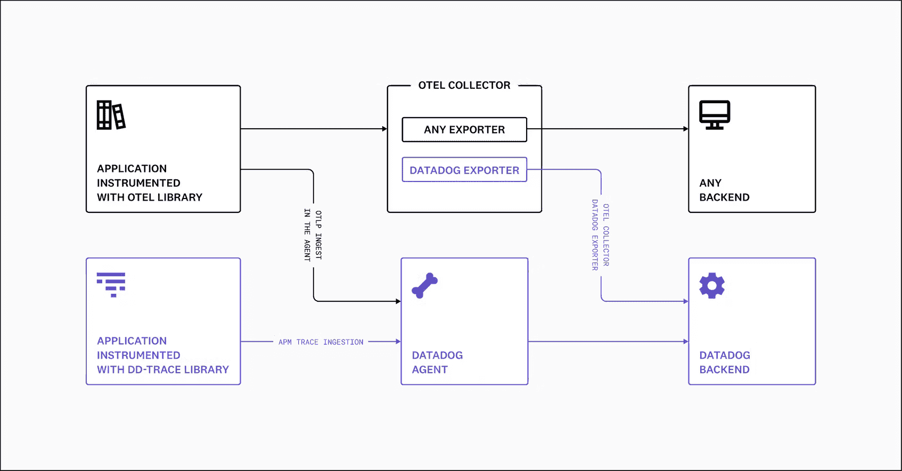

# Datadog 增加了对 OpenTelemetry 协议的支持

> 原文：<https://devops.com/datadog-adds-support-for-opentelemetry-protocol/>

在[kube con+CloudNativeCon Europe 2022](https://events.linuxfoundation.org/kubecon-cloudnativecon-europe/?)活动上，Datadog 宣布其为 OpenTelemetry Protocol (OTLP)提供了[支持，该协议通常在其提供给仪器应用的代理软件中提供。](https://www.datadoghq.com/about/latest-news/press-releases/datadog-announces-opentelemetry-protocol-support/)

Datadog 的产品和社区高级副总裁 Ilan Rabinovitch 表示，该功能消除了安装单独的 OpenTelemetry 收集器的需要，以便从使用云计算原生计算基金会(CNCF)支持下推进的开源 OpenTelemetry 库装备的应用程序中聚合指标、日志和跟踪。

Datadog 代理已经可以通过 Datadog 提供的 500 多个集成来收集应用配置文件、网络数据和基础设施指标。OpenTelemetry 通过一组应用程序编程接口(API)和一个用于检测应用程序的有线协议扩展了该功能。

Datadog 是一系列[可观测性](https://devops.com/?s=observability)平台提供商中的最新一家，该平台增加了对 OpenTelemetry 项目的支持，该项目继续获得发展势头。我们的目标是降低使用开放源代码代理软件开发应用程序的成本，该软件提供了一组一致的接口。以前，每个可观测性平台提供商开发他们自己的代理软件，DevOps 团队需要安装这些软件。Datadog 正在为代理软件做准备，除了从现有应用程序中收集数据之外，它现在还与 OpenTelemetry 项目的贡献者创建的 OLTP 协议兼容。

DevOps 团队需要解决的问题是，虽然 OpenTelemetry 代理软件是免费的，但他们中的许多人已经安装了专有的代理软件来管理应用程序。该代理软件通常可以提供 OpenTelemetry 中尚未提供的附加上下文。然而，历史表明，随着时间的推移，拥有大量贡献者的开源项目将超过任何单一供应商的创新能力。

无论如何，随着更多基于微服务的应用程序的部署，DevOps 团队将为更多的应用程序提供工具。微服务之间存在的依赖性使得在没有额外工具的情况下管理应用环境变得非常困难。许多 DevOps 团队的目标是最终用一个可观察性平台取代跟踪有限的预定义指标集的监控工具的大杂烩，该平台不仅聚合指标，而且使 DevOps 团队能够在 IT 问题成为重大问题之前启动查询并将其暴露出来。在某些情况下，监测工具的合理化将有助于证明购买可观察性平台的合理性。

当然，可观察性是任何 DevOps 最佳实践的核心原则之一。然而，实现它一直是一个挑战。Rabinovitch 说，一个可观察性平台，定期暴露关键的 IT 问题，而不需要 DevOps 团队启动查询来搜索异常，最终将赢得可观察性优势的战斗。

与此同时，已经不缺乏可观测平台。面临的挑战是确定哪一种能够以最合理的成本实现最高水平的仪器。