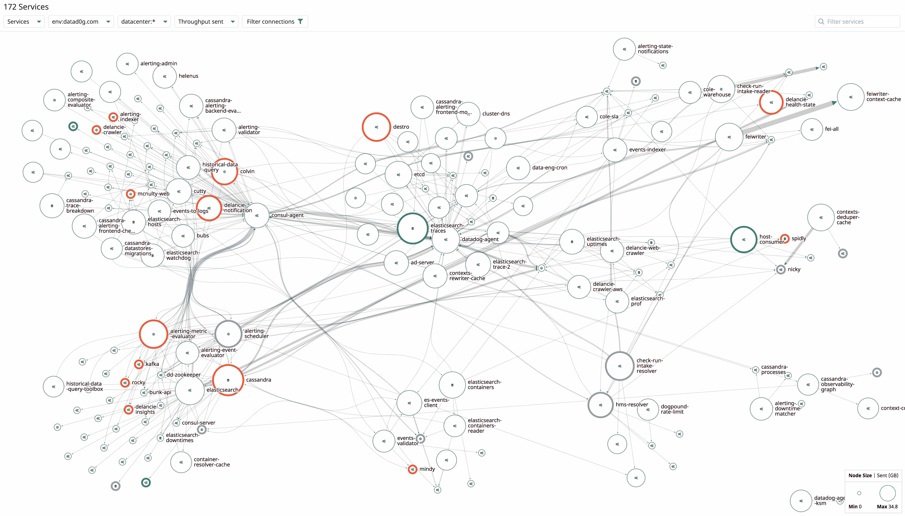

# Datadog 获取大量附加 DevOps 服务

> 原文：<https://devops.com/datadog-fetches-bevy-of-additional-devops-services/>

在今天举行的 [Dash 2019](https://www.datadoghq.com/blog/dash-2019/) 大会上，Datadog 推出了一系列 DevOps 计划，这些计划大大扩展了驱动该公司监控服务的代理软件的用例。

Datadog 产品组合的新成员包括[网络性能监控](https://www.businesswire.com/news/home/20190717005103/en/Datadog-Announces-Network-Performance-Monitoring)和[真实用户监控](https://www.businesswire.com/news/home/20190717005035/en/Datadog-Announces-Real-User-Monitoring) (RUM)服务，以及之前宣布的用于监控无服务器计算框架的[服务](https://www.businesswire.com/news/home/20190717005030/en/Monitoring-Serverless-Workloads-Generally-Datadog)。

此外，Datadog 宣布将无限制的跟踪添加到其应用性能监控(APM)和分布式跟踪服务中，允许 DevOps 团队搜索所有跟踪，而无需实时采样，并长期存储与不良用户体验匹配的跟踪。

最后，Datadog 增加了对[日志再水合的支持，以及从驻留在其日志管理服务中的摄取日志数据生成定制指标](https://www.businesswire.com/news/home/20190717005094/en/Datadog-Announces-New-Cost-Optimization-Features-Log)的能力。

Datadog 产品和社区副总裁 Ilan Rabinovitch 表示，该公司继续投资扩大其代理软件可以应用的核心用例。他说，随着时间的推移，这种方法将使 DevOps 团队能够合理化他们需要部署的代理软件类型，以监控应用程序、网络安全、基础设施、网络和用户体验。

Rabinovitch 指出，将 Datadog 服务的范围和广度扩展到网络领域的兴趣特别高，因为 DevOps 团队目前很难了解云服务提供商提供的各种软件定义网络(SDN)服务如何影响他们的应用程序。

开发运维团队现在也被要求以反映实际终端用户体验的方式呈现 IT 指标。Datadog 提供的 RUM 服务实现了这一目标，除了提供地理位置、最终用户使用的操作系统和浏览器类型之外，它还使跟踪前端延迟指标(如交互时间和首字节时间)变得更加容易。

Rabinovitch 指出，随着组织越来越依赖于数字业务流程，他们正在努力实现交付 IT 服务的各个方面。例如，APM 在过去可能仅限于在内部运行的少数任务关键型应用程序。他说，现在，随着越来越多的数字业务应用程序分布在云和内部 IT 环境中，对相互依赖的应用程序和微服务的可见性的[需求变得更加迫切，他补充说，大多数组织更愿意将监控作为一种服务来使用，而不是必须自己部署和维护该软件。](https://devops.com/monitoring-the-devops-tool-chain/)

目前还不清楚能够应用一个通用的代理软件库会如何加速 It 组织内部工作职能的融合。但它确实使跨职能 it 团队更容易协作和排除 it 环境故障，因此团队的所有成员都可以使用一个通用的管理平台来发现问题。在许多情况下，每当发现新问题时，不需要召开“作战室”会议，节省的时间本身就是无价的。

— [迈克·维扎德](https://devops.com/author/mike-vizard/)