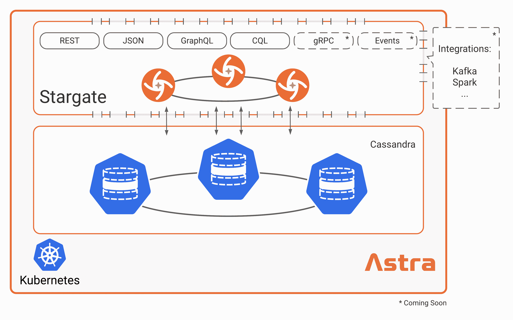

# DataStax 兑现开放 API 承诺

> 原文：<https://devops.com/datastax-delivers-on-open-apis-commitment/>

DataStax 今天宣布，用于在 Cassandra 数据库上构建应用程序的开源 [Stargate](https://www.businesswire.com/news/home/20201209005346/en/DataStax-Delivers-New-Open-Source-API-Stack-for-Modern-Data-Apps) 应用编程接口(API)框架已经全面上市。

DataStax 首席产品官 Ed Anuff 表示，Stargate 将使开发者更容易使用事实上的标准 REST API、GraphQL API、无模式文档 API 或 JSON 来构建在 Cassandra 上运行的应用程序。

以前，开发人员必须使用一组独特的 API 来为基于宽列存储架构的开源数据库构建应用程序。Anuff 说，这往往导致 IT 团队只有在他们的应用程序在其他平台上遇到扩展问题时才使用 Cassandra。

Stargate 将使开发者有可能使用他们已经知道的 API 来构建最初部署在 Cassandra 上的应用程序。Anuff 说，这将减少每当组织需要将应用程序从一个数据库转移到另一个数据库时遇到的麻烦。

Stargate 可以通过 Astra 云数据库服务下载，这是 DataStax 提供的 Cassandra 的托管实例。Stargate 最初在去年夏天进行了预览，它还使得在 Astra 中存储 JSON 对象成为可能，而不需要任何前期建模，从而更容易地原型化应用程序，而不必预先定义模式和查询。

DataStax 显然试图让开发者更容易为 Cassandra 构建应用程序，并在需要时移动它们。许多开发人员倾向于尽早采用文档数据库，只是因为它们更易于访问，并且通常不需要数据库管理员来部署和管理。然而，随着这些应用程序开始扩展，开发人员不得不将它们转移到另一个平台上的情况并不少见。

总的来说，Anuff 说，数据库管理最终开始被纳入许多 IT 组织的一个更大的 DevOps 流程集。与此同时，传统数据库管理员正在向数据运营或云运营工程角色迁移，创建这些角色是为了管理各种数据存储中的数据。他说，数据库管理员通常将自己与单一类型的数据库平台联系在一起的日子现在基本上已经过去了。他指出，IT 组织正在转向这样一种模式，即数据作为服务提供，而不管它通过标准 API 存储在哪里。

DataStax 正在为使用 Cassandra 作为数据服务的基础提供理由，因为该平台能够随着时间的推移扩展这些服务。

很难说数据库平台战争最终会如何发展。许多 IT 团队经常使用各种数据库和数据存储。然而，现在降低 IT 总成本的压力更大了，这可能会导致更多的组织合理调整其支持的数据库平台的数量和类型。

不管选择什么样的数据库平台，企业中访问数据的方式已经完全改变了。现在的挑战是使构建和部署应用程序的过程符合现在管理数据的方式。