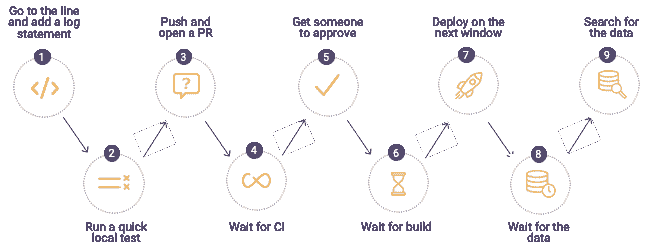

# 调试中断——以下是修复方法

> 原文：<https://devops.com/debugging-is-broken-heres-how-to-fix-it/>

面对现实吧，调试坏了。

不管你完全同意还是强烈反对这种说法，我想我们都同意调试至少还有改进的空间。事实上，软件开发人员调试代码的方式并没有太大变化。当然，现在有各种各样的可观察性和监控工具可以使开发人员的生活更加轻松，但是当我们看到开发人员在调试代码时通常遵循的过程时，这些年来它相对保持不变。

拥有合适的可用工具无疑改善了整体调试体验，但它们不是唯一的因素。内部组织过程同样重要，并且应该被调整以使开发人员的生活尽可能平稳和没有压力，同时仍然保持适当的组织安全性和遵从性水平。低效或高度限制性的流程虽然对法规遵从性团队有好处，但会对快速找到问题根源的速度产生负面影响。正确的解决方案通常是调整这些流程以适应公司文化的组合，以及允许符合行业标准和最佳实践的工具的组合。

## 开发人员如何调试代码

当你今天与开发人员谈论他们如何调试他们的应用程序时，这个过程通常与许多年前没有什么不同。调试的标准方法仍然是使用日志框架。当然，团队正在利用[应用程序性能管理](https://devops.com/?s=application+performance+management) (APM)工具以及监控和可观察性领域的其他工具，但是当您查看需要开发人员深入代码的调试问题的主要方法时，日志记录通常是主要方法。

该过程通常如下所示:

当发现一个缺陷时，开发人员将首先在他们调试的环境中查看生产或生产前服务器上的日志文件。如果他们在日志中找不到信息来帮助他们找到问题的根源，他们会返回到他们的代码并添加额外的日志行，最后通过上面显示的过程发送他们的代码。对于高度先进的组织来说，这一过程可能需要几分钟或几小时，但通常情况下，这一过程会持续几天甚至几周。当开发人员试图在生产中发现和修复缺陷时，这变得特别耗时。在这些情况下，企业的成本可能是惊人的；一定有更好更有效的调试方法。

## 工具可以提供帮助的地方

虽然新的闪亮的工具并不总是能解决所有的调试问题，但它们通常可以减轻开发人员面临的一些痛苦，并且在这个过程中，使他们的生活稍微轻松一些。调试、[可观察性](https://securityboulevard.com/?s=observability)和监控工具可以让开发人员更快地获得他们解决问题所需的数据，这比挖掘日志和使用试错法更传统。

许多组织在考虑诊断工具时首先从 APM 开始。这些类型的工具专门关注应用程序可用性的监控和管理，可以帮助收集指标和其他相关的应用程序信息，这些信息有助于查明基础架构问题。大多数情况下，这些工具实际上不是由开发人员自己使用，而是由运营或生产支持团队使用，以确保应用程序的可用性和性能阈值。

遥测技术的另一个重要类别是跟踪工具，它可以帮助开发人员更好地了解请求如何通过多层应用程序，甚至帮助确定错误率和延迟。有许多供应商出售这类工具，但也有一些开源选项，允许开发人员通过一种供应商中立的方法将跟踪集成到他们的应用程序中。

在诊断出 APM 解决方案的问题后，通常会移交给开发部门来解决问题。当开发人员需要调试时，他们通常使用本地 ide，或者更好的是远程调试解决方案。开发人员直接使用远程调试器来简化远程环境中应用程序的调试。这些工具可以帮助开发人员在应用程序运行时以安全可靠的方式直接访问底层应用程序数据，而无需停止或重新部署应用程序，从而更快地了解客户问题。远程调试器的一个主要好处是，它们可以从生产环境中为开发人员提供他们需要的数据，而不会损害安全性或要求开发人员直接访问敏感环境。虽然远程调试器和其他调试工具不是灵丹妙药，但它们可以是一个关键组件，使开发人员能够更好地解决关键问题。

## 修复组织问题

如果解决客户问题花费的时间比预期的要长，或者可能会损害您的品牌，那么与您的开发团队坐下来，使用数据驱动的方法来确定问题所在，这一点至关重要。深入研究您的问题跟踪或 ITSM 系统，以确定特定应用程序组件中的趋势或重复出现的问题。开发团队经常会变得不知所措，处理问题和构建新的特性，以至于这些内部系统中有价值的信息没有被利用。应定期审查客户问题和缺陷，以评估业务影响、修复成本以及与产品路线图的一致性等。有一些有价值的信息可以帮助团队将精力集中在节省时间的活动上，并改进产品，让客户更满意。

另一个需要关注的领域是你的软件交付过程。您的交付渠道中是否存在瓶颈，这些瓶颈可以变得更容易或更高效，但却被忽略了？您的软件交付管道的速度和效率对开发人员有效调试的能力有着直接的影响，并可能导致调试过程中断或变慢。开发人员应该有能力尽快将代码推入新的环境，以消除过多的上下文切换带来的缓慢。这意味着尽可能多地自动化交付管道，去除不必要的手动部署批准，并尽可能多地转移活动。

当涉及到授权开发人员和修复损坏的调试过程时，组织应该专注于修复组织瓶颈，以及为开发人员配备可以节省他们的时间和改进他们的日常工作流程的工具。关注这些领域可以提高开发团队的速度，并消除日复一日的缓慢，这种缓慢随着时间的推移会对生产力产生负面影响。通过一些关键的改变，调试可以成为一个更易于管理和预测的过程。