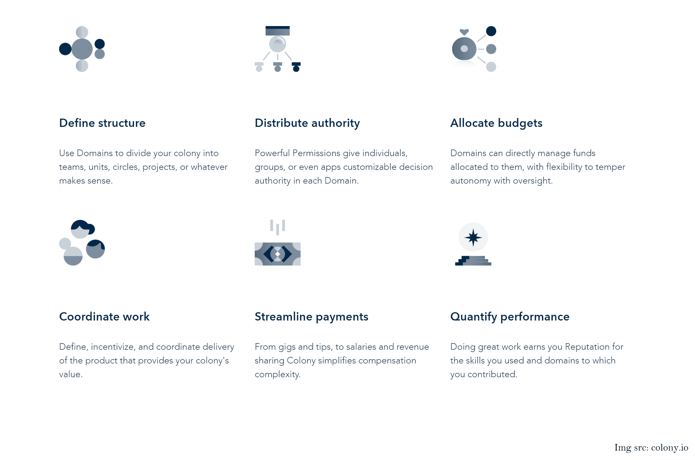

# 分散自治组织(Dao):组织代码

> 原文：<https://devops.com/decentralized-autonomous-organizations-daos-org-as-code/>

我们都熟悉“一切如代码”——这种模式始于基础设施如代码，现在已经扩展到其他领域，如架构如代码，安全如代码等等。然而，到目前为止，我们所看到的所有化身都不那么雄心勃勃！加密货币和潜在的区块链技术的黎明正坚定地将我们带向组织代码化的 T2。Org-as-code 是我们迄今为止看到的最具颠覆性的发展。加密世界对此使用了不同的术语:分散自治组织(DAO)。

在你抓狂之前，因为，“OMG 加密！”让我向你保证，我不会试图向你出售 9000 种加密货币中的任何一种。毫无疑问，crypto 使公众舆论两极分化。有些密码至上主义者认为密码是一切的解决方案。你经常听到“比特币解决了！”然后，有密码怀疑论者将这一运动简单地斥为数字郁金香——互联网时代的庞氏骗局。只有时间才能证明他们是否正确。

现在，我的观点处于两者之间的灰色地带，一些开创性的新工作方式正在发展。全球各地的人们正在以分散的、高效的、民主的和无等级的方式在密码世界中合作。互联网时代的全新概念正在试行——Dao、智能合约、假名身份、令牌组学等。仅举几个例子。

本帖坚定关注道斯。

## 那么，什么是刀呢？

“道”是一种与全球志同道合的人一起工作的方式，其中业务(组织)由其成员以民主的方式拥有和管理。

> “在传统组织中，人是核心，自动化是边缘；而在 DAOs 中，自动化是核心，人处于边缘。”–[维塔利克·布特林](https://blog.ethereum.org/2014/05/06/daos-dacs-das-and-more-an-incomplete-terminology-guide/)

与具有多层管理和官僚协调的自上而下层级结构的传统组织不同，Dao 为相互不了解也不信任的人和机构提供了一种运作模式，这些人和机构可能生活在不同的地理区域，讲不同的语言，因此受不同的管辖。代替法律合同管理人与人之间的关系，计算机代码执行规则。

DAO 的一些关键特性是:

1.  基于编码为计算机代码的规则和策略的组织设置。
2.  规则是透明的，由成员控制，而不是一个中央权力机构；通常，在公共区块链上。
3.  规则是由一组独立于人类的智能契约执行的(甚至不是创建者！)牵连。
4.  未经集团/社区批准，任何人无权访问的内置金库。
5.  决策和想法由提案管理和资助，提案由令牌持有者投票表决和管理。

Colony.io 是一家帮助建立 DAOs 的初创公司。下面一个来自他们网站的截屏让你对组织设计的元素有一个概念，这些元素可以在激进的新 DAO 世界中被(重新)定义。

## 我们真的需要 DAOs 吗？

下面是 DAO 试图解决的一些挑战，这些挑战是您在传统的集中式组织中经常看到的:

*   好的想法很难到达顶端。
*   该体系鼓励独裁领导。
*   未能利用大众的智慧。
*   从安然(Enron)或 2008 年金融危机等例子可以明显看出，少数人的贪婪导致大规模失败的可能性更大。
*   决策通常缺乏透明度。
*   好的政策是存在的——通常写在纸上或者藏在细则里——但是不可执行。
*   由于组织结构的不对称性，单点故障是很自然的。

## Dao 的示例

在你认为这是不切实际的空想之前，这里有几个现实世界中的例子

1.  [Nexus Mutual](https://nexusmutual.io/)—一种分散的“以人为本”的保险替代方案，以“道”的形式运作。它完全由其成员管理。只有成员可以决定哪些索赔是有效的。所有会员的决定都被记录在[以太坊公共区块链](https://cointelegraph.com/ethereum-for-beginners/what-is-dao)的智能合约中并强制执行。
2.  [戴和](https://makerdao.com/en/%20-)——稳定的去中心化货币(DAI)和去中心化金融应用平台(市值约 50 亿美元)。
3.  DAO 是一种风险投资形式，最初是由大众出资的代币销售。没有传统的管理结构或董事会。但它在 2016 年遭到黑客攻击，三分之一的资金被抽走。(这是一个提醒我们自己的重要例子，如果 org 是代码，那么安全问题可能是致命的。)
4.  [破折号](https://www.dash.org/)——一种数字加密货币。由称为 masternodes 的用户子集运行的 DAO，它执行标准的[节点](https://en.wikipedia.org/wiki/Node_(networking))功能，如托管区块链的副本、中继消息和验证网络上的交易，此外，它还充当股东，对改善 DASH 生态系统的提案进行投票。
5.  火烈鸟刀——通过 NFTs 处理数字艺术的刀。NFT 是不可替代的令牌，不是非功能性测试！
6.  [git coin](https://gitcoin.co/)——使用 DAO 资助数字公益项目(迄今为止使用[二次](https://www.radicalxchange.org/concepts/quadratic-funding/#:~:text=Quadratic%20Funding%20(QF)%20is%20a,accessible%20to%20the%20general%20public.&text=QF%20optimizes%20matching%20funds%20by,number%20of%20people%20who%20contributed.)资助模式资助了 2400 万美元)

这些只是几个例子。采用正在爆炸式增长，并延伸到慈善机构、自由职业者网络、风险基金、投资俱乐部等领域。

[Dao](https://ethereum.org/en/dao/)仍在不断涌现，还有许多方面有待充分探索，尤其是围绕法律地位、监管框架和合规性。然而，道的工作方式成为主流只是一个时间问题。

在我看来，DAOs 和传统组织之间不是一个二元问题。采用 Dao 的许多实践将增强传统组织，并减少我们前面提到的一些弱点。