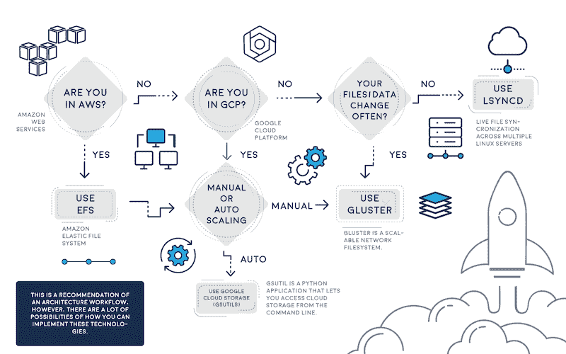

# 云环境的深度扩展艺术，第 2 部分

> 原文：<https://devops.com/deep-art-scaling-cloud-environments-part-2/>

在我们关于云环境扩展的两部分系列的第一部分中，我们探讨了一些重要的扩展因素和代码存储的最佳实践。让我们继续讨论。

## 面向下一代应用的自动扩展

有几个非常好看的云托管服务提供商提供了第一部分提到的功能:AWS、谷歌云平台(GCP)和微软 Azure。如果您打算自动扩展，最好使用这些云托管服务之一。据我所知，还有其他一些云托管服务提供商也采用了类似的方法，但它们并没有被广泛使用，或者属于平台即服务(PaaS)生态系统，因此我们不会讨论它们。

此外，重要的是要记住，在自动扩展中，所有应用程序节点都是随着新主机、新 IP 等动态变化和创建的。，所以您的同步机制需要确定如何用以后可能更改或删除的新节点来更新代码。

## 自动缩放和不死尝试的选项

### Lsyncd

Lsyncd 允许您同步集群中正在启动/关闭新实例的节点，使用[这个脚本](https://github.com/zynesis/lsyncd-aws-autoscaling)工作，它监视新节点的自动扩展组，并用新的自动扩展从节点更新 Lsyncd 主节点。发现哪些 IP 或实例在自动缩放组中是自动缩放面临的首要任务，但此脚本将有助于解决发现问题。

### GlusterFS

另一种方法是使用 GlusterFS，它可以确保高可用性和 web 节点之间的同步。您至少需要两个实例，以防其中一个失败。另一个实例可以加入进来，并且仍然能够容忍故障。一旦失败的实例重新联机，它将再次添加到集群中。GlusterFS 的工作方式类似于主/主或主/从。我不会介绍如何配置 GlusterFS，但我确信在 AWS EFS 发布之前，这种方法是一个非常好的选择。如果你没有使用 AWS，这是一个很棒的选择。

另一方面，如果您将 AWS 环境与 EFS 一起使用，请考虑使用“AWS 用户数据”将 web 节点注册到主节点，这样每次 ASG 创建新的 EC2 实例时，它都会将这个新卷注册到主节点，并保持数据与其余节点同步。

### 预烘焙 AWS AMIs(旧方法)

鉴于您的代码不会更改或几乎不会更改，烘焙 AWS AMI 并更新自动缩放启动配置将会达到目的——这是一种较老但仍在使用的方法。当您有了一个定义好的代码发布时间表和开发工作流时，您可以为每个新的代码发布烘焙一个 AMI，并且一旦准备好，就回收节点以使用带有最新代码更新的新 AMI。有很多关于这种方法的教程。

### 管理服务器(主要用于基于 WordPress、Drupal、Magento 和 CMS 的应用程序)

另一个大胆的方法是使用自动扩展组之外的管理或主服务器。这通常用于将代码从主服务器同步到缩放组，但是我认为这是对服务器资源的浪费，而这些资源可以用在自动缩放组中。我推荐 WordPress 或 Magento 网站使用这种方法；除此之外，考虑将 wp-admin 或管理员 URL 代理到管理服务器，或者将 CMS 直接更新到管理服务器。和 NFS 一样，AWS EFS 将通过 WordPress、Magento、joomla 和基于 CMS 的应用程序来简化一切。[点击这里](https://harish11g.blogspot.mx/2012/01/scaling-wordpress-aws-amazon-ec2-high.html)查看我所说的例子。

### 实施 AWS EFS

最后，最简单的方法是 AWS 弹性文件系统-EFS。亚马逊网络服务在几个月前发布了 EFS，认为这是一项非常有前途的技术——一种类似于 NFS 但有所改进的分布式文件系统——可以将其视为一种复杂的 NAS 解决方案。在 AWS Re:invent 期间，该公司表示，EFS 基于 NFSv4.1，但网络性能更好，是 pNFS 的一种变通方法。几个月来，我一直在等待 AWS 的武器库中有这样一个组件，尽管早期访问只适用于弗吉尼亚地区。然而今天，它在所有 AWS 地区都得到支持——耶！

EFS 可以挂载为 fstab 中的本地挂载点，类似于 NFS，并且您可以在 AWS 自动伸缩组之间共享您的代码:在/etc/fstab 中设置您的 EFS 卷，以便在每次重新启动时自动加载。所以，如果你在 AWS，用 EFS；这将有助于一切——真的。为了实现这种方法，请确保使用 EFS 挂载点更新每个 EC2 实例中的用户数据，这样每次创建新实例时，它都会自动拥有 EFS 卷。

注 1:所有 EFS 挂载点应该在同一个区域；如果 EC2 实例试图从另一个 EFS 地区挂载，这是不允许的。

更多细节可以在这里找到[。](http://www.julianwraith.com/2016/07/aws-elastic-file-system/)

## 谷歌云平台

那么，我们有什么谷歌云平台呢？我建议使用 GlusterFS、Lsyncd、rsync 或谷歌云存储——尽管它与亚马逊 S3 共享许多功能，但速度更快。谷歌声称其云存储比亚马逊 S3 更快，因为它在世界各地有无限的边缘点，是的，这是正确的。在您的自动伸缩小组中共享代码的最简单的方法是使用 Google 云存储和 GSutils。此外，您可以使用 GSutils 并在每个 Google 实例中调用 bucket 只要确保访问者/用户不会更改实例中的代码或静态内容。此外，Gsutils 有助于将 bucket 数据同步到实例数据，以保持同步。如果您的代码随着流量动态变化，您需要使用 gluster 或 Lsyncd，因为它的部署非常复杂，因为 Google auto scaling 总是回收实例/IP，需要一些变通办法。

## 不要忘记扩展数据库！

另一个我们没有触及的主题是扩展数据库，针对 AWS RDS、DynamoDB、Postgresql、Mysql 和 Nosql 数据库。所有这些现代数据库都易于扩展；其中一些是 PaaS，如 DynamoDB 或 RDS。对于 Postgresql，MySQL 仅用于手动伸缩，即向主/从集群添加新的数据库节点。在 AWS RDS 中，只需点击几下，您就可以获得一个从属“副本”,而且您已经在扩展了。但是我不会进一步讨论它，因为它超出了本文的范围。

## 扩展微服务和无服务器应用

毫无疑问，这些话题需要再谈一谈。将会有另一个时间来探索这个新的架构方法，将您的应用程序分成几个部分。微服务正在改变 IT 范式，但要在这一新范式中生存下来，您需要先了解云的扩展，然后再发展到采用 Docker、Consul、Compose、RancherOS、AWS ECS、Kubernetes 和无服务器应用架构的微服务。

## 结论

如您所见，当您处理自定义应用程序或基于 CMS 的应用程序时，扩展应用程序是一项挑战。通过这篇文章，您可以了解如何使用定制应用程序进行扩展的各种选择及其利弊。每个人都使用他们自己的扩展过程，严重的是，他们从来没有适合其他应用程序的需求。现在 AWS EFS 已经推出，我会尽可能推荐它，但是如果您没有使用 AWS，请实现 Lsyncd 或 GlusterFS，但是不要忘记其他方法也可以帮助您实现扩展目标。

## 关于作者/阿方索·巴尔德斯

 Alfonso Valdes 是 [ClickIT Smart Technologies](https://www.clickittech.com/) 的首席执行官和创始人，这是一家专注于在 Linux 和开源技术中高度灵活的现代云应用程序的架构和实施的 IT 机构。他在可扩展架构、分布式系统和开发云原生应用领域拥有超过 8 年的 IT 经验，曾在多家美国公司工作过，例如:Sprint Nextel、德州仪器和 Nike USA。如今，他鼓励企业加入云计算。在 [LinkedIn](https://mx.linkedin.com/in/alfonso-valdes-75a55714) 上与他联系。