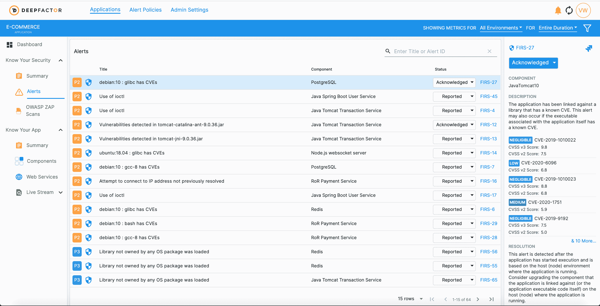

# DeepFactor 为开发人员统一了性能和安全监控

> 原文：<https://devops.com/deepfactor-unifies-performance-and-security-monitoring-for-developers/>

DeepFactor 今天发布了它所描述的第一个专门为预生产环境设计的连续监控平台。

公司首席执行官 Kiran Kamity 表示， [DeepFactor 生产前监控](https://a9c2j7h6.stackpathcdn.com/wp-content/uploads/2020/08/Datasheet-DeepFactor-20200824.pdf)平台将安全性、性能和行为监控结合在一起。基于“深度被动监控”功能，该功能要求开发人员将文件添加到容器映像以检测应用程序，该平台将通过该文件收集的遥测数据提供给应用程序运行时智能引擎。他说，该引擎暴露了潜在的安全和性能问题，以及应用程序版本之间的风险和意外行为变化。

对应用环境的扫描是通过 DeepFactor 门户网站启动的。然后将每次扫描与一组由 DeepFactor 研究团队开发和维护的可配置规则进行比较，以识别应用程序不当行为的指标。该引擎还学习应用程序环境，随着时间的推移，DeepFactor 能够基于阈值触发、已知的不良行为、异常检测和其他属性生成警报。

DeepFactor 生产前监控平台还附带了针对广泛使用的 DevOps 工具的预打包集成，包括吉拉、詹金斯、Slack 和 GitHub。

除了商业平台，DevOps 团队还可以利用 DeepFactor 标准版，该版本对非商业开源项目是免费的，没有用户限制。

在理想情况下，开发人员应该在将应用程序部署到生产环境之前很久就解决包括安全性在内的问题。问题是开发人员被要求使用太多的工具来实现这个目标。Kamity 表示，DeepFactor 预生产监控平台将使开发人员更容易以无摩擦的方式提出见解。

大多数采用最佳 DevOps 实践的组织都将可观察性作为核心原则。他们面临的挑战是让开发人员能够在构建应用程序时轻松地对其进行检测，然后理解收集到的所有遥测数据。这一点尤其重要，因为开发人员试图在补救安全问题和优化性能之间取得平衡，以更好地确保整体用户体验。现有的开发人员工具针对性能进行了优化；要求开发人员转换工具来解决潜在的网络安全问题是一项任务，这项任务可能会被延迟到基本上被遗忘或完全忽略的地步。

目前还不清楚开发运维团队在多大程度上拥有部署自己的监控工具所需的预算资金，而不是依赖 It 运营团队部署的现有监控工具。但是，部署和更新传统 it 监控平台所需的代理软件通常需要花费大量时间。DeepFactor 正在使用一个相对轻量级的容器来捕获遥测数据，该容器可以添加到单片或基于微服务的应用程序中。

当然，如果应用程序已经在预生产环境中进行了测试，那么使用相同的监控平台来观察生产环境中的应用程序可能是有意义的。然而，说服 IT 运营团队将他们现有的监控工具换成让开发人员的生活更轻松的工具可能是一项艰巨的任务。