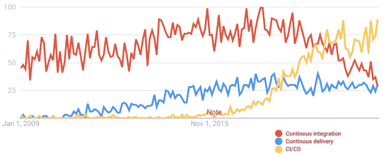

# 定义下一个技术周期

> 原文：<https://devops.com/defining-the-next-cycle-of-technology/>

我们正处于 ScyllaDB 所谓的下一个技术周期。不是“明天的世界”，也不是“未来事物的形状”，也不是“未来的浪潮”——因为它今天已经在这里了。 我们就在其中。这是一个带着我们前进的浪潮，但它始于本世纪初开始的趋势。

从你运行的硬件到你使用的语言和操作系统，再到你日常使用的操作 方法，一切都在同步发展。所有那些熟悉的技术和商业模式本身都在经历革命性的变化。

### 下一个技术周期远远超出了“大数据”

我们说的是 *庞大的* 数据。欢迎来到 [Zettabyte 时代](https://en.wikipedia.org/wiki/Zettabyte_Era) 。这个时代，取决于谁在定义它和它在测量什么，要么开始于 2010 年(如果你在测量地球上存储的总数据)，要么开始于 2016 年(如果你在测量一年内的总互联网协议流量)。

右 现在， 一个个数据密集型企业 每天都在以 Pb 的速度产生信息，存储总量为 EB。有一些预言家认为，到 2025 年，我们将看到人类、我们的计算系统和我们的物联网机器每天产生半吉字节的数据。

然而，反过来，我们也看到了 小 数据的重要性。看看基因组学革命。

因为，比如说，新冠肺炎的 RNA 基因序列实际上[没那么大，就数据而言](https://www.ncbi.nlm.nih.gov/nuccore/1798174254/)——你可以把它存储在不到 100kb 的空间里；不到一个古老的软盘。但是理解这些信息的每一个字节变得越来越重要，因为针对全球疫情的疫苗接种需要理解缓慢进化的病原体的每一个变化。

因此， 下一个技术周期必须扩展从 大数据到小数据系统的一切。您将使用的数据库和您执行的数据分析需要与您管理的数据量、多样性 和速度保持一致。

### “太好了！现在让它全部成为多云！”

此外，下一个技术周期 不仅仅是“云计算周期”AWS 于 2006 年推出。谷歌云于 2008 年推出。而微软 Azure 是在 2010 年正式推出的。 所以， 公有云的黎明已经过去十多年了。然而，下一个技术周期 肯定会在这些提供的 生态系统、方法和技术的基础上构建 。

你使用的数据库也必须与你需要部署它的地方保持一致。它只能在云中工作，还是可以部署在远离防火墙的内部？它是只与一家云供应商合作，还是可以部署到任何一家云供应商？还是全部同时进行？这些都是重要的问题。

正如我们不希望被束缚在旧的思维和行为方式中，行业也不希望被束缚在任何一家技术提供商身上。

如果你刚刚掌握了使用 K ubernetes 在单个云上运行有状态分布式数据库的艺术，那还不够好。现在你被要求重新做一遍；这一次是在混合或多云环境中，使用 Anthos、OpenShift、Tanzu、EKS Anywhere 或 Azure Arc。

### 超越摩尔定律的计算

这也不是基本的宽带或无线互联网 网络革命。我们在这两个领域已经发展了整整 20 年。然而， 千兆 宽带和新的多样化 5G 服务(也能够扩展到千兆)的出现，为实时数据流服务、物联网 等带来了令人难以置信的新机遇。

那么，当您需要连接到远近的系统时，您的数据库是如何工作的呢？光速的限制对你的延迟有多重要？在每秒千兆比 t 的规模上，你能很好地处理从数亿个端点获取的数据吗？

最后，支撑所有这些的是硅的原始能力，这可以通过当代 CPU 的晶体管和内核数量来总结。我们已经达到了 64 核 CPU。下一代将会翻倍，在这里一个 CPU 将会有超过 100 个处理器。在一台机架式高性能计算机中装满这些内核，您可以轻松地在每台服务器上部署数千个内核。

所有这些都只是传统的基于 CPU 的计算。你也有 GPU 的进步 正在推动像区块链这样的分布式账本技术的世界。 Plus， 所有这一切都是 同时发生的，因为 IBM 计划在 2023 年推出 1000 量子位的量子计算机，谷歌计划在 2029 年推出 100 万量子位的计算机 。

下一个技术周期由 和 这些根本性的革命性能力推动。正是让实时[全流数据](https://devops.com/how-stream-processing-goes-beyond-real-time/)从任何人到任何地方成为可能。这只是基础设施。

如果您深入了解该基础架构，您会发现每个硬件架构瓶颈点都在经历着自己的变革。

我们已经看到了 CPU 密度的增长。然而，普通的独立 CPU 本身也正在让位于全 s 片上系统(或 SOC)。

虽然它们在过去已经被用于高性能计算，但预计会看到拥有超过 1000 个 CPU 的常见服务器系统。这些将是下一代的主力—或者更具体地说，是 战马——能够承载巨大工作负荷的巨大野兽。

内存，另一个经典瓶颈，正在从今天的[【DDR 5】](https://en.wikipedia.org/wiki/DDR5_SDRAM)[DDR 6](https://www.digitaltrends.com/computing/samsung-developing-ddr6-gddr7-twice-as-fast/)短短几年间得到巨大的提升。密度正在上升，所以你可以期待看到具有全兆兆字节 RAM 的战马系统。这些以及更大的规模将会越来越普遍——而且，对于企业来说，更容易负担得起。

随着最近批准的[base](https://nvmexpress.org/developers/nvme-specification/)和[transport](https://nvmexpress.org/developers/nvme-transport-specifications/)规格，储物也看到了自己的革命，这将使【NVMe】更容易在织物上实施。

现在，软件必须赶上这些能力。正如纵向扩展的盒子中的内核和应用程序需要时间才能实现 无处不在的异步、无共享、每核分片和 NUMA 感知，下一个技术周期将要求系统适应全新的方法，以充分利用这些新的硬件功能。我们将 需要 重新考虑许多基础软件假设 。

### 演进的方法:敏捷和超越

说到方法论，让我们看看从千禧年开始到现在的这些方法。作为一个行业，我们已经从周末多 小时停机时间执行的批量操作和整体升级，转变为一个 24 × 7 × 365 全天候连续交付流数据和软件的世界，从未出现过零停机时间。

通过迁移到云(以及这个永远在线的世界)，我们将自己和我们的组织暴露在一个随机混乱和安全威胁的世界中。我们现在 必须 自主运营服务器群，并在内部、ed ge 和多个公共云供应商环境中协调它们。

虽然 Scrum 从 20 世纪 80 年代就已经存在，并且从 1991 年开始持续集成，但是在本世纪，2001 年的 [敏捷宣言](https://agilemanifesto.org/) 中的 [十二原则](https://agilemanifesto.org/principles.html) 改变了软件开发方式的根本哲学——更不用说方法论了。

敏捷宣言的第一行就谈到了最高优先级是“通过早期和持续交付有价值的软件来满足 cu 客户”

然而， 我们今天所知道的连续交付(CD)这一特定术语直到 2009 年才出现。然后它被加入到持续集成中，并与我们现在所知的 devo PS的诞生相吻合。

有了它，你就有了一个通过响应式开发人员文化来定义面向变化的过程和软件生命周期的框架，现在，这场革命已经进行了一二十年，每个人都认为这是理所当然的。

*该图展示了 持续集成(CI)和持续交付(CD)是如何独立发展的。 它们最终被 CI/CD 这个词连接在一起，这个词作为搜索词的受欢迎程度在 2016 年左右才开始上升，直到 2020 年初才取代这两个独立的词。现在越来越少单独提到 CI 或者 CD，根据*[Google Trends](https://trends.google.com/trends/explore?date=2009-01-01%202021-12-20&q=Continuous%20delivery,Continuous%20integration,CI%2FCD)*。*

在巴塞尔协议的基础上，建立了工具、系统和哲学，扩展了这些基本原则。世界上的混乱猴子，以及 [圣灵降临者](https://devops.com/what-developers-really-think-about-pentesting/) ，想要打破你的系统——或者打破它们——在事情变得 混乱和灾难性或者有人恶意地为你做这件事之前发现缺陷和瑕疵。

像 Kubernetes 这样的云原生技术和像 GitOps 这样的基础设施方法论的单一来源被创造出来 完全是为了将系统扩展到所管理的成千上万的生产软件部署。

### DevSecOps

这还不够。我们已经看到了像网络安全管理软件产品这样的软件供应链攻击，低级系统 at 的攻击，像 Spectre ，Meltdown 和 Zombieload 之类的人为因素威胁，如病毒性深度假货 和数百万个虚构的社交媒体帐户使用由生成性对抗网络生成的个人资料图像，更不用说数百万个支持物联网的 设备了就在最近 y，关于 [Log4j 漏洞](https://nvd.nist.gov/vuln/detail/CVE-2021-44228) 的新闻爆出——我们向所有在过去的假期中修补代码的人致以最美好的祝愿。

这些都只是即将到来的的冲击波。

所以现在，你的 AI 驱动的 securi ty 系统每天都处于实时战斗状态，对抗试图破坏你正常运营的威胁行为者 。我们知道这一点，因为越来越多的入侵防御和恶意软件分析系统是使用分布式数据库作为底层存储引擎，以超过万亿字节的规模构建的。

因此，这些天来，不仅仅是 DevOps，我们越来越多地谈论——因为安全不能是事后的想法。即使是为了你的 MVP。2022 年不会。

这些方法还在继续发展。

### 总结

下一个技术周期已经来临。我们正忙着呢。你会有这种感觉，就像你渴望重大的人生 或者职业改变一样。可能是编程语言 rebase。是时候把你的一些核心代码重写为 Rust 了吗？或者，您可能正在考虑通过一个 AWS 前哨 迁移某些云 工作负载或 扩展您最喜欢的内部云服务 suc h as 。或者也许 你在 实际上在找 把数据移到边缘？计划大规模的散开？无论这种巨变对您意味着什么，您都需要坚如磐石的 基础架构，该基础架构目前可以将工作负载立即投入生产，但又足够灵活，能够随着您不断涌现和发展的需求而不断增长。