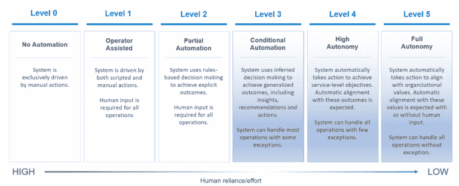

# 戴尔更新 AIOps 平台以更好地自动化 IT 运营

> 原文：<https://devops.com/dell-updates-aiops-platform-to-better-automate-it-ops/>

戴尔技术公司本周更新了其注入人工智能的 IT 运营平台，称为 CloudIQ，以增加对其 PowerEdge 服务器的支持。此外，戴尔承诺下个月将增加对其 PowerSwitch 网络硬件的支持，这是其持续努力的一部分，旨在将其 [AIOps](https://devops.com/?s=AIOps) 平台扩展到整个戴尔 EMC 产品组合。

与此同时，戴尔下个月还计划采用 webhooks 和 REST 应用程序编程接口(API)来将 CloudIQ 云服务与第三方平台集成，并通过 ServiceNow、Slack、Microsoft Teams、Ansible 和 vRealize 等工具和平台共享通知和建议的操作。

戴尔还定义了一个自主运营框架，该框架定义了随着 CloudIQ 的不断发展，组织应该能够利用的 AIOps 功能的各个阶段。

戴尔技术产品管理副总裁 Drew Schulke 表示，CloudIQ 目前使 IT 组织能够实现该框架的第三级。Schulke 指出，随着戴尔在提供持续基础架构升级的同时继续更新 CloudIQ，附加功能将稳步增加。

戴尔正在为其基础架构及其提供的 IT 运营平台的标准化寻找理由。无论是由内部 IT 团队收购和管理，还是使用戴尔提供的“即服务”,目标都是说服 IT 团队减少对与 CloudIQ 集成不紧密的竞争对手基础架构平台的依赖。Schulke 说，实际上，戴尔正在将持续智能作为 AIOps 服务提供。

当然，IT 运营团队可以选择在集成了多家供应商提供的基础设施的 AIOps 平台上实现标准化。然而，戴尔认为，针对其平台优化的 AIOps 框架将降低 IT 的总成本，这是 IT 组织无法忽视的。

每个 IT 组织都需要自己决定什么样的前进道路对他们最有意义。然而，随着越来越多的人工智能功能被注入 it 运营平台，IT 团队日常执行的许多任务变得越来越自动化变得越来越明显。大多数组织将需要在未来几个月内做出决定，他们在多大程度上愿意等待现有的 IT 运营平台通过人工智能功能得到增强，而不是购买一个可能更先进的新平台。

不管前进的道路如何，AIOps 给 IT 团队带来的文化干扰程度将会很高。很自然，DevOps 团队一直处于 IT 自动化的最前沿。然而，IT 运营方面的大多数最新进展通常都是以零敲碎打的方式应用的。像 CloudIQ 这样的平台被设计成在更加端到端的基础上实现。

这种自动化水平将对从 IT 团队可以支持的应用程序数量到组成该团队的个人角色的方方面面产生深远的影响。AIOps 不太可能取代对这些 It 团队的需求，也不太可能扩大他们的规模，并重新定义他们被要求执行的工作。