# 使用 Azure DevOps CI/CD 管道部署到 Azure 应用服务

> 原文：<https://devops.com/deploying-into-azure-app-service-using-azure-devops-ci-cd-pipeline/>

本文演示了如何使用 Azure DevOps (VSTS)持续集成/持续交付(CI/CD)管道将应用程序部署到 Azure App Service 中。

在本文中，您将创建一个示例环境来:

*   基于代码的新构建提交到您的 Azure DevOps Repo。
*   自动将你的应用部署到 Azure 中。

**先决条件:**

*   Azure 门户帐户、Azure 订阅和 Azure DevOps (VSTS)帐户。
*   Azure 资源组。
*   在 Azure 中创建 web 应用程序。记下应用程序服务 URL，您稍后会用到它。

## **什么是 Azure App 服务？**

Azure App Service 使您能够以自己选择的编程语言构建和托管 web 应用、移动后端和 RESTful APIs，而无需管理基础架构。它提供自动扩展和高可用性，支持 Windows 和 Linux，并支持从 GitHub、Azure DevOps 或任何 Git repo 进行自动部署。

### **在 Azure 中创建资源组**

在 Azure 中订阅后，您需要创建一个资源组来管理 Azure 中的资源。最佳实践是为每个环境(开发、集成、质量保证、测试、PERF、生产)维护一个单独的资源组，并遵循适当的命名约定。要创建一个资源组，从左侧刀片中选择**资源组**，点击**+添加，**，然后选择**订阅，**给资源组一个合适的名称，点击**查看+创建**。

### **创建应用服务**

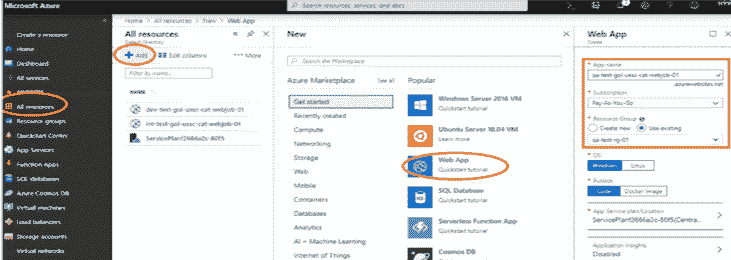点击面板左侧的**所有资源**，点击**添加**，然后选择 **Web App** ，给你的 App 服务起一个合适的名字。然后选择**订阅**并选择已有的资源组。将剩余选项保留为默认选项。并点击**创建**。

创建应用服务后，点击该应用服务并进入**概述**。在那里，您可以识别属于该应用服务的所有细节，包括状态、资源组、订阅和 URL(请记下这一点；你以后会需要它的)。

### **创建服务主体**

当应用程序需要通过 ARM 或 Azure 中的 VSTS 访问部署或配置资源时，您需要创建一个服务主体，这是您的应用程序的凭证。

进入**Azure Active Directory**->**App 注册** - > **新应用注册**，然后给服务原则命名，选择应用类型，给它一个自己选择的 URL。创建应用程序注册后，从该服务转至**设置**并记下应用程序 ID，然后转至**密钥**创建密钥并复制密钥值。(注:后期不出现，请保存在安全的地方。)

**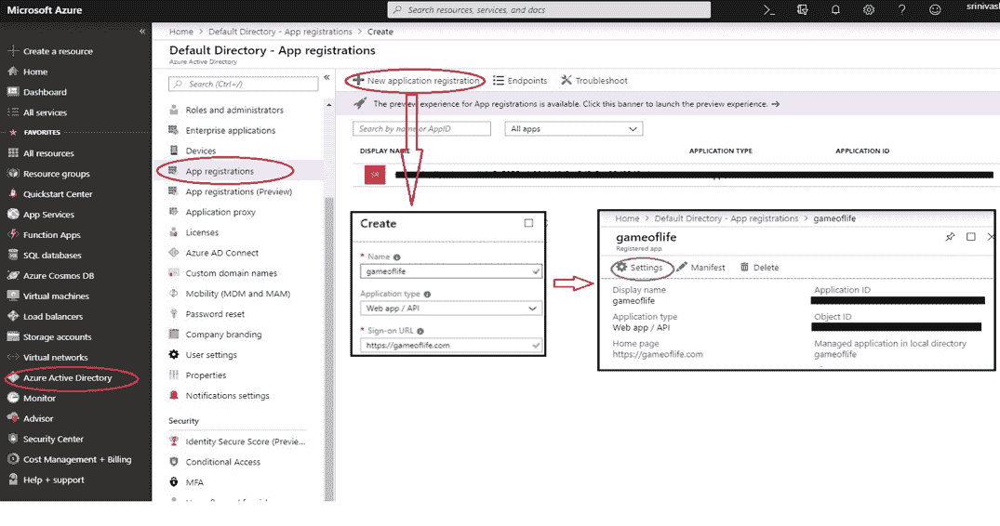**

**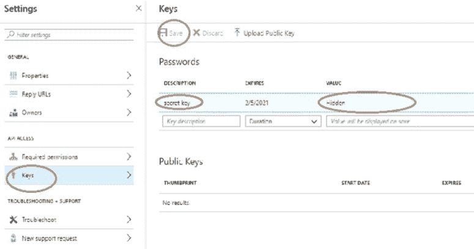**

### **在 VSTS 创建一个新项目**

第一步是在 Azure DevOps (VSTS)中创建一个帐户，然后按照下面的步骤开始应用程序部署。在这里，我从 GitHub repository 获取了[基于 java 的示例开源代码](https://github.com/wakaleo/game-of-life.git),并将其导入 Azure DevOps repo。(可以把自己的源代码推送到 repo 里。)是一个简单的多模块 Maven 项目。该应用程序是康威的“**生活游戏**”的一个非常简单的在线版本

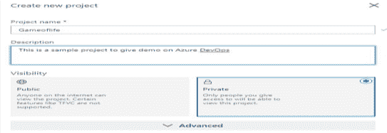要创建一个新项目，点击**创建新项目**，给你的项目起一个合适的名字，然后选择创建。然后进入 **Repos，**点击 **Import** ，然后选择 source type，在 **Clone URL** 选项卡中输入上述 URL，选择 **Import** 。源代码将导入到您的存储库中。

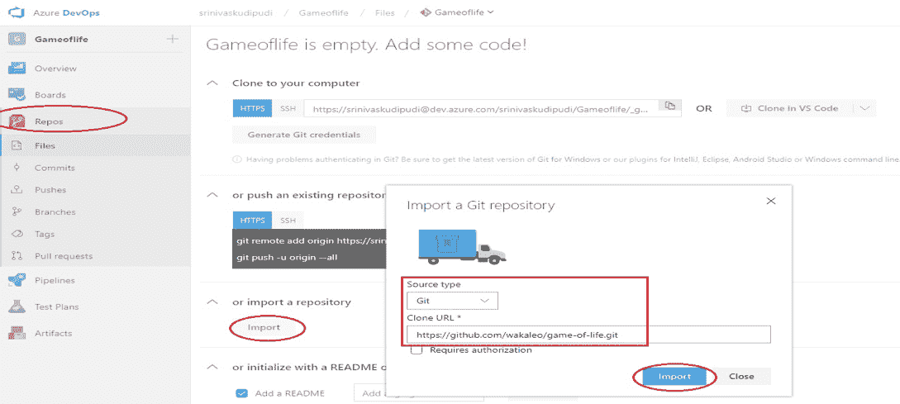我们需要为我们的项目提供服务连接，所以在我们的项目主目录中从 blade 的底部进入项目设置，然后选择**服务连接** - > **新服务连接** - > ** Azure 资源管理器**。点击弹出窗口中的“使用服务连接对话框的完整版本”，然后将应用程序 ID 粘贴到**服务主体客户端 ID** 选项卡中，并将密钥值粘贴到**服务主体密钥**选项卡中(在创建应用程序注册时保存)。然后点击**确定**。

### **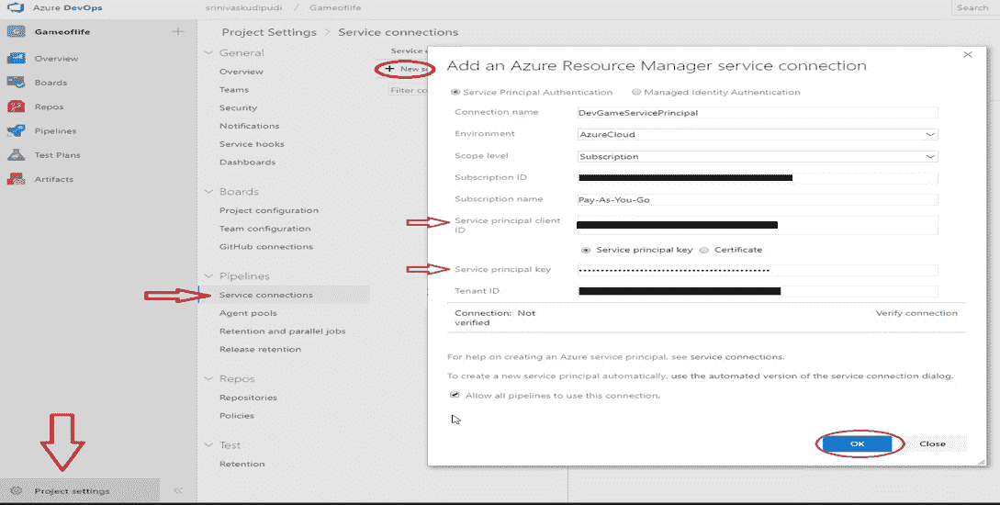创建持续集成(CI)构建**

进入**管道** - > **构建** - > **新建管道**，然后点击“使用可视化设计器”它将询问源代码回购细节，因此选择 **Azure Repos Git** 并选择**团队项目**，这是您在项目开始时创建的，选择**存储库**和分支名称，然后单击**继续**。

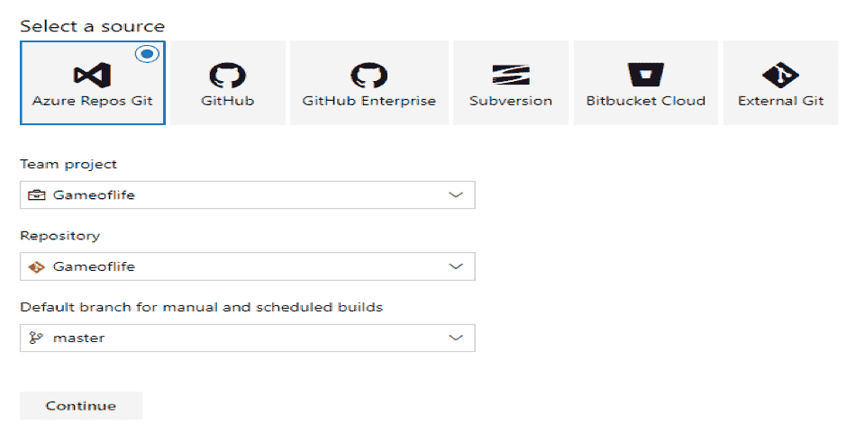 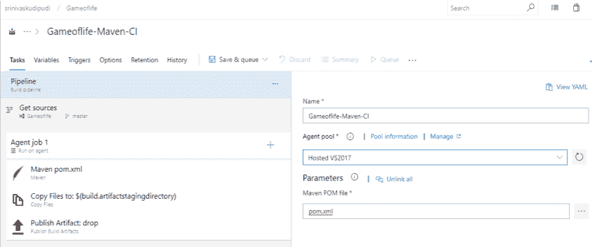 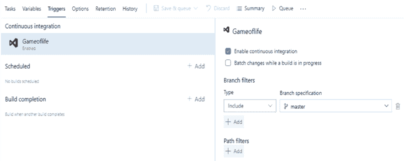接下来，选择一个模板 **Maven** ，键入管道名称并为代理池选择 **Hosted VS2017** ，点击 Maven POM 文件中的 **pom.xml** 。在那里，您可以将目标列为**清理包**，并选择**复制文件**。请在内容部分输入 ****/*。war** 然后转到 P**publish Artifact:drop**，将工件名称列为 Gameoflife，并将所有剩余选项保留为默认值。然后，在**触发器**下，选择**使能连续积分**并给出右边列出的分支滤波器，使能连续积分特性。一旦开发人员将他们的更改提交到 master 中，CI 构建将自动触发。

配置完成后，点击管道顶部的**保存**和**队列**来触发 CI 构建。(每次提交到 master 都会触发新的构建。)

### **创建连续交付(CD)管道**

**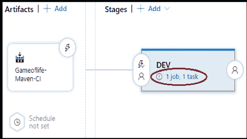** 转到**管道** - > **发布** - > **新发布管道**，然后选择模板 **Azure App 服务部署**，列出阶段名称为 **DEV** ，点击**添加一个工件**。选择项目和源(构建管道)，然后选择默认版本为**最新**，点击**添加**。点击**任务**(在 DEV 下面)，选择**运行在代理**上，选择代理池为**托管 VS2017** ，然后点击加号( **+** )，搜索模板**文件重命名**并选择**。从源文件中 war** 文件并给它新的名字 **ROOT.war** 。

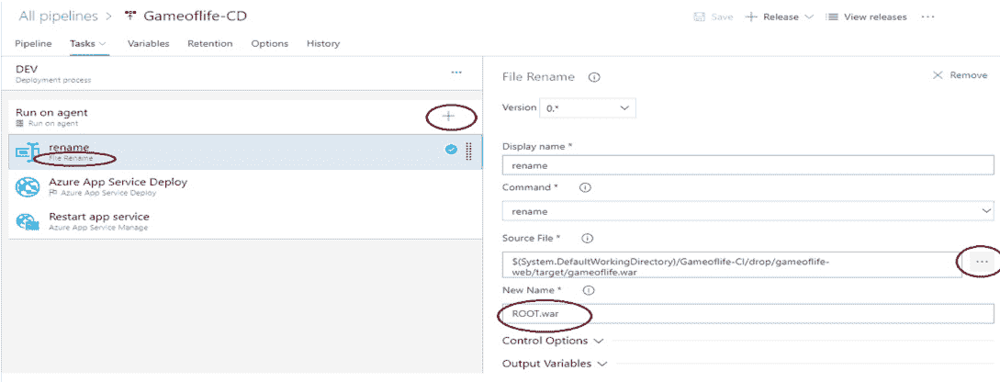在显示名称框中，列出 **Azure App 服务部署**。在 **Azure subscription** 字段中，您需要选择一个服务主体名称来授权资源。然后选择 **App 类型**和 **App 服务名称**。在**包或文件夹**选择中，选择 war 文件并将其重命名为 **ROOT.war** ，因为对于基于 java 的应用程序，我们需要将我们的应用程序部署到一个适当的目录结构中。

最后，选择模板 **Azure App service manager** 并选择 **Restart** 选项，确保选择您在 **Azure app service deploy** 窗口中选择的相同订阅和应用服务名称。点击**保存**，然后点击**发布**->-**创建发布**->-**选择工件构建号**->-**创建**。然后，构建将触发并部署到应用服务中。

现在，您的代码已成功部署到 Azure App Service 中。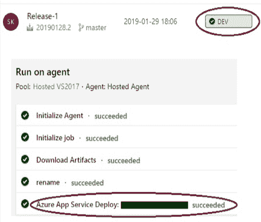

您可以从任何浏览器(如[https://xyz-abc-webjob-01.azurewebsites.net](https://xyz-abc-webjob-01.azurewebsites.net))使用 app service URL 访问，并可以使用以下 URL 检查代码是否部署成功:【https://xyz-abc-webjob-01.scm.azurewebsites.net】T2。

— [斯里尼瓦斯·库迪普迪](https://devops.com/author/srinivas-kudipudi/)