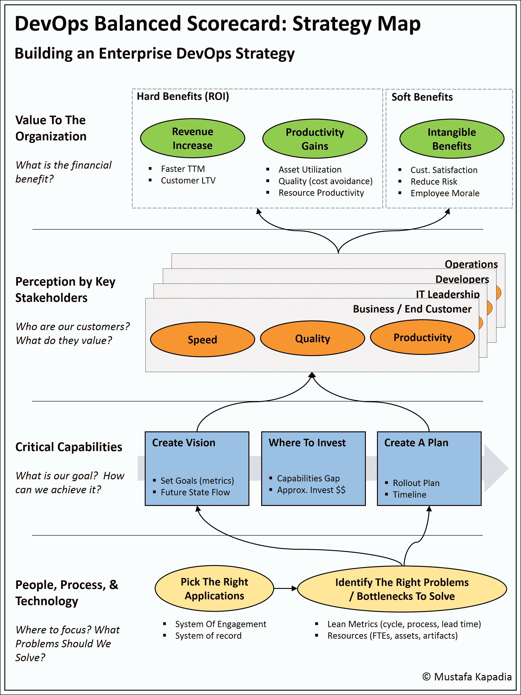

# 设计 DevOps 战略:平衡计分卡框架

> 原文：<https://devops.com/designing-devops-strategy-balanced-scorecard-framework/>

尽管有关于 DevOps 的大肆宣传，但很少有关于正式 DevOps 策略的文章。开发运维计划经常从工具讨论开始，并在技术上停滞不前。更大的愿景很少被讨论。本文的目标是为各种规模的企业提供一个框架来创建这一愿景并释放 DevOps 的承诺。

## DevOps 战略的要素

从最基本的层面来看，全面的 DevOps 战略必须回答以下问题:

*   应该把精力放在哪里？我们从哪里开始？
*   我们要解决什么？
*   我们的目标是什么？我们将如何解决它？需要多长时间？
*   这对大型企业有什么影响？谁是我们的利益相关者，他们看重什么？
*   这值得做吗？收益和成本是什么？

如果实施正确，一个好的战略可以为组织提供关注点，对当前问题形成一个共同的(不偏不倚的)观点，发展未来状态，揭示增长机会，并导致更好的业务产出。

## DevOps 战略地图:平衡计分卡框架

平衡记分卡通常由四个高层次的视角组成，这些视角突出了构建战略所需的关键实践和目标。我们选择这个框架主要是因为它在三个方面做得非常好。首先，它提供了一种创建策略的训练有素的方法。其次，它将关键活动联系在一起，并描述了它们之间的因果关系。第三(也是最重要的)，它易于使用和遵循。

记分卡通常是自下而上阅读的。下面附上为 DevOps 修改的平衡计分卡。

DevOps Strategy Map

**1。人、流程&技术**

在 DevOps 中，我们拥有大量的奢侈品:大量的应用程序、技术、竞争计划、瓶颈、模糊的问题、工具等等。该维度的目标是缩小应用选项的范围(记录系统与参与系统)，并针对真正重要的问题(价值流映射练习)。通过这样做，我们为组织带来了清晰度和重点，并大大提高了成功的机会。

**2。关键能力**

下一步由三项活动组成–创建愿景(包括未来状态价值流)、确定投资方向以及制定实施计划。做这个练习时，有三件事要记住。首先，为你的愿景选择硬目标。不要“提高速度”，而是尝试“提高 25%的速度”。第二，特别注意能力差距。然后，差距可用于确定投资领域、大概预算以及投资回报模型的关键输入。第三，确保对瓶颈进行优先排序。将优先级列表放在时间线上可以快速转化为实施计划。

**3。主要利益相关方的看法**

下一个关键步骤是确定你的关键利益相关者，确定他们的优先级，并相应地调整你的策略。要考虑的一些关键利益相关者是业务/最终客户、CIO 和 IT 领导、开发、运营和安全。一旦确定，将愿景中的价值驱动因素与每个利益相关者匹配起来。这与前一部分的输出一起，将突出您的未来状态解决方案的缺陷、其可行性和政治反对意见。

**4。**对组织的价值

财务收益部分是平衡计分卡的基石。通过使用前面部分的输出，业务案例将整个策略结合在一起。至于好处本身，它们有硬的和软的两种形式。我们看到的最常见的好处列在上面的图表中。为了获得投资回报，将硬收益与上一节的投资结合起来。

## 最后一件事

战略地图应该是迭代式的——devo PS 解决方案的伟大之处在于它不是一种“一刀切”的方法。尝试以上所有步骤。移动事物，改变范围，更新解决方案，重新定义愿景，直到你提出一个对你的组织来说既具有变革性又可实现的目标。

DevOps 是一个两步走一步退的旅程。祝你好运！！

*特别感谢[苏尼尔·乔希](https://www.linkedin.com/in/sunil-joshi-22424b)和[艾米丽·彭斯](https://www.linkedin.com/in/emily-pence-92781ba2)帮助创建战略地图。要了解如何使用该地图的更多信息，请参加我们的 [IBM 互联](https://www.ibm.com/cloud-computing/us/en/interconnect/)。*

## 关于作者/穆斯塔法·卡帕迪亚

 Mustafa Kapadia 是 IBM devo PS practice 的服务线负责人，这是一项业务咨询业务，致力于帮助大型企业转变其软件应用交付方式&。他在技术领域有超过 17 年的经验。空间，既是服务提供商，又是管理顾问。

在加入 IBM 之前，Mustafa 是德勤战略与运营部的管理顾问。他住在旧金山湾区，是一个狂热的博主(如果时间允许的话)，一个演说家，也是初创企业的顾问。

与穆斯塔法 [LinkedIn](https://www.linkedin.com/in/kapadiamustafa) | [Twitter](https://twitter.com/mkapadiatweets) 联系