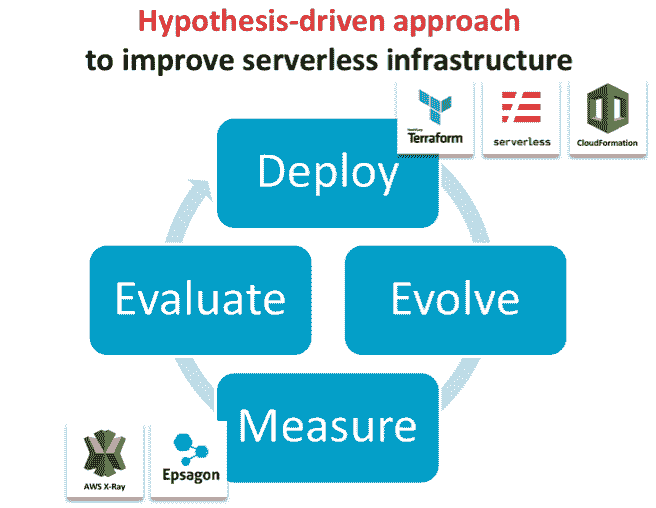
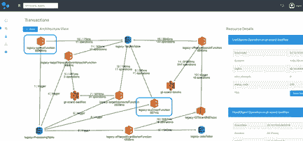
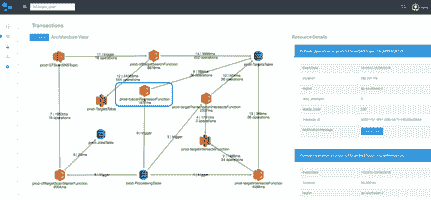

# DevOps 2.0:无服务器云架构的新发展

> 原文：<https://devops.com/devops-2-0-a-new-evolution-of-serverless-cloud-architecture/>

科学教会我们制定假说，并通过实验来检验它们，以便系统地前进。虽然这听起来合乎逻辑，但是 devo PS——尤其是软件架构——并没有遵循这种方法，因为当前的工具使得这太麻烦了。所以，架构的选择通常是由 HiPPO 做出的(收入最高的人的意见)。

然而，开发的速度，尤其是在无服务器或功能即服务(FaaS)领域，使得为 HiPPO 有效工作收集所有必要的信息变得困难。例如，据 AWS 称，它平均每天发布两种新的云服务，其他公共云提供商的开发速度类似。有这么多细微差别的选择，不经过实验测试就选择最佳架构是不可能的。

我们提出了一种完全不同的方法来开发高效和健壮的无服务器架构:假设驱动的架构演化，它由部署、演化、测量、评估和迭代步骤组成。在这篇博文中，我们将详细介绍每一个组成部分，并展示如何以自动化的方式实现这一点，以激发我们所有人内心的科学家。

## **使用代码作为文本部署**

为了轻松、一致地部署，无服务器架构堆栈需要通过代码/文本进行全面定义。这就是众所周知的代码基础设施(IaC ),它包含了完整的基础设施，从无服务器功能中的计算核心一直到权限、数据库和连接服务。诸如无服务器框架和 Terraform 之类的框架或诸如 AWS CloudFormation 之类的特定于供应商的工具通过允许单个文件定义所使用的基础设施并自动部署这些服务来实现这一点。这确保了可以隔离部署多个版本，即使它们托管在同一个可用性区域，以减少比较性能时的混淆因素。

## **进化**IaC，实现假设驱动的进步

然后可以修改和重新部署这个基础结构文件，以系统地测试假设，例如某个算法是否更快，或者某个特定的自动缩放组是否更有效。这个想法首先是由 ThoughtWorks 的詹姆斯·刘易斯在通用软件架构开发的上下文中提出的，但是特别适用于无服务器空间。

## 测量新发展的架构的性能

这种演进架构的新方式的第二个关键要素是自动评估任何新部署的架构，而无需手动记录运行时或指定服务之间的交互。这里，像 [Epsagon](https://epsagon.com) 这样的工具可以帮助自动检测架构中的工作流并分析它们的性能。

## **评估**并迭代

在这种方法中，评价需要与整个过程保持同步。为了提高效率，必须能够及时识别整个体系结构中的错误和瓶颈。在无服务器架构中，大多数工具关注的是单个功能，而不是端到端的完整事务。您可能知道一个长时间运行的函数，但是您必须抓取日志并检查您的代码来执行根本原因分析。像 [Honycomb](https://www.honeycomb.io/) 或 Epsagon 这样的工具有助于在多个层或整个数据流中消除错误。

## **案例研究:提高生物信息学工具的运行时性能**

我们现在描述一个实例的两个关键方面(部署和评估),展示它如何帮助改进无服务器应用程序的运行时。我们选择了生物信息学软件框架 [GT-Scan](https://www.gt-scan.net/) ，它被澳大利亚的主要研究机构用于进行医学研究，以将其运行时间提高 85%。

GT-Scan 是首批无服务器架构( [杰夫巴尔博客](https://aws.amazon.com/blogs/aws/genome-engineering-applications-early-adopters-of-the-cloud/) )之一，专注于处理数据和计算密集型任务的突发 web 服务。因此，它在很大程度上依赖于其所有组件尽可能节省时间和资源。

我们将自动化方法与之前使用 AWS X 射线( [AWS 公共部门博客](https://aws.amazon.com/blogs/publicsector/faster-genome-search-via-aws-x-ray/) )评估绩效的方法进行了对比，并总结了我们的三个学习成果:

### **自动可视化当前架构很重要** 

快速架构演进的关键视觉反馈，尤其是如果只评估架构的小变化。因此，拥有架构的可视化表示有助于区分部署并关注差异。

 

*图 1:功能架构的 X 射线视图与爱普生自动检测架构的视图*

******

********

### ****使用调用次数和运行时间来确定哪个函数是瓶颈****

**为了识别系统中的瓶颈，所有函数运行时的表格视图是必不可少的。这也允许我们剔除过时或未使用的功能。可以对内存使用进行类似的分析。**

**因此，我们按照调用计数进行排序，这使我们能够将注意力集中在最常用的方法上，以达到优化的目的。现在，我们可以通过将一个部署标记为“遗留”来并排比较新旧部署**

****

***图 2:所有 Lambda 函数及其调用次数和运行时间的表格视图***

**从函数表中可以看出，运行时间最长的函数及其前身来自传统部署，其中值(p50)持续时间为:**

*   ****legacy-sgrna function**:75.7 秒**
*   ****legacy-wuCrisperFunction**:468 毫秒**
*   **总计: 76 秒**

**相比之下，新的 **tuscanRegressorFunction** 取代了两个传统函数，运行**仅需 1.6 秒**！运行时间减少了 97.8%，比快了 47 倍！**

### ****评估整个数据流，以自上而下的改进工作为目标****

**复杂的生产应用程序通常包含许多托管服务和异步事件，它们的相互作用决定了整体性能。除了发现个别运行缓慢的功能外，评估整个工作流以优化主数据流也是值得的。**

**对于每个 GT-scan 部署，该解决方案确定了两个流:一个由监视 DynamoDB 的服务组成，另一个由 API-gateway 组成。**

**在这一级别比较两个部署可以发现， **GT-Scan2_legacy** 中的主流程在优化前平均花费 97.7 秒，而 **GT-Scan2_prod** 中相应数据流的平均运行时间为 14.1 秒，减少了 85.5%，总体运行时间提高了 7 倍！**

****

****

***图 3:生产部署和传统部署之间自动检测到的数据流之间的比较。***

**可视化两个架构的数据流突出了我们的优化工作确实是针对根本问题的:遗留部署使用了两个低效的 Lamdba 函数，而生产部署只包含一个更高效的函数。**

** **

***图 4:包含生产和遗留部署之间差异的事务的架构比较。***

## ****将所有这些整合在一起****

**通过代码部署整个云基础架构堆栈，并使用评估系统自动询问运行时，可以系统高效地改进无服务器架构。Epsagon 等专业工具通过提供表格视图来轻松识别表现不佳的 Lambda 函数，并提供可解释的架构视图，从而为评估步骤提供了超越 AWS X-Ray 的实质性改进。检测系统中的数据流有助于对架构的主要事务进行优化。专用工具帮助开发人员在记录性能改进时节省时间；使用假设驱动的进化原理，我们能够将 GT-scan 的无服务器系统的效率提高 85%。**

***本文由以下作者合著:***

**艾丹·奥布莱恩是 GT-Scan2 项目的主要开发者。他是 CSIRO 的博士研究生，也是澳大利亚最有影响力的 CRISPR 研究机构之一。**

**尼赞·沙皮拉是爱普生的联合创始人兼首席执行官。他是一名软件工程师，在基础设施技术和网络安全方面经验丰富。**

** **香农·布朗**是爱普生的高级成长总监。她是一名软件工程师，在软件开发、管理和销售方面拥有 20 多年的经验。**

**— [丹尼斯·鲍尔](https://devops.com/author/denis-bauer/)**