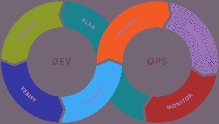

# devo PS:2017 年的最新进展，以及为什么 CDO 应该关注

> 原文：<https://devops.com/devops-2017-cdos-care/>

在术语“devo PS”[被创造出来](https://blog.newrelic.com/2014/05/16/devops-name/)的九年后，以下两个问题似乎仍然悬而未决:

*   的确切含义是什么？和
*   我们如何让所有这些技术[协同工作](https://www.cloudbees.com/resources/devops-radio)？

从软件行业中工作劳动的工业化角度来看，第一个问题的答案对我来说似乎非常清楚:DevOps 是软件和 IT 服务的第三次(数字)革命，CI/CD 相当于第二次工业革命，详见本文。正如[在此](https://www.devopsguys.com/2016/12/16/devops-will-underpin-the-fourth-industrial-revolution/)所言:“DevOps 将支撑第四次工业革命。”这也是首席数字官(CDO)应该与其组织中的 DevOps 团队保持联系的原因。

现在，我看到 2016 年底发生了两件重要的事情:首先是 [DevOps Express](http://www.businesswire.com/news/home/20160914005298/en/DevOps-Leaders-Announce-DevOps-Express-Industry-Initiative) 的成立，因为 14 家领先的企业供应商已经认识到他们的工具的互操作性对于利用 DevOps 堆栈的重要性。对这一点的需求——第二件重要的事情——已经被(在我看来)正在疯传的 [CA 的信息图](https://www.blazemeter.com/blog/ultimate-devops-tools-ecosystem-tutorial-part-1)完全证实了，该信息图围绕软件开发生命周期绘制了广泛的工具选择。相对于 XebiaLabs 的[周期表](https://xebialabs.com/periodic-table-of-devops-tools/)中提出的工具概述，增加生命周期视图无疑是一个改进。然而，我们还没有完成。我来解释一下原因。

我看到的下一个挑战是，社区内还没有就什么是或可能是参考 DevOps 工具链(元)模型或过程(元)模型达成一致。难道是:

*   “计划、开发、测试、发布、运营”，如 CA 建议的[，或者可能](https://www.blazemeter.com/blog/ultimate-devops-tools-ecosystem-tutorial-part-1)
*   “计划、创建、验证、打包、发布、配置、监控，”(维基百科)或
*   “需求、开发、构建、测试、部署、执行”(Len Bass 等人)？

Source: Wikipedia, DevOps toolchain

在开创性的著作《持续交付》中，这个生命周期被建议为“提交阶段、自动化验收测试、自动化容量测试、手工测试、发布”虽然我们在 DevOps 中谈论了这么多文化，但我们应该认识到需要在 DevOps 生命周期的高层次上保持一致，这是大多数利益相关者都很好理解和接受的。

为了追踪所有这些并吸引其他合作者，我已经[创建了一个开放格式(SVG)信息图](https://github.com/1605200517/alm-devops-landscape)并将其作为 GitHub 项目发布。亲爱的 DevOps Express 联盟的同事们，这是你们的电话！让我们联合起来，共同完成这件事。

## **接下来的步骤**

在我们拥有(我希望如此)一个社区认可的 DevOps 元模型工具链设置和生态系统中所有重要的工具之后，更多有趣的问题将会出现:

*   以下哪些 DevOps 工具利用开放 API 来降低供应商锁定风险？
*   哪些工具属于哪个[代系统](https://www.linkedin.com/pulse/devops-beyond-forecast-upcoming-generations-software-lines-muryshkin)，利用人类劳动的优化？

## **为什么 DevOps 也是 CDO 的事情**

第四次工业革命建立在数字过程数据的基础上，对吗？因此，如果我们将分布在 DevOps 工具上并由 devo PS 工具产生的所有数据聚合起来，我们可以在比我们今天想象的更快的时间内获得有用的整体分析和见解。

## **关于作者/彼得·穆雷什金
**

Peter 获得了应用计算机科学的理学硕士学位，并从事侧重于复杂分析和客户满意度的管理咨询工作，如 IT 业务分析师和变革经理。他目前的科研重点是大型分布式组织中应用于软件工程领域的数字化转型。在 [LinkedIn](https://www.linkedin.com/in/muryshkin/) 上与他联系。