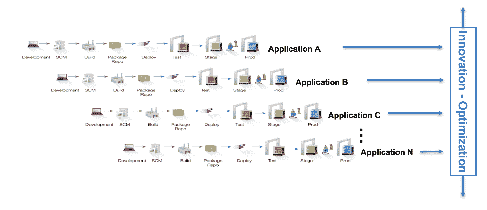
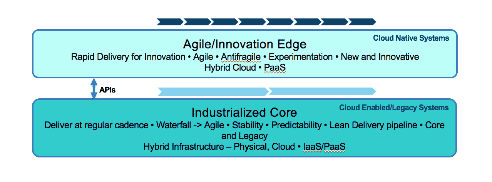

# 面向多速 IT 的开发运维与敏捷性

> 原文：<https://devops.com/devops-agility-multi-speed-it/>

让我们退后一步，从传统的以技术为中心的视角来看待 it 世界，我们大多数 IT 人都倾向于通过这种视角来看待事物。业务线(lob)需要我们这些 IT 组织向他们的客户和用户提供能够带来业务价值的功能。他们还依赖这些系统来提供关于客户和用户如何消费业务能力和获取价值的反馈；他们如何与商业系统互动；以及他们需要哪些功能和特性来获得更好的价值。业务线要求 IT 组织通过以下方式提供这些功能:

*   速度
*   灵活
*   创新ˌ革新
*   成本管理

在大多数情况下，IT 组织不是为速度、敏捷性或创新而设计的。他们是大型组织，由于遗留系统、无数的实践和工具、专横的治理和合规制度、陈旧和孤立的组织结构以及文化惰性，他们交付这些的能力受到阻碍。在某些情况下，IT 组织缺乏提供敏捷性、速度和创新的能力，甚至导致业务部门创建自己的“影子 IT”组织来满足其 IT 需求。

## 寻找速度、灵活性和创新

最近的解决方案是进行 DevOps 转型，使 IT 组织能够采用必要的实践、自动化工具以及组织和文化变革来快速、敏捷地交付，并通过能够交付快速实验来实现创新。DevOps 的起源在于精益 IT，采用 DevOps 实际上是应用精益原则来帮助实现敏捷性、速度和创新。

DevOps 通过使交付 IT 系统和软件的组织更加高效和精简来做到这一点。采用 DevOps 的组织能够:

*   更快地将想法投入生产
*   让用户/用户代理使用它们
*   获得快速反馈

利用这些反馈，组织可以改进三件事:

1.  提交的应用程序
2.  交付的基础设施
3.  交付 IT 系统和软件的过程

然而，大型组织一直在努力实现 DevOps 承诺的结果，并通过发起该运动的 DevOps 海报儿童实现这些结果。对于每一个网飞和 Etsy 来说，都有一个大型、复杂的组织一直在纠结从哪里开始。他们也许能够在他们 IT 组织的某些部分取得成功——通过小的、创新的“两个比萨饼”团队在孤立的项目上工作——但不是在企业规模上。他们挣扎着如何实现他们在自己的成功团队中看到的大规模采用 DevOps 的结果。组织和文化惯性似乎太难克服了。

无法大规模实现的主要原因是所有大型组织在创新欲望和稳定需求之间的持续斗争。这种推拉关系存在于所有组织中——即使是创新型的初创公司也能感受到。开发团队专注于通过快速变化和实验来创造创新，而运营团队专注于创造稳定性和连续性。DevOps 通过采用一系列推动文化变革、自动化和流程采用的实践来解决这种生存斗争，使这些开发和运营团队能够朝着共同的目标努力并平衡他们的需求。即使在大型组织中，这也可以在小型团队中实现，这些团队能够绕过遗留的组织结构和实践，并找出如何让所有的利益相关者朝着共同的目标努力。这就是为什么这种方法非常适用于小型战略项目，这些项目有明确的目标和时间表，可以“躲过”公司治理执行者的雷达。当我们转移到具有大型的、潜在的分布式团队的更大的项目时，分散在不同的组和公司“领地”中，采用会很困难并且经常失败。

## 多速 IT 的兴起

这些大型组织需要认识到的一个事实是，他们确实必须有两种交付 IT 的模式:一种侧重于创新(以及速度和敏捷性)，另一种侧重于优化(稳定性和连续性，以及敏捷性和速度)。这种观点在业内被称为“双模式 IT ”,它实际上是一个连续体，而不是一个清晰的双模式模型。因此，这个术语现在演变为“多速 IT”然而，根据创新或优化的业务意图将连续体分为两大类，有助于确定如何很好地采用 DevOps。
多速 IT

看待这两种模式的一个有趣方式是将它们分类为:

1.  提供核心业务能力的“工业化核心”——保持业务持续发展的东西，主要业务目的是优化
2.  “创新边缘”,在这里进行实验，识别和开发新系统；换句话说，主要的商业意图是创新

创新与优化

创新优势的目标是允许快速实验、最小可行产品(MVP)的开发、快速交付和快速失败。另一方面，工业化核心的目标是精简高效，以优化、可预测、稳定和安全的方式提供业务能力，并能够根据需要进行扩展。注意:最终，来自创新边缘的系统一旦开始服务于核心业务功能，就需要被“工业化”。这是一个从创新到优化的连续体。

工业化核心本身需要不断增加工业化，以提供所需的稳定性和可靠性，同时在规模上变得更精简、更高效。在交付核心系统时，核心需要以敏捷性和速度实现优化，再次实现规模化。核心也需要采用 DevOps 和敏捷开发实践，即使是遗留系统，包括大型机上的系统。毕竟，这种工业化的核心是保持业务持续发展和提供持续商业价值的基础，因为创新优势寻求新的和颠覆性的业务能力以及提供这些能力的途径。

然而，它们都需要不同的 DevOps 方法和平台，在不同的级别提供敏捷性、速度和创新。

这两个交付业务能力的系统实际上是紧密结合在一起的。在创新边缘交付的系统依赖于工业化核心提供的服务来交付他们正在开发的创新。另一方面，工业化核心消耗了典型大型组织的大部分预算，需要进行优化以释放资源用于创新。

考虑一个典型的移动应用程序(比如移动银行)。为了交付该应用程序，有一个团队负责开发移动前端。这类应用是在创新边缘开发和交付的。当您使用该应用程序时，所有的数据和业务逻辑都在您的手机上吗？当然不是。最有可能的是，业务逻辑和数据是应用程序的组件，由工业化核心中预先存在的系统或服务交付。因此，移动应用程序是混合的，由在两个地方运行的组件组成。为了提供这个移动应用程序的一些实验性功能，该公司需要发布一个混合或复合应用程序，提供由创新优势和工业化核心提供的组件。

在开发/测试周期中，这两种应用交付模式必须尽可能地分离，这样一个的开发进度和周期就不会拖累另一个，以防止核心成为创新的拖累。因此，创建一个 API 生态系统对于将工业化核心与创新边缘分离至关重要。核心以 API 的形式提供创新应用所消费的业务服务。开发这种基于 API 的架构的一个主要好处是，这些 API 有可能被第三方合作伙伴货币化，同时产生收入来源。

值得注意的是，在这两种模式下采用 DevOps 的架构和流程需求在许多方面都是不同的。他们的需求以及他们交付应用和服务的方式是不同的，因为他们服务于不同的业务目标。在我的下一篇文章中，我将开始深入研究创新边缘和工业化核心采用 DevOps 的这些架构和流程需求，这允许创新边缘允许实验和创新，而工业化核心变得更加优化。

观看行业从业者之间关于他们如何在多速 IT 模型中采用 [DevOps 的讨论:面临的挑战、取得的成功和吸取的教训。](https://www.youtube.com/watch?v=23d3Re4Rduo)

**关于作者/ Sanjeev Sharma**

IBM 云部门 DevOps 技术销售和采用首席技术官兼杰出工程师 Sanjeev Sharma 在软件行业已有 20 年的从业经验，在 DevOps、移动开发和 UX、精益和敏捷转型、应用生命周期管理和软件供应链方面拥有丰富的专业知识。他是 IBM 的 DevOps 思想领袖，经常在会议上发言。他写了几篇论文，是《傻瓜的开发》一书的作者。