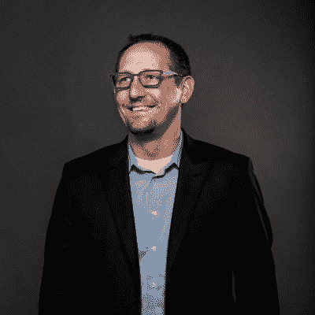

# DevOps 和数字化转型:与 Cloud Foundry Foundation 的 Childers 的问答

> 原文：<https://devops.com/devops-and-digital-transformation-qa-with-cloud-foundry-foundations-chip-childers/>

最近，我有机会与 Cloud Foundry Foundation 的首席技术官 Chip Childers 坐在一起。Chip 的角色之一是与公司合作，以数字化方式转变他们的业务，从传统业务转变为更加以 DevOps 为中心的技术和文化。以下是他要说的话。

**Swapnil Bhartiya:** 部署 DevOps 的人员面临的最大挑战是什么？公司通常会出什么问题？

**Chip Childers:** 在向更现代、开发运维驱动的方法过渡的过程中，拥有传统基础设施的公司可能会遇到许多技术和文化方面的挑战。惰性和急躁都有风险——试图过快地进行现代化可能会导致技术中断甚至停机，还可能在组织内部造成文化摩擦。然而，未能以稳定的速度实现现代化可能会导致组织落后，因为竞争对手会更快地选择开发运维并进行数字化。

Chip Childers, CTO, Cloud Foundry Foundation

最终，你买不到 DevOps。它不是一种工具或产品，即使有很多公司试图向你推销它。这是一种文化的转变，它需要实施技术、工具和产品，这些技术、工具和产品在这种文化的背景下，在新流程和现有系统之间实际上是合适的。

Bhartiya: 为什么 DevOps 非常适合自动化？这种部署中的具体挑战是什么？

**Childers:** DevOps 从根本上讲是文化、流程和工具协同工作，以实现更好的业务“流程”。以尽可能少的努力快速、高质量地部署变更自然会导致自动化。也就是说，自动化太多太快，或者试图自动化更细微的任务是有风险的。某些任务需要适应性更强的方法，或者更容易出错，因此试图自动化这些任务会带来挑战，而不是带来好处。

**Bhartiya:** 公司应该如何部署 DevOps 以避免陷阱并充分利用优势？

**Childers:** 从人和文化入手。让每个人都交谈并相互理解。确保每个人都真正了解业务是什么，以及他们如何融入其中。在传统的孤立角色之间建立共同的理解和信任是最难也是最重要的一步。除此之外，不可能为所有公司提供一个通用的方法，因为每个企业都处于其旅程的不同阶段。例如，拥有全新应用程序和基础架构的小型初创公司在开发运维方法上可能比拥有现有旧基础架构的企业更加雄心勃勃。对于所有公司来说，了解 DevOps 非常重要的一点是，无论他们处于哪个领域，他们都必须有一个基于自己的资源、团队和技术堆栈的切实可行的方法。

bharti ya:devo PS 和敏捷不是对立的，而是经常被吹捧为互补的。公司如何将这两者结合起来使用才能达到最佳效果？

**Childers:** 两者从根本上讲都是为了实现一种更好、更具增量和响应性的技术变革方法。敏捷是关于将想法制造成软件的开发过程，而 DevOps 是关于对 IT 环境的部署和变更的敏捷。具体到软件，DevOps 本质上将敏捷软件开发方法扩展到运营和基础设施领域。

— [斯瓦普尼尔·巴提亚](https://devops.com/author/swapnil-bhartiya/)