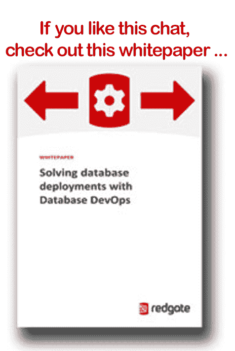

# DevOps 聊天:DevOps 和数据库，史蒂夫·琼斯，雷德盖特

> 原文：<https://devops.com/devops-chat-devops-databses-w-steve-jones-redgate/>

在本次 DevOps 聊天中，我们的嘉宾是来自 Redgate 和 SQL Server Central 的史蒂夫·琼斯。Steve 向我们介绍了 DevOps 和数据库，以及 Redgate SQL Clone 的最新产品。越来越多的 DevOps 团队告诉我们，数据库正在成为一个限制因素。我们必须带 DevOps 去数据库！

和往常一样，流媒体音频就在下面，后面是我们聊天的文字记录。还有一个链接，可以下载 Redgate 的白皮书，供您阅读。

## 串流音效

[https://w.soundcloud.com/player/?url=https%3A//api.soundcloud.com/tracks/311021882&color=ff5500&auto_play=false&hide_related=false&show_comments=true&show_user=true&show_reposts=false](https://w.soundcloud.com/player/?url=https%3A//api.soundcloud.com/tracks/311021882&color=ff5500&auto_play=false&hide_related=false&show_comments=true&show_user=true&show_reposts=false)

## 聊天记录

艾伦·希梅尔:嗨，大家好！艾伦·希梅尔，DevOps.com，来这里参加另一个 DevOps 聊天*。*本期 DevOps 聊天的主角是红门镇的史蒂夫·琼斯。史蒂夫，欢迎来到 DevOps 聊天。

琼斯:谢谢你，艾伦。很高兴来到这里。

**Shimel:** 谢谢。那么，史蒂夫，你在——嗯，你有双重角色，你是 Redgate 的传播者，但你也是，我不知道你是否想称之为馆长、编辑、经理——

* * **奇兵:**方正。*【笑声】*

**Shimel:**——创始人—

琼斯:SQL Server Central。

**Shimel:**–SQL Server Central，没错。

琼斯:是的。

**Shimel:** 不过，在我们进入 SQL Server Central 之前，我确信我们的观众中有些人可能不熟悉 Redgate，所以如果可以的话，让我们给他们一个简短的电梯故事，介绍一下 Redgate 是谁以及他们在 DevOps 世界中的位置。

琼斯:好的。好吧，Redgate 已经有 17 年的历史了，实际上，我们的口号是，“我们创造巧妙简单的工具，帮助你构建软件。”因此，我们的目标是帮助您构建数据库软件或。NET 软件以更有效的方式。这是对 Redgate 所做工作的简要介绍。

**Shimel:** 明白了。如何——给我们多一点背景知识。雷德盖特存在多久了？

琼斯:所以，Redgate 大约在 2001 年启动，有趣的是，SQL Server Central 也在同一时间启动。我和几个合作伙伴一起建立了这个出版领域，我们希望在这里帮助人们更好地工作和成长，Redgate 实际上是我们的第一个客户，我们在 2001 年向他们出售广告。

Shimel: 哦，酷。

琼斯:所以我几乎从一开始就认识他们了。这些年来，他们——雷德盖特已经长大了。我们现在大约有 300 人左右。我们在英国的剑桥有我们的主要办公室，然后我们在帕萨迪纳(加利福尼亚)也有一个销售办公室，我们有几个人，然后像我一样分散在世界各地做各种工作。

因此，多年来，Redgate 一直试图帮助不同的团队更好地开发软件。您知道，我们向世界各地的许多财富 100 强、财富 1000 强公司销售产品，在过去的五六年里，我们一直在努力解决数据库领域的 DevOps 问题。因此，我们花费了大量的脑力和精力来开发产品，试图帮助人们将数据库整合到 DevOps 流程中。

**Shimel:** 嗯嗯。所以，你知道，这有点抢先我的下一个问题，史蒂夫，这是，你知道，显然，当 Redgate 刚开始在这里，没有人跑来跑去谈论 DevOps，尽管人们仍然试图做得更快，自动化和所有这些事情。

但你认为，大约四五年后，你们会有意识地说，“哦，我们会，你知道，尝试打破 DevOps 的思维模式，”如果你愿意，或者 DevOps *【相声】*？

琼斯:是的。你知道，我们的创始人——这是个有趣的故事。一开始，当他在寻找一些额外的资金来启动公司时，我们已经建立了我们的第一个产品，名为 SQL Compare，它比较两个不同数据库的方案，为您提供差异，并为您生成一个脚本，以便您可以进行部署。

而且，在试图向外行人、经理、银行家或签支票的人解释这一点时，这是一个繁琐的过程，对吗？模式的概念和比较是一个相当技术性的领域；我想很多人没有直观地理解这一点。但是他拿了两本电话簿给顾客，说:“给我找出这两本之间的区别，”你知道吗？他们会说，“我不知道我们是怎么做到的，”对吧？*【笑声】*“就像，我们一页一页地看，然后把它舔干净？”他说，“这就是我们的产品所做的——它发现两个事物之间的差异，并让你知道。”

这就是我们在过去 17 年里走过的路。我们已经使该产品变得成熟，然后，五六年前，我们决定想办法让它变得更好，所以我们花时间观察人们如何执行部署，有时让某人运行某个特定产品以确定此时有什么差异的一些缺点。因此，我们已经建立了自动化，我们已经建立了一些其他的安全理念，您在 DevOps 中做的一些事情，以产生到各种产品的流程，以便我们可以减轻部署数据库更改的痛苦。

**Shimel:** 有道理，有道理。Steve，你知道，我们已经看到 Redgate 和其他一些公司并没有发起攻击，而是非常努力地将数据库和 DBA 引入 DevOps 环境，引入 DevOps 家族，如果你愿意的话，对吗？你知道，我们在 DevOps 中谈论了很多文化等等，我们试图打破孤岛，将团队聚集在一起，将开发与运营聚集在一起，将 QA 融入其中，将安全性融入其中，并将 DBA 和数据库融入其中。

而且，你知道，我个人已经看到这成为 DevOps 拼图中越来越大的一块。如何——现在，在那之前，雷德盖特已经取得了很多成功，对吧，而且——

琼斯:是的，是的。

**Shimel:**–是的，所以我想我的问题是，你在哪里看到这种上升，或者，你知道，devo PS——所以你的业务，听起来好像在这之前很好。它真的击中了哪里——你知道，或者它已经找到了与 DevOps 的甜蜜点？

琼斯:你知道，情况正在好转。我不得不说，五年前，当我开始尝试谈论部署时，我们几年前就开始了一个产品来进行部署，试图帮助人们进行 web 部署，我们希望在其中包括一个数据库。我们发现这个问题比我们预期的要困难得多，而且我们在解决这个问题时发现的一件事是，我认为数据库管理员比运营、J、安全和任何其他部门都更需要维护部署之间的状态，这是他们根本没有的挑战。

在运营领域，他们说我们要像对待牲口一样对待我们的服务器——如果一个死了，我们就在它的位置上弹出另一个，然后我们就走。当然，我们用容器来做，用软件来做，我们可以——你知道，QA 人员习惯于这样做。但是，你知道，在数据库世界里，我们不能那样做，你知道吗？如果我可以在每次部署软件时删除表并重新创建它们，我的生活会变得如此轻松。*【笑声】*

**希梅尔:** *【笑声】* *【相声】*

琼斯:是的。*【笑声】*但是你知道，我认为在过去的十年里，我们已经开始看到在许多行业，许多企业中，数据真的非常非常重要。你知道，随着我们看到人们转向机器学习和人工智能以及所有这些不同的东西，数据库从根本上变得更加重要，因为这些数据是必需的，你知道吗？无论您是关系型 NoSQL 还是其他类型，您都必须在做出更改时维护这些数据。

所以我们有一个基本的问题，那就是我们必须找到方法，我们可以在不太扰乱我们系统状态的情况下做出改变。这是一个艰难的过程，对吗？如果我部署错了。dll 或错误的 XT 或错误的。jar 文件，我把它放下，把最后一个扔上去，我们就好了。如果我部署了错误版本的数据库，如果我对一个表进行了根本性的更改，而这是错误的更改，可能会存储，这可能需要几个小时，几分钟，谁知道呢？您必须努力撤销更改，这意味着，如果有任何数据被更改，我必须尝试撤销更改，我必须捕获该语句，然后通过某种 ETL 转换将数据放回原处。

这非常危险和麻烦，而且你知道，作为我职业生涯中的一名前 DBA，你是厌恶风险的。您不希望长时间关闭数据库。所以，你知道，实际上，当我们试图寻找新的产品来生产和销售，并试图增强我们现有的产品时，我们意识到这是一个困难的过程。

**Shimel:** Mm-hmm.

**Jones:** 五年前，我和一些人交谈，他们认为这已经完成了，他们不认为这可以解决，我有很多好朋友在三年前、四年前嘲笑我，你知道，在过去的一年半时间里，他们一直回来问我，“好吧，我们实际上如何将这个数据库纳入开发运维流程并进行部署？”

是的，很公平。史蒂夫，首先，有什么最新消息吗？和雷德盖特有什么关系吗？

琼斯:绝对是。所以今天，实际上—你知道，我们从 2 月 27 日开始记录—Redgate 发布了 SQL Clone，这是一款类似于市场上其他产品的产品，但它旨在在几秒钟内提供数据库的副本。因此，我们本质上要做的是，我们为您的数据库建立一个图像文件，然后我们可以在几秒钟内制作真正的实时副本。

因此，如果您有一个 1tb 的数据库，一旦我调配了该映像，我就可以制作一个 1tb 的 SQL Server 数据库副本，并让它在大约 7 到 10 秒内出现在您的瞬间。而且每个副本都是独立的，它们看起来都一样，看起来都像原始数据库。你可以写信给他们，你可以改变事情，你可以放弃他们，并在几秒钟内重新创建他们。

因此，在开发/测试领域，我可以在几秒钟内提供开发人员数据库，这是一个很棒的想法，他们可以在自己的分支机构中，对数据进行任何他们想要的结构性更改。如果他们认为自己犯了一个错误，就像我们在开发中经常做的那样，我们在试验和尝试一些东西，如果我们想撤销它，他们可以放弃那个数据库，在几秒钟内建立另一个 1tb 的数据库，并继续他们的开发。

**Shimel:** 明白了，明白了。Steve，我想花一点时间谈谈你在 Redgate 的传道者角色。

琼斯:好的。

**Shimel:** 所以，你知道，福音传道者不是——我想用什么词来着？这在 DevOps 世界中并不是一个闻所未闻的职位，但是你能给我们的观众一点你的角色所需要的味道吗，特别是在处理 DevOps 市场中？

琼斯:当然，当然。所以，我——作为一个福音传播者，我最终做的是大量的关于 Redgate 和 Redgate 产品的写作和演讲，当然还有 DevOps 世界，但也只是关于软件开发和数据库管理的良好实践。

我已经为微软的 SQL Server 工作了 25 年，所以基本上自从微软有了这个产品，我就把它作为我职业生涯的一部分，你知道，SQL Server Central 的使命是帮助你每天都做得更好。为此，我写了很多文章，也说了很多话，你知道，Redgate 基本上遍布世界各地，所以我有机会参加不同的会议，不同的活动，并提供关于一般良好数据库实践或特别是 Redgate 产品的信息。

**希梅尔:**优秀。史蒂夫，我们——正如我之前提到的，我们开始了，你知道，生活，这里的时间过得很快。但是我想知道你是否能给我们的观众——首先，他们在哪里可以访问你的 SQL World 博客？他们怎么找到的？

琼斯:是的，所以 SQL server central . com——全是一个词，SQL server central——我是这个网站的编辑，我是创始人，我现在经营这个网站。所以我们每天发布信息来帮助你。

我在 voice of DBA . com 上维护自己的博客——所以 voice of DBA . com——在那里我写了各种与数据、数据库和软件相关的主题。所以，这样做，然后在 DBA 之声上，我有一个演讲时间表，所以我到处旅行。大约三周后我会去科罗拉多斯普林斯，然后去英格兰的 SQLBits，之后会去其他地方，所以。*【笑声】*

**Shimel:** 明白了。那么——那么 Redgate 呢？如果我之前没有告诉你，我们的观众，你知道，我们的观众来自世界各地，有没有关于会议、演出、开发活动的计划。

琼斯:好的。

**Shimel:** 他们可能看到 Redgate 的地方？

**Jones:** 我们将参加在英国、美国和其他地方举行的各种 DevOps 会议，所以我们将参加 4 月份在特尔福德举行的 SQLBits 会议，然后我们将参加在班加罗尔举行的数据平台峰会，我也会参加。我不知道我们所有的营销存在，我们将超越这一点，但你知道，我们在 Redgate 有一个很好的，活跃的 Twitter 帐户，我们经常在那里发布我们将参加不同活动的消息，所以这是一个找到我们的好地方。

**希梅尔:**优秀。

琼斯:当然，还有 Redgate.com。*【笑声】*

Shimel: 嗯，有道理。史蒂夫，我们的时间快结束了。我想问你最后一个问题，这是我经常问我们的客人的一个问题，是这样的——如果你必须为我们的观众推荐一本必读的书，一本必读的书，可能是关于开发运维、数据库或其他相关内容的，你会推荐什么？

琼斯:所以，我们简单地讨论了一下这个问题。我知道可能每个人都想过，谈论过“凤凰计划”，这很棒。如果你没有读过“目标”，这是“凤凰计划”的前身，那很好。

但是我可能推荐的是 Pramod Sadalage 的《数据库重构》,它很有趣，因为在数据库世界中有一个复杂的问题领域，它们是有问题的。所以这是那种你不容易做出改变和撤销的问题，你知道吗？如果我有一个专栏，那么我可以很快放弃它——但有些问题很难解决。

在《数据库重构》一书中，他们很好地阐述了这些问题以及如何跨时间解决这些问题，因为大多数问题需要你在几天、几周或几个月内做出改变才能真正完成——所以这可能是我推荐的一个方法。

***Shimel:***数据库重构”——太棒了。顺便说一句，我也喜欢“目标”。我在很多很多年前读过《目标》——远在《凤凰计划》之前

琼斯:是的。对——我也是。那是我读的第一本。

是的，这是好东西——但是“数据库重构”听起来不错。

史蒂夫·琼斯，很高兴有你在这里。很明显，这是你第一次出现在 DevOps Chat 上，但是我们希望你将来能再回来，我们可以聊得更多。你知道，我真的很喜欢深入研究数据库和数据库管理员，你知道，在许多组织中采用和被采用 DevOps 方法和工作程序。所以也许下次我们可以潜得更深一点。

但是现在，我想我们快没时间了。

琼斯:好的。非常感谢你邀请我，艾伦。

史蒂夫，谢谢你的出现。史蒂夫·琼斯，Redgate 的宣传者，SQL Central 的创始人，我说的对吗？

琼斯:SQL Server Central。

**Shimel:** 不好意思—SQL Server Central。史蒂夫，我道歉。

琼斯:是的。别担心。

**Shimel:** Steve，下次再见，我们会让你继续在 SQL Server Central 和 Redgate 上取得成功。

琼斯:非常感谢。很高兴来到这里。

**Shimel:** 谢谢。嘿，我是艾伦·希梅尔，我们将在下一次 DevOps 聊天中再见。

— [Alan Shimel](https://devops.com/author/ashimmy/)