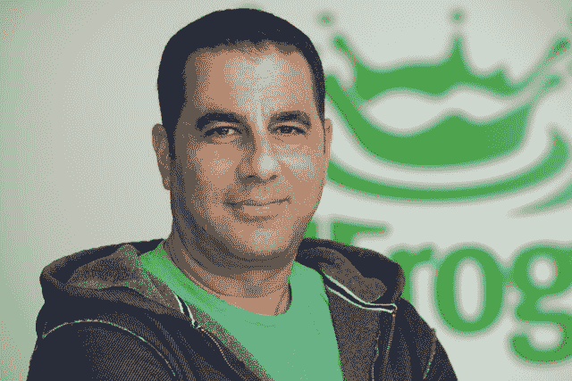

# DevOps Chat: JFrog 宣布融资 1.65 亿美元

> 原文：<https://devops.com/devops-chat-jfrog-announces-165-million-funding-round/>

 今天， [JFrog](https://www.jfrog.com) 宣布完成总额 1.65 亿美元的 D 轮融资，这可能是 DevOps 领域迄今为止最大的一轮投资。这轮融资由新投资者 Insight Venture Partners 牵头。Insight 的联合创始人兼董事总经理杰夫·霍林(Jeff Horing)将加入 JFrog 董事会。

Artifactory 和其他工件相关软件的开发商 JFrog 最近承担了一项更高的任务，开发了一个名为 JFrog EnterprisePlus 的平台，这是一个首款通用 DevOps 平台。根据 JFrog 的说法，筹集的资金“将推动 JFrog 的产品创新，支持向新市场的快速扩张，并加速有机和无机增长。”

该公司在前几轮融资中筹集了大约 6500 万美元。它还进行了几次收购，以增加新的功能和地理覆盖面。

正如《DevOps.com》的读者所知，我们多年来一直密切关注着 JFrog 的发展，因为该公司代表了一个供应商如何在 DevOps 市场发展和建立自己的良好范例。

我们有机会坐下来，与 JFrog 的联合创始人兼首席执行官什洛米·本哈姆谈论这一最新消息。下面可以听我们的对话，后面是我们聊天的文字记录。享受并祝贺 JFrog 团队。

# 声音的

[https://w.soundcloud.com/player/?url=https%3A//api.soundcloud.com/tracks/507902388%3Fsecret_token%3Ds-G4Wvs&color=%23ff5500&auto_play=false&hide_related=false&show_comments=true&show_user=true&show_reposts=false&show_teaser=true](https://w.soundcloud.com/player/?url=https%3A//api.soundcloud.com/tracks/507902388%3Fsecret_token%3Ds-G4Wvs&color=%23ff5500&auto_play=false&hide_related=false&show_comments=true&show_user=true&show_reposts=false&show_teaser=true)

# 副本

艾伦·希梅尔:大家好。我是 DevOps.com 的艾伦·希梅尔。您正在收听的是 DevOps 聊天，我们今天早上在这里宣布了一些重大新闻。JFrog 的人是 Artifactory 和其他几个伟大项目和产品的制造商，他们宣布了可能是 DevOps 领域有史以来最大的一轮融资，1.65 亿美元，我相信，但加入我们的是 JFrog 的联合创始人兼首席执行官什洛米·本哈姆，他可以告诉我们所有关于它的事情。什洛米，欢迎你。

什洛米·本哈姆:嘿，艾伦。很高兴再次见到你。谢谢你邀请我。

谢谢，我的荣幸。正如我之前提到的，今天来自 JFrog 的令人兴奋的大消息。我算对了吗，1.65 亿美元？

本哈姆:是的。*【笑】*你答对了。是 1.65 亿美元，d 系列。

Shimel: 首先，Shlomi，祝贺你。你知道，筹集任何数量的资金都不容易；筹集这样的资金确实是一项难以置信的任务，我甚至无法想象。因此，祝贺你和弗雷德、尤夫以及 JFrog 的整个团队取得这一成就。

本哈姆:非常感谢你，艾伦。我们不认为这是理所当然的，我们非常非常兴奋。谢谢你。

**Shimel:** 好。Shlomi，我知道 Insight Venture partners 领投了这一轮，对吗？

本哈姆:没错。Insight Venture 领投了我们的 d 轮融资，Jeff Horing 将成为我们董事会的合伙人。

**希梅尔:**优秀。请和我们谈一谈——他们是领导者，但你的现有投资者也参与其中。还有其他新投资者吗？

本哈姆:是的。所以这一轮实际上是我们在融资领域有过的最好的经历之一*【笑】*。在过去的三年里，我们有很多优秀的合作伙伴向我们伸出援手，我们开始与他们建立关系。在这轮融资中，我们想要确保的一件事是，我们会有了解后期阶段和了解市场上拥有成熟产品的成熟公司的基金，这就是我们如何会见 Insight 和其他一些伟大的风投的。在这一轮中，Spark Capital 与 Alex Clayton 和 Geodesic 一起加入了我们，你们可能知道，它们在日本有一些业务。除此之外，电池真的支持这一轮。Battery 是我们目前的投资者之一，另外还有 Sapphire、Scale、Vintage 和 Bell Capital。其实我们大部分投资人又加入了这一轮。

**希梅尔:**优秀。太好了，太好了，太好了。所以 Shlomi，你知道，除了这个大数字之外，请告诉我们它对 JFrog 意味着什么？

**本哈姆:**这是一个很好的问题，因为我们是在公司做得很好的时候来到这里的，你走得非常快，非常有效率，市场也在发展，所以这不仅仅是你的业务，而是整个市场，整个 DevOps 市场都在蓬勃发展，我们的劳动成果是我们所有六种产品每天都能感受到的。就在三个月前，我们发布了一个平台，Enterprise Plus JFrog 平台，这是一个针对各种二进制的端到端解决方案，我们知道这是一个上市并将其淘汰的正确时机，因为正如人们告诉我们的那样，JFrog 无处不在。它将成为 DevOps 行业的佼佼者。现在，我们正在为市场规划一些大的东西，我们需要用适量的资金来支持它，并建立一个伟大的公司。

Shimel: 当然可以。还有，你知道，什洛米，我们上周刚聊过。你们收购了一家公司，该公司将帮助提供 DevOps 专业服务 Trainologic。很明显，你已经在世界各地扩张，或者正在扩张，但这确实给等式带来了一个完全不同的尺度，你知道吗？我们谈论的不仅仅是开设前哨基地；有了这种资本，你知道，你就可以下大赌注了，对吧？你在哪里看到了重大的赌注，重大的举措？不仅仅是地理上的，Shlomi，还有关注的领域？

本哈姆:对。所以安娜和我会谦虚地说，我们已经筹集了 DevOps 历史上最高的金额，不仅仅是为了创造新闻，也是为了创造历史。因此，JFrog 的愿景是确保软件更新变得流畅。软件更新应该像水管里的水一样顺畅。随着我们的产品调整，随着 Enterprise Plus 的发布，现在我们有了一个通用 DevOps 的端到端解决方案，让开发人员可以自由选择，我们确信，加上我们在市场上的存在——我们有超过 4500 个客户——我们确信 JFrog 将成为公司，或者至少有潜力成为世界上所有软件更新的幕后公司。

而这才是 DevOps 真正的痛，这才是 DevOps 想要解决的；我们试图将软件从 A 带到 B，JFrog 遵循所有的优势，并在客户的数据中心和不同方面支持这种二进制流和软件分发。所以我认为，有了这个愿景，要成为世界上所有软件更新背后的公司，你必须有远大的梦想，你必须有远大的抱负，你必须不断扩张。正如你所提到的，你不仅要在地理上扩张，你还要在技术上扩张，这样你才能支持任何可能出现的需求，而且你还必须认真对待它。它伴随着许多责任。

Shimel: 没错，没错。Shlomi，你知道，他们说水涨船高，当然，你知道，看，我们看到就在上个月，GitLab 筹集了 1 亿美元，估值超过 10 亿美元。我们看到 GitHub 不久前以 70 亿美元从微软收购。现在我们看到 JFrog 筹集了 1 . 65 亿美元。这对整个 DevOps 市场意味着什么，对吗？这对 DevOps 市场意味着什么？我指的是对其他公司和类似的公司？

本哈姆:嗯，你和我都还记得 DevOps 甚至不是一个术语的日子，对吧？当然也没有叫 DevOps 的预算项目。所以我认为业界意识到并承认了一个事实，最大的挑战不是软件的挑战；这是快速的挑战。我们必须快速做事，我们必须将人力和机器能力结合起来，这就是 DevOps 的意义所在。你是对的；对于这个领域的公司来说，今年是令人惊奇的一年。我认为 GitLab 上个月筹集了 1 亿美元，但这些开始于 Xebia，然后是 Mesosphere，然后是 Sonatype 和 GitLab，当然还有 GitHub 的巨大收购，我不确定是 DevOps 还是 dev，但无论如何，都是同一个领域。这正是我要说的。

世界属于那些将软件从构建推向生产的人，我们都是消费者，希望软件在任何地方、任何时间以安全的方式保持最新，这就是我们正在做的。这是 JFrog 使命，我想风投们也承认这一点。我认为市场承认这一点。我认为，如果你看看 Atlassian，对我来说，这是在软件基础设施领域建立大公司的最好例子，如果你看看他们的市值，我们都会看到相同的迹象，这将是一个大市场。

希梅尔:是啊。这是个巨大的市场。所以 Shlomi，你知道，有了这样的加薪，我们也有机会走出舒适区。所以这是一个创业困境；你会加倍努力做好自己正在做的事情，并把它做得更好吗？或者你会着眼于相邻的领域，或者与你现在做的事情很好地融合在一起，但扩大产品范围吗？你知道，你驱动着愿景。你知道，这很诱人，但纪律也要求专注于你擅长的事情。你对此有什么看法？

**本哈姆:**我认为这可能是最普遍的创业困境，但是一位非常聪明的投资者曾经告诉我，“我不是来投资他所做的事情的；我来这里是为了投资你将要和我一起做的事情。”而且我还在非常认真地对待这句非常重要的话。我们建立了一个伟大的企业，一个基础非常坚实的企业，我认为，艾伦，你知道，市场知道，你知道，大公司每天都在投资 JFrog。我们正以每月 100 个新标识的速度增长，所以我们很荣幸也很高兴看到我们创造的东西在增长，但这还不是冰山一角。将软件从开发机器推到任何边缘的整个想法是一个巨大的任务，因为它伴随着高可用性，伴随着通用解决方案，伴随着安全性，伴随着自动化和调度。

你开始看到 DevOps 市场的整合；人们开始理解你需要一个代码库——这是非常重要的一块——你需要一个工件库——这是非常重要的一块——在这两者之上，你开始构建 DevOps 层。所以我们正在一个领域一个领域一层一层地研究，但这只是冰山一角。我们将沿着任何边缘前进，我认为这只是开始。我们甚至没有开始考虑物联网的 DevOps，这也将是五年后的一件大事。

Shimel: 我想甚至可能在五年之前。

本哈姆:是的，我同意你的观点。

Shimel: 让我把它转到另一个方向。你知道，我个人欣赏 JFrog 的一点是你和你的团队在那里建立的文化。这很棒，很令人兴奋，充满活力。我只能想象公司内部围绕这场比赛的喧嚣。你为什么不和我们的观众分享一点点真知灼见。那里的团队对这个消息有什么反应？

**本哈姆:**所以，艾伦，我——你接触到了*【笑】*你知道，当你谈到我们的团队时，你在我心中留下了非常特别的印象。我一直认为，建立一个 50 人或 100 人的公司很棒，因为你可以保留文化，但现在我们有 400 多人，你知道，一些人是并购其他公司的结果，其他公司也加入了我们，我们仍然可以保护我们所谓的 JFrog codex 和我们的文化，我非常非常高兴看到这一点。很明显，我们还没有与所有人分享它——我们将在第三天，也就是星期三——但我们与所有管理层分享了它，管理层的不同层级。

兴奋之情溢于言表，主要是因为走进 JFrog 的每个人——你知道，不是每个人——但 90%走进 JFrog 的人都是如此谦逊，你知道，如此专注于日常任务，当这样的事情发生时，这不仅仅是令人震惊的消息。它会走到镜子前，看着镜子里的映像，然后说，嘿，我们做了一件很棒的事情，而且是我们一起做的。我们在 JFrog 中说，一旦我们向前跃进，你就不会回头，但事实并非如此。一旦你和你的团队一起向前跃进，你就不会回头，我认为这就是 JFrog 的意义。

**Shimel:** 优秀，优秀。Shlomi，还有——看，我知道你现在大部分时间都在美国，但 JFrog 最初是一家以色列公司。我想这在以色列也是个大新闻。我不知道一家以色列公司——我是说以色列公司有过大的退出，但是这种增长，你今天在以色列和我们谈话。你能给我们一个感觉吗，它在以色列的科技产业中意味着什么，你知道，这是一个非常非常热的领域，但这必须，你知道，在那里制造一些噪音，对吗？

本哈姆:对，没错。你知道，这对于任何市场来说都是很大的数字，就像我不知道 DevOps 领域的任何其他公司筹集了这么多资金，并且有这些伟大的合作伙伴，所以我认为这在任何地方都是大新闻，但是的，你是非常正确的。而且，你知道，以色列市场，这将是一个大新闻，虽然以色列有公司筹集了大约 1 亿美元，其中一些甚至超过 2 亿美元，但在以色列的高科技行业，有一些非常有趣的事情正在发生。我们过去以我们的技术而闻名，你知道，以色列的技术和所有在这个非常小的国家蓬勃发展的创业公司， 然后是产品——你可能听说过 Waze 等公司——现在我看到越来越多的以色列企业家敢于大胆梦想，并说“我要建立自己的公司，上市并永远存在下去”，并留在那里，不只是在接下来的五年里，然后被其中一家巨头收购，而是在剩下的几年里保持相关性。 我看到越来越多的以色列创始人以这种方式思考，从后期基金中筹集资金，通过 IPO 筹集资金——你知道吗？不是一个目标，而是一个里程碑。这将使公司变得更大更好。我也很高兴能成为这个行业的一员。

当然，你也应该如此。所以什洛米，就在那里，我要问；这是——首次公开募股还是收购是我们的目标，是我们的最终目标，还是我们会顺其自然？

本哈姆:你知道，我们在考虑下一幕。对我们来说，IPO 是一个非常重要的里程碑。这是另一种筹集资金的方式。不是从基金中而是从公众中支出，但这是我们正在考虑的事情。我们的首席财务官 Jacob Shulman 是从上市公司 Mellanox 加入我们的。我们知道我们在做什么，但这是一个里程碑。如果你问我最大的挑战是什么，我希望 JFrog 能够在 2025 年之前跨越 10 亿美元的门槛。这是一个非常非常长远的目标，但是，我们已经有 10 年的历史了，所以你可以相信我们，睁大你的眼睛，我们会实现它。

**希梅尔:**优秀。好吧。什洛米，我们快没时间了，但让我再次祝贺你，恭喜你；这才是真正的成就。但是你知道吗？我从筹款中学到的一件事是，没有人会帮你忙。人们给你钱不是因为你是个好人或者他们想要——你知道，他们这么做是因为他们看到了一种赚更多钱的方法。所以对我来说，这代表了对你在那里所做的事情和潜在投资回报的巨大信任票，对吗？仅此一点，真的要向你和你的团队致敬。我祝愿 JFrog，你知道，还有你和你的团队取得巨大的成功。我们都会看的。让我们骄傲。谢谢你今天和我们谈话。

本哈姆:非常感谢你，艾伦。我非常感谢您为我们以及 DevOps 行业所做的一切。这不是理所当然的。非常感谢您抽出时间给我这个机会——

希梅尔:好的，我很乐意。

**本哈姆:**——再次谈论这个话题。谢谢你。

我们肯定会的。JFrog 联合创始人兼首席执行官什洛米·本哈姆刚刚宣布由 Insight Venture Partners 领投 1.65 亿美元。好消息。我是 DevOps.com 的艾伦·希梅尔。您刚刚听到了另一个 DevOps 聊天。祝你愉快。

— [Alan Shimel](https://devops.com/author/ashimmy/)