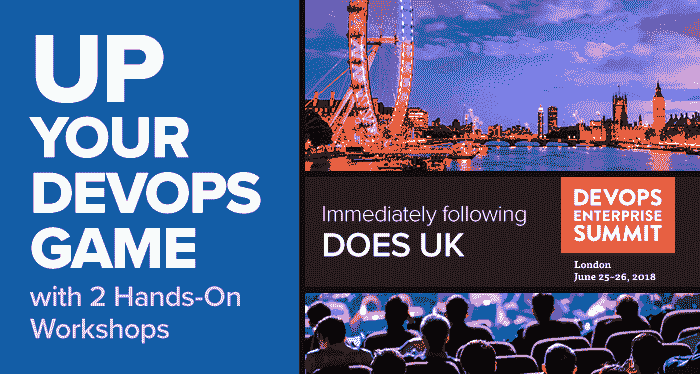

# DevOps 聊天:与 Gary Gruver 和 Helen Beal 一起参加后 DOES 研讨会

> 原文：<https://devops.com/devops-chat-post-does-workshop-w-gary-gruver-helen-beal/>

 吉恩·金的英国 DevOps 企业峰会还有几周就要召开了，6 月 25 日至 26 日。虽然英国 DOES 今年将成为一个不容错过的活动，但也有一些重大活动围绕 DOES 举行。一个是由电云赞助的(也是 DOES 的创始赞助商)。这是一个[后工作室](https://www.eventbrite.co.uk/e/devops-workshop-from-new-learner-to-executive-leader-with-gary-gruver-and-devops-institute-tickets-45409188104)，由加里·格鲁弗、约翰·威利斯和海伦·比尔授课。

研讨会系列包括 John Willis 的“DevSecOps”，Gary Gruver 的“引领 DeOps 转型”，以及 Helen Beal 的“DevOps Essentials”。Helen 的 DevOps essentials 和 Gary 的 executive leader 研讨会都是半天时间，因此您可以同时参加。这些都是很好的学习机会，也是与同龄人交流的好方法。如果你 6 月 27 日在伦敦，一定要去看看。

像往常一样，下面是我们谈话的音频流，然后是一份文字记录，这样你就可以跟上了。

# 声音的

[https://w.soundcloud.com/player/?url=https%3A//api.soundcloud.com/tracks/455654853&color=%232f71a5&auto_play=false&hide_related=false&show_comments=true&show_user=true&show_reposts=false&show_teaser=true](https://w.soundcloud.com/player/?url=https%3A//api.soundcloud.com/tracks/455654853&color=%232f71a5&auto_play=false&hide_related=false&show_comments=true&show_user=true&show_reposts=false&show_teaser=true)

# 副本

艾伦·希梅尔:大家好，我是艾伦·希梅尔，您正在收听的是 DevOps Chat 的特别版。我们今天的 DevOps 聊天小组有三个人，实际上，他们每个人对我来说都是 DevOps 社区中非常特别的人。让我马上把他们介绍给你。首先，女士优先。

我想介绍海伦·比尔。海伦当然是《游侠 4》里的 DevOps 梦幻。不过，海伦也是我在伦敦 DevOps 社区遇到的第一批人之一，从那以后她就成了我的朋友。在 DevOps 学院也有一个职位，也是 DevOps 学院的顾问。海伦，欢迎来到 DevOps cChat。

海伦·比尔:非常感谢你，很高兴能在这里和你聊天。

**Shimel:** 谢谢。我的第二位客人真的需要在 DevOps 社区介绍一下。他有三本——数一数，一本、两本、三本关于 DevOps 的书，在惠普和梅西百货领导 DevOps 团队多年，现在为许多许多不同的组织提供咨询，帮助他们实现数字化转型和 DevOps 之旅，不是别人，正是 Gary Gruver。加里，欢迎你。

**Gary Gruver:** 大家好，非常感谢来到这里，很高兴再次与大家交谈。

很高兴你能来这里。当然，最后但同样重要的是，我在 DevOps 领域的一个好朋友，他在 Electric Cloud 负责营销，当然，他也是 DevOps 企业峰会(DOES)与 Gene Kim 和 ITREV–山姆·菲尔的创始合作伙伴。山姆，欢迎你。

山姆·菲尔:谢谢你，艾伦。很高兴来到这里。

**Shimel:** 好的，今天我想说的第一件事是我们离伦敦越来越近了，我认为是什么？6 月 25 日和 25 日在伦敦 O2。

我知道你们都会参加，我们当然也能参加——Electric Cloud 也是创始赞助商之一，我们可以在 IT revolution 网站上获得所有信息。但是，作为今年伦敦活动的一部分，我想提一下紧随伦敦活动之后发生的两个特殊事件。

一个是特别的后处理研讨会，Sam，你和电子云的人已经开过了。你为什么不给我们一点背景，你们在做什么，为什么？

是的，很好——谢谢，艾伦，我很感激。Gary——你提到过，他有帮助这些大公司进行数字化转型的丰富经验。当我们在 2013 年开始我们的用户会议时，Gene Kim 来发言，Jez Humble 来发言。

我们在一起交谈，我们说这些正是那种人——这些老马正在努力进行这些转变，我们希望尝试并吸引他们参加大型会议，这就是 DevOps 企业峰会的起源。在那场演出中出现的人们，他们中的许多人处境艰难。

他们知道他们需要转型。他们的企业希望他们进行转型，但他们不知道如何着手。因此，有一个社区的人可以交谈和学习，以一种安全的方式承认错误，知道你会得到建议和忠告，这是该团队组织的一场精彩的演出。你可以从它的成功看到社区真的接受了它。

因此，我们去年与 Gary 的想法是，我们为什么不找一个帮助过公司进行这些转型的人，去参加 DevOps 企业峰会，听听这些故事，看看人们正在经历什么，然后在那之后，你直接与一位专家教练共处一室，他会说，现在，让我们将这一点应用到你身上。让我们把它应用到你的情况中。你听过的那些故事，对你有什么作用？

去年我们度过了一段美好的时光，所以我们决定今年在伦敦做同样的事情。我们将在 10 月份在拉斯维加斯做同样的事情。对于人们来说，这只是一个将他们在精彩的 DevOps 企业峰会上听到的许多事情付诸实践的机会。

太棒了，山姆。的确，这是一个很棒的工作室。Gary 和 Helen——在我跳到你们面前之前，Sam——我忘了我已经道歉了。人们报名参加研讨会的原因是什么？涉及到什么？他们去哪里了？

**fall:**所以这是一个有大量补贴的车间。Helen、DevOps institute、Gary、John Willis——这些人付出时间为社区提供服务。电子云帮助支付房间和所有其他东西的费用。所以成本非常低。我想我们的早起鸟是 195 美元。

我们没有那么多票，但是还有一些票。也有团体价格。所以你知道，不贵，对你来说，这是一个真正与那些总是想学习如何做这些事情的人接触的机会。正如你提到的，约翰，我们确实有一些不同的工作室。

约翰·威利斯当天在技术研讨会上做开发-安全-操作手。所以我们有两条轨道，基本上已经设置好了。我不想泄露海伦和加里将要谈论的内容，但约翰·威利斯研讨会确实让我们感到兴奋。他将向人们展示如何通过实时管道逐步改进它。如何将安全性融入您的部署管道。

你可以做的事情之一就是让你的团队和开发人员发布安全的代码。奇妙的东西。

**Shimel:** 是的，不，对任何对 DevSecOps 感兴趣的人来说，这都是一次很好的实践研讨会。稍后我们会有更多关于 DevSecOps 的信息。但首先，让我们转向加里。Gary——你的工作坊将会是关于什么的？

我想我会听从你的领导。让我们先从海伦的开始，再从女士的开始，我想这是我们今天要做的事情。你先带海伦去，然后我来跟进。

**Shimel:** 骑士精神没有死。海伦——说吧。

谢谢你，加里。因此，我将参加为期半天的 DevOps institute 课程——DevOps 的基本内容，基本原理或基础以及 devo PS 的相关性，如三种方式和通信，以及它如何与敏捷和 it 发送和精益相适应，PK 研究，将它与这种集成联系起来。

和连续输送。他们是如何相互引导的。原来如此。这是一门专门为开发运维新手开设的课程，他们应该希望在学完这门课程后，能够真正理解开发运维的由来、它的重要性，以及使用开发运维实践和原则可以带来哪些业务优势。

理解一些我们这些生活在 DevOps 中的人非常熟悉的词汇。因此，像约束理论和 CD 之类的东西，并希望有某种行动计划，他们可以在第二天带回到他们的办公桌上，并开始在他们自己的组织中做出一些 DevOps 差异。

**Shimel:** 这是 DevOps 基础课程，实际上是整个 DevOps 基础课程的一个重要版本，Helen——你帮助更新了这个最新版本——我想它是 DevOps 基础课程的第三版？

是的，马上就好了。因此，它已经更新了许多额外的案例研究，我们也更新了像调查这样的东西，DevOps 调查的最新版本。我知道还有一个要出来。我不认为我们还需要几个月的时间来期待它，实际上我们一直在做的更新的一部分是遵循我们自己的原则。因此，我们实际上的目标是随着我们的前进，更多的增量发布周期，而不是频繁的大更新。

我相信我们都会同意的。然后，更新的东西出现了，像责任工程和更多关于服务和容器之类的东西。侧重于安全文化、学习型组织以及 John 和 Gene 可以在他们的《超越成品有声读物》中涵盖的一些内容，该书也有特色。

Nicole 和 Jane 的书《加速》中的一些材料也是如此。和一些参考文献。然后我们删除了一些在 DevOps 世界中不再存在的东西。

所以像 NoOps 这样的东西——现在真的消失了。火箭 DevOps 已经非常被 DevSecOps 赶超了。因此，这是一个很好的坚实的更新，希望基金会能够更频繁地更新它，因为这是一个快速变化的世界，这是一个 DevOps 世界。

希梅尔:当然是了。好吧，太棒了，海伦。我鼓励那个星期可能在伦敦地区的听众，如果你离 DevOps 很近或者你真的没有接受过任何正式的 DevOps 类型的教育或课程，你知道,“倾听-去做”是从现实生活中学习的好方法。但实际上这是一个很好的课程，可以给你一个很好的 DevOps 基础。加里，你呢？

当我和高管们一起工作时，我将参加我的高管研讨会，我会和大多数组织一起做，真正帮助人们整理他们的计划，并找出他们如何实现它。将要出席的人。他们将会听到很多不同的想法，以及很多关于他们应该做什么的观点，我希望能帮助他们把这些放在适当的环境中。

我支持的一件大事是，当你拥有大型紧密耦合系统时，你需要使用不同的方法，而不是拥有能够独立开发、鉴定和部署代码的小型团队。我们会经历很多这样的差异。我们将了解高管在领导转型方面的角色。

如果您有松散耦合的小团队，这其中的许多内容都可以得到授权，但是如果您有一个大的团队，他们必须一起工作来协调部署管道，以便能够作为一个系统进行开发、认证和发布，那么您需要让高管在协调这些团队的工作和确定改进的优先级方面发挥非常积极的作用。所以我们会经历这些。

高管如何让团队达成一致？然后，你如何让他们对将要做的事情有一个共同的定义，并对此达成一致？因此，我的类比是一个管道 ____，描述了大象感觉就像我与开始进行 DevOps 转型的组织开始的大多数讨论一样。

我致力于一个过程和方法，让他们对大象有一个共同的看法，让人们都朝着同一个方向划船。并且帮助人们理解，对于大型的紧耦合系统和松耦合系统，他们能够和应该做的事情是不同的。然后，我们将介绍并帮助他们了解他们真正应该从哪里开始转型。

这对于许多不同的组织来说是不同的。而且我觉得起点真的很重要，因为这是很大的能量。改变软件开发的方式需要付出很大的努力。

你真的想首先选择对你的业务有最大影响的变化，这样你就可以创造积极的势头。我认为，如果你只是沿着开发运维的道路走下去，而没有选择那些将产生最大影响的事情，你将开始这样做，你将看不到好处，随着时间的推移，组织将会脱离，你将失去转型的动力。

因此，我们重点关注的是试图突出那些您可以真正开始产生重大影响的关键点，以及如何针对您组织中的不同部署渠道进行分析。

所以真的是这样。我会去的。但是房间里也会有很多你的同龄人。所以这将是一个很好的机会，把你在 Does 学到的东西拿来反思，并与我和你的同事讨论你正在考虑做什么。

并从中学习。我想说，我已经做了很长时间，我告诉人们的是，这只是给我更多的机会去犯你将要犯的错误。

所以如果我能帮助你避免我已经犯过的错误，这样你就可以去犯一些新的错误，从中吸取教训，这就是我的目标。我的经验是，这种东西对商业来说是一个突破，我们需要更多的人来做。但是我们如何尽我们所能帮助人们，让他们意识到同样的好处。

**希梅尔:**优秀。Gary–你知道，我认为人们有时会感到困惑或产生疑问的一件事是，当我们谈到这是针对高管时。这是一个有内涵的术语。在像梅西百货这样的大型组织中，高管可能意味着首席信息官，也可能意味着 it 副总裁。在其他组织中，这可能意味着主管级别。你能给我们一个更好的定义吗，或者你如何定义你知道的，将从这个研讨会中获得很多好处的执行官？

我想他们都会的。我从首席信息官和执行研讨会一直做到负责紧密耦合部署管道的领导，然后是一些负责开发的主管或高级经理，理想情况下，如果是单独的，你可以让你的合作伙伴参加 QA，如果是单独的，可以让他们参加运营，这很好。也许是你的安全人员，也许是你的审计人员。

然后团结成一个团队。所以，如果你有一群人去参加过很多不同的演讲，让他们聚在一起会很有帮助。因此，这是您认为将领导转型或推动变革的组织中任何级别的团队。可能是——通常，当我参加高管研讨会时，首席信息官更多的是告知他们在 It 中的角色。然后在某种程度上，我们深入到特定的部署管道。

如果你有一个大的紧密耦合的系统，就像我们在梅西百货那样，部署管道可能仍然是 1000 人。

这需要大量的人一起工作，或者它可能很小。如果它很小，你可以做很多你见过独角兽做的事情。如果它更大，同样的原则适用，但做法略有不同。

**希梅尔:**优秀。没错。太好了。伙计们，我们已经谈了很多了。让我快速回顾一下。萨姆，研讨会是星期几？

**落:**研讨会是 DevOps 企业峰会后的第二天。6 月 27 日星期三。

今天是 6 月 27 日。

**摔:**没错。就在…28 号^(和 3 号)之前！

**Shimel:** 是的，Sam——我会在我们的展示笔记中添加一个关于研讨会和注册的 URL 链接。但是具体在哪里举行呢？

**Fell:** 它与伦敦的洲际 O2 酒店 DevOps Enterprise Summit 位于同一个位置，非常方便。所以如果你在伦敦，去那里也很方便。所以过来吧。

**希梅尔:**优秀。

你不必去 DOES 或 DevSecOps。如果你在欧洲，想顺道拜访。

**Shimel:** 说得好。这不是一个先决条件，如果您正在寻找一些好的、实际的开发运维培训、网络和教育，此研讨会是一个独立的活动。这也很棒。因此，让我们来看看那天实际进行的三个不同的研讨会。第一，约翰·威利斯亲自领导了一个真正的开发小组。山姆，安德斯在和约翰合作吗？

安德斯会在那里，是的，他会在附近。但这真的是约翰的节目。这是他的激情所在。他正在推动这个工作室的技术方面，在那里人们真的能够接触到技术，有一个管道。让一些易受攻击的代码通过它，部署它，然后弄清楚我们如何将自动化步骤放在适当的位置，以及我们如何让开发人员思考正确的方法来确保这种事情能够发生，以及需要采取什么做法。所以，真的，对于那些想要尝试并获得如何做到这一点的具体水平的人来说，不仅仅是高水平的，有趣的，有趣的研讨会。

绝对的。我们都听说过很多关于 DevSecOps 的事情。加里提到了德夫塞科普斯。我想海伦也一样。我们讨论了这款 DevSecOps rugged DevOps 等。这真的要动手了。所以不管你是 DevOps 的人还是安全的人都很棒。然后我们有海伦，她正在提供 pre-req 101 DevOps essentials，基于 DevOps Institute 的 DevOps foundation 的最新版本。海伦，那些选修基础课程的人，他们有没有获得任何学分或任何基础方面的东西，或者能够获得证书或类似的东西？

**Beal:** 如你之前所说，这基本上是 DevOps 基础课程的精简版，是一门认证课程。这不是一个认证课程，所以我相信如果人们想跟进 DevOps 基金会，我们可以解决一些问题。

**希梅尔:**妙极了。当然，最后但并非最不重要的一点是，针对 DevOps 领导和高管，Gary 将在本质上提供许多组织为之支付成千上万美元的服务。他的课程在某种程度上引领了变革。这是从你的一本书里抄来的，加里。我道歉。但是真的，物有所值，这是一个很好的阵容，对任何想要获得 DevOps 培训和教育的人来说都是一笔好交易。我还想在我们快用完这里的时间之前，我想提一下，研讨会后的第二天是伦敦的第一个 DevSecOps 日。

再次由约翰·威利斯主演。海伦，我想你也在说。正确吗？

比尔:我的确是。是的。

**Shimel:** 给我们一点预告，你在说什么？

约翰看到了一个演讲，我想我是在贝尔法斯特或其他地方做的，可能是去年。可能过了一整天了，我不记得了。总之。但基本上，我们将把 DevSecOps 工程作为一个概念来讨论。你可能知道，DevOps 学院的 DOI 正准备发布一门 DevSecOps 工程的新课程。因此，我们将讨论该角色以及在该领域取得成功的要求。

希梅尔:是的。DevSecOps days 也有望成为一个梦幻般的日子。Sam 和电气云的工作人员——我们非常感谢你们的赞助。电云是那里的赞助商之一。我会在展示笔记中提供更多关于 DevSecOps 日的信息。但是你可以去 DevSecOpsdays.com，这就是问题的症结所在。伙计们，还剩几分钟，我们结束吧。

海伦——除了你和 DevOps institute 所做的这些伟大的事情，还有什么好消息吗？游侠四号有什么新进展吗？

我们目前正在做的一件很受欢迎的事情也是我最喜欢的事情之一。也就是我们版本的凤凰计划模拟游戏。我们和我们的合作伙伴在阿姆斯特丹开发的游戏。所以这是一个为期一天的业务模拟，所以是体验式学习，而不是课堂学习。7 月 19 日^(T3，我们将在伦敦推出免费的公开版本。它非常接近于被全部预订。)

但是如果人们想在 Linked In 上找到我或者想一起来，我们还有几个空位。

**希梅尔:**优秀。我做过凤凰计划模拟游戏，我喜欢它，我相信你们会推出一个激动人心的版本，强烈推荐。加里，你呢？

哦，我只是花了更多的时间在个别公司，从他们的经历中学习，并试图帮助他们避免我犯过的错误，帮助他们从他们发现的新错误中学习，这样我就可以帮助其他人指出这一点，这样人们就可以加快他们的旅程，取得更大的成功。因此，我花了大部分时间来指导不同的团队，这些团队试图转变他们的软件开发交付过程。

**Shimel:**Gary，你知道吗，我们应该提到的是，对于那些想让你的团队帮助他们的听众来说，他们从哪里获得信息呢？

他们可以去 garygruther.com——我的网站。他们还可以去那里下载我最新的 starting scaling DevOps 和 enterprise 的免费版本，电子版本在那里。我自己出版的，所以我可以把它送出去。作者并不是真的靠书赚钱。所以它就在那里，所以我可以把它送出去。

如果你读完前三章，然后点击最后一章，你可以得到其余的章节，只要你告诉我你的名字、头衔、工作地点和居住地点，这样如果我碰巧在这个地区，我会一直想把它作为一种营销工具。我还没有向它发送任何东西，但我仍然在收集读过这本书的人的名字，因为这对我来说是一个很好的联系方式。

**Shimel:** 当然，你已经将你的隐私条例更新为 GDPR。不管怎样，Sam，让我想想——DOES——你们是 DOES 的创始合伙人，你们举办这些研讨会，你们帮助我们赞助 DevSecOps days。你在业余时间做什么？

**Fell:** 下周我们将在 Velocity San Jose，如果有人在该地区，我们希望您能顺道拜访我们。是的，我们只是期待在伦敦见到大家。这将会是超级有趣的一周。我是说，这是整整一周的假期。我非常高兴。我对此超级兴奋。我真的很感谢大家为这次社区活动的成功所做的努力。期待着去伦敦。

我也是。这三个活动我都会参加，你一定会去的，山姆。无论是工作坊还是 DevSecOps，这些都是社区活动。伦敦有一个奇妙的 DevOps 社区。寻求你们的支持，我认为这将是 DevOps 伟大的一周。因此，我认为我们已经没有时间了。海伦——和往常一样，很高兴听到你的声音，也很高兴你能和我们一起参加节目。期待见到你本人。

加里，很高兴见到你，我的朋友。对不起，海伦，我踩到你了。

我只是想说，非常感谢你们邀请我，也非常期待再次见到你们。

**Shimel:** 太好了。Gary——一如既往的荣幸。

**gru ver:**Alan，很高兴有机会与你交谈，并期待着帮助 DevOps 社区。

非常酷——山姆，我还能说什么没说过的话呢？

**摔:**不知道。你可以说“再见？”

好的——那样的话，再见。这是艾伦·希梅尔。您刚刚听到了另一个 DevOps 聊天。开发周伦敦见。

— [Alan Shimel](https://devops.com/author/ashimmy/)