# DevOps Connect: DevSecOps 版完整会话视频

> 原文：<https://devops.com/devops-connect-devsecops-edition-complete-session-videos/>

[nextpage title=”Introduction” ]

[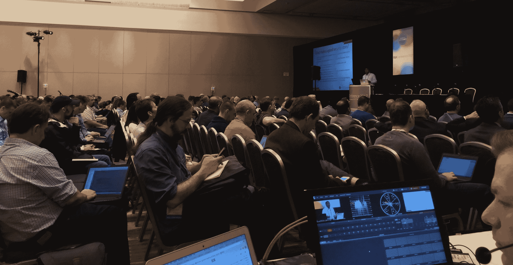](https://devops.com/wp-content/uploads/2017/02/crowd-e1488209283204.jpg)

在 2017 年 RSA 大会上举行的第三届年度“DevOps Connect: DevSecOps”展示了 DevOps 近年来从 IT 亚文化到主流实践的成熟程度。在本幻灯片的演示中，您将看到企业将传统方法转变为开发运维实践、构建更健康的文化以及更安全的软件的第一手资料。

[/nextpage][nextpage title=”Breaking Bad Equilibrium” ]

[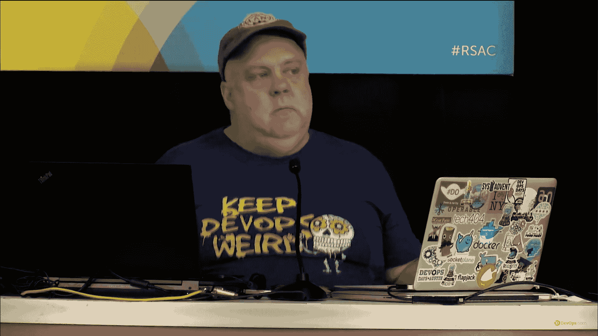](https://devops.com/wp-content/uploads/2017/02/Willis.png)

**打破坏平衡**

约翰·威利斯

在 DevOps 中，我们试图识别并修复不良均衡。我们不断在技术债务、协作、风险和工作生活平衡等领域寻找不连续性。在这次演讲中，John Willis 关注了其他一些成功的领域，这些领域解决了各自领域中的平衡和不连续性问题。威利斯着眼于行为经济学、认知心理学和博弈论等领域。他还拿一些流行文化书籍、电影和游戏节目作为坏的和/或纳什均衡的例子。

你可以在这里看到这个演示[。](https://www.youtube.com/watch?v=W3h3cyFteXs&list=PLotLY1RC8HosrR60aQyafck5qWn2cteQq&t=239s&index=5)

[/nextpage][nextpage title=”A Tale of Two Stories” ]

[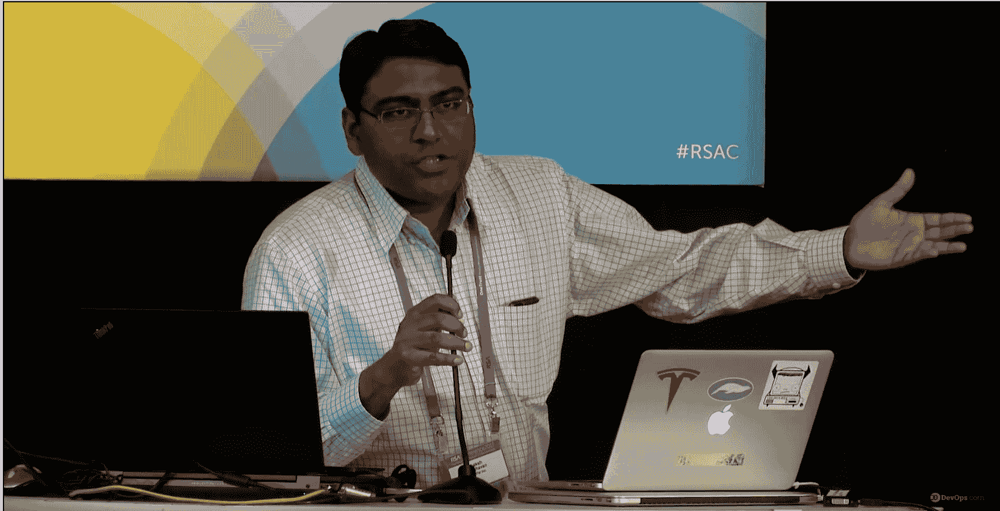](https://devops.com/wp-content/uploads/2017/02/raghavan.png)

**建筑安全:两个故事的故事**

拉克什·拉格哈万

软件安全专业人员的圣杯是让他们的开发团队将功能性和非功能性需求视为平等的公民。这在“敏捷”中变得更加具有挑战性如果你有一种快速简单的方法来编写相关的、可操作的“安全故事”，并把它们放入所有 scrum 团队的待办事项中，这样它们就可以和“用户故事”一起优先完成，这不是很好吗？然而，挑战在于如何在拥有不同框架、应用程序堆栈和编程语言的大型企业中实现这种可伸缩性和无缝性。在这个演讲中，Raghavan 分享了实施这样一个系统的故事——什么有效，什么被证明具有挑战性，以及相关的结果。

你可以在这里看到这个演示[。](https://www.youtube.com/watch?v=_rFVui0dWnI&list=PLotLY1RC8HosrR60aQyafck5qWn2cteQq&t=18s&index=4)

[/nextpage][nextpage title=”2016 State of DevOps Report” ]

[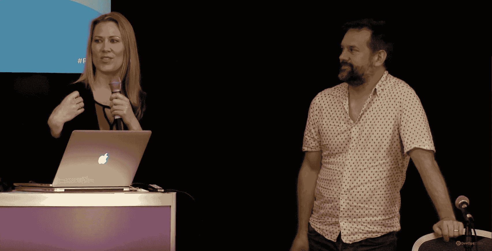](https://devops.com/wp-content/uploads/2017/02/Humble.png)

**开发运维与安全:我们从 2016 年开发运维状况报告中学到了什么**

妮可·福斯格伦博士&杰斯·亨布尔

四年后，在超过 20，000 名调查对象的参与下，Forsgren 和 Humble 对是什么让 IT 和组织绩效变得令人敬畏有了更多的了解。他们还学到了一些关于安全性在技术变革中所扮演角色的知识。他们的最新研究包括对基于主干的开发、精益产品管理和员工参与度的洞察。观看此演讲，了解将使您的团队和技术转型变得更好的实用要点。

你可以在这里看到这个演示[。](https://www.youtube.com/watch?v=cMHThVI6EMA&list=PLotLY1RC8HosrR60aQyafck5qWn2cteQq&t=202s&index=3)

[/nextpage][nextpage title=”Bits and Bytes” ]

[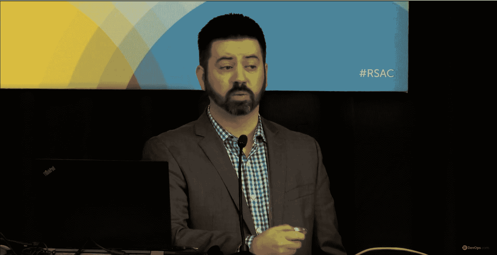](https://devops.com/wp-content/uploads/2017/02/Corman.png)

**比特和字节相遇的地方:DevOps、网络安全和物联网**

约书亚·科尔曼

我们听说软件正在吞噬世界。科尔曼说，软件正在感染世界。在影响公共安全和人类生活的领域，我们对互联技术的依赖增长速度超过了我们保护互联技术的能力。科尔曼在这次演讲中认为，增加数百万行代码并将所有东西都连接到其他东西会将网络物理系统暴露给新的事故和对手。这是真正的位和字节满足血肉之躯。

尽管有最佳实践，但现代软件开发和安全性已经让《财富 100 强》中的 100 家公司丢失了知识产权和敏感信息——甚至我们的政府也经常屈服于对手。这些失败率无法承受失败的后果——不是以创纪录的数字——而是以人的生命和 GDP 来衡量。科尔曼说，矛盾的是，可能需要 DevOps 来应对这些挑战。Rugged DevOps 正在寻找不明显的共同点和突破，如软件供应链原则、更高的可见性和响应敏捷性以及不可变的基础设施。科尔曼说我们必须变得更好，并提供了他对更好的看法。

你可以在这里看到这个演示[。](https://www.youtube.com/watch?v=Fv4uZxNgqKM&list=PLotLY1RC8HosrR60aQyafck5qWn2cteQq&t=674s&index=1)

[/nextpage][nextpage title=”Release engineering” ]

[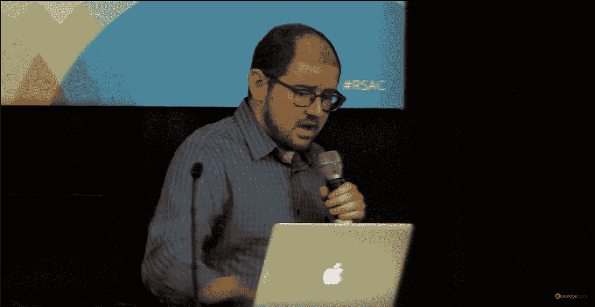](https://devops.com/wp-content/uploads/2017/02/J-Paul-Reed.png)

**发布工程和加固开发的交集**

保罗·里德

在 RSAC 2016 大会上，发布工程在 rugged DevOps 中的作用得到了讨论，重点是它如何与软件交付供应链以及日益重要的安全和安全管理主题相关联。

今年，J. Paul Reed 探讨了我们在过去一年中所学到的关于发布工程和加固开发运维的交集。

他深入研究了特定的发布工程技术和工具，这些技术和工具不仅可以帮助您有效地管理您的软件供应链，还可以让您的软件安全状况变得更好，并在出现安全问题时帮助您更快地修复问题。

他还探讨了软件交付和安全管理前沿的一些新兴趋势，包括在快速、可持续和安全*交付我们社会中越来越重要的软件组件的更广泛背景下，人为因素和系统安全的作用。*

你可以在这里看到这个演示[。](https://www.youtube.com/watch?v=6gm0mwfNqqM&list=PLotLY1RC8HosrR60aQyafck5qWn2cteQq&t=350s&index=2)

[/nextpage][nextpage title=”Next Gen Security” ]

[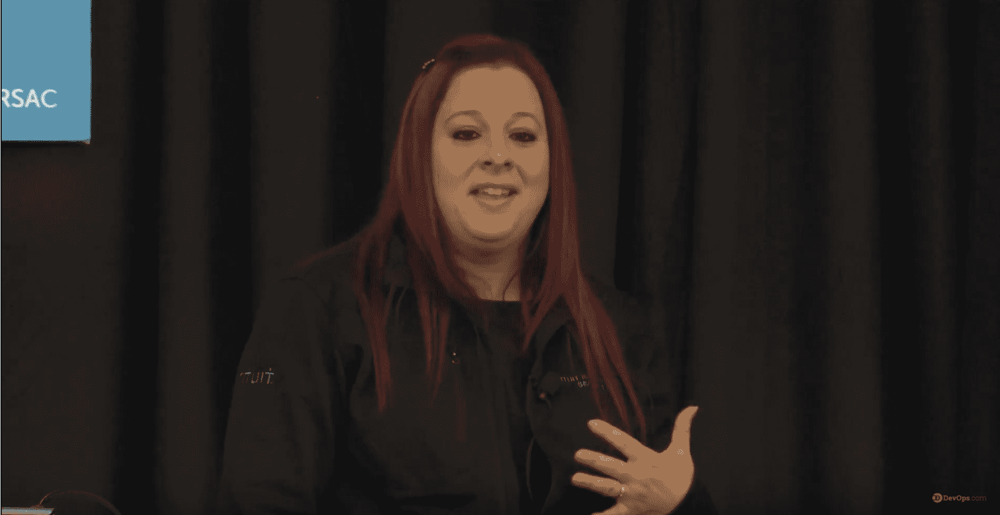](https://devops.com/wp-content/uploads/2017/02/Hacktress.png)

**下一代安全需要你！**

香农·利茨

下一代软件应该从一开始就具有安全性，并需要更好的协作来有效降低攻击者带来的实际风险。有些人可能会说这是异端邪说，但鉴于传统方法的安全漏洞层出不穷的趋势，可能不会。安全的理想状态一直是实现持续改进或 5 级成熟度。正是出于这个目的，安全性一直是软件生产中的一个重要因素，但由于其复杂性，相对难以商品化。

使用 DevSecOps 方法和原则，简单性和高保真度控制正在软件行业中出现，以帮助组织预测攻击者并对其做出更快的反应。Lietz 的演讲为安全从业者提供了一个基本的路线图，以解决如何将 DevSecOps 引入他们的组织并避免早期课程中出现的常见陷阱。

你可以在这里看到这个演示[。](https://www.youtube.com/watch?v=9F6zACCMhko&list=PLotLY1RC8HosrR60aQyafck5qWn2cteQq&t=433s&index=9)

[/nextpage][nextpage title=”DevOps in a Regulated Environment” ]

[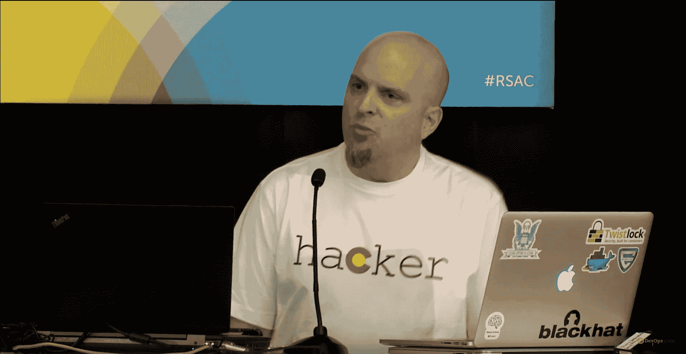](https://devops.com/wp-content/uploads/2017/02/Aetna.png)

**在监管环境中实施 devo PS:Aetna 的经验**

杜安·施林

组织面临的一大挑战是如何将 DevOps 原则引入受监管的行业。医疗保健或金融服务等行业必须遵守严格的安全和治理控制，这通常会导致难以采用 DevOps 和容器化等新技术堆栈。如果您采用了敏捷的软件开发方法，并计划迁移到 DevOps、微服务和容器化，您会遵循什么流程来避免合规失误？本次演讲分享了 Aetna 实现应用堆栈和基础设施现代化的历程。

Schleen 介绍了 DevOps 方法的设计和选择考虑了哪些因素，哪些应用首先迁移到微服务和容器化，以及观察到的结果。Schleen 还介绍了安全部门如何帮助企业理解 DevOps 和容器的优势——消除恐惧而不是增加恐惧。最后，Schleen 详细介绍了在快速变化的应用程序环境中设计安全性的经验，以及持续集成和持续监控如何在交付应用程序灵活性的同时提高安全性警惕性和能力。

你可以在这里看到这个演示[。](https://www.youtube.com/watch?v=8iSvTmpe4e8&list=PLotLY1RC8HosrR60aQyafck5qWn2cteQq&t=374s&index=10)

[/nextpage][nextpage title=”Ops Happens” ]

[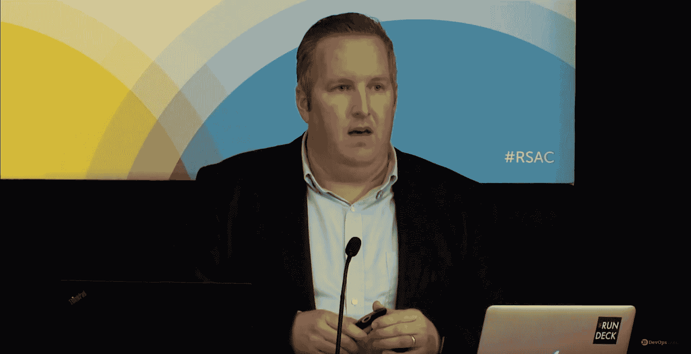](https://devops.com/wp-content/uploads/2017/02/Edwards.png)

**操作发生:部署后的开发操作**

达蒙·爱德华兹

听了足够多的 DevOps 会议演讲，一切开始听起来像是:“部署，部署，部署。”但是部署后会发生什么呢？DevOps 对其他传统企业运营活动(如事件响应、问题管理和法规遵从性)意味着什么？

达蒙·爱德华兹在本期节目中解答了这些问题。在这里，Edwards 研究了当 DevOps 启发的交付团队的“快速”精神符合传统企业运营组织的“稳定、安全、合规”要求时会发生什么。

Damon 还指出了 DevOps 启发的原则和实践正在被正在转变其运营组织的高绩效企业所利用。

你可以在这里看到这个演示[。](https://www.youtube.com/watch?v=G6CpgTM7Eys&list=PLotLY1RC8HosrR60aQyafck5qWn2cteQq&t=587s&index=8)

[/nextpage][nextpage title=”Requirements Gathering” ]

[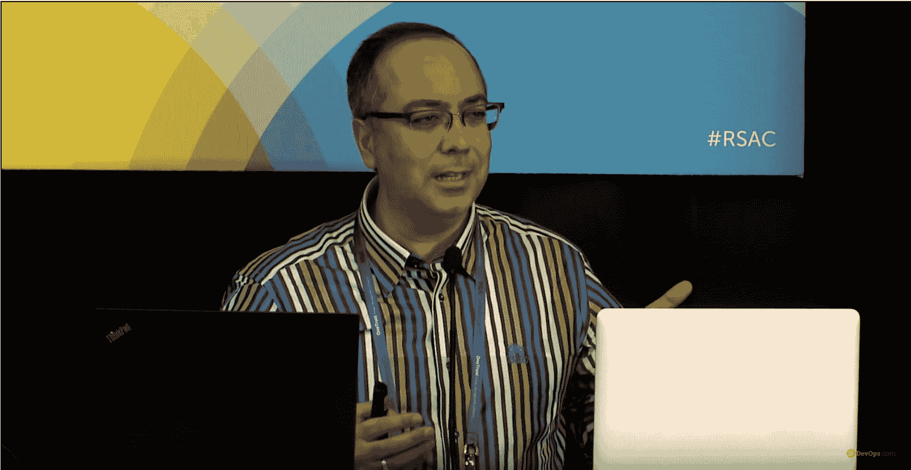](https://devops.com/wp-content/uploads/2017/02/Yassar.png)

**成功实施加固型 DevOps 的需求收集**

*哈桑定律*

必须在应用程序开发生命周期中包含安全的编码实践，以生产健壮的软件。然而，每个组织的开发管道和应用程序与其他组织相比是不同的。在成功实施加固型 DevOps 之前，也有必要做好准备。这包括组织文化、安全策略、开发平台、应用程序技术堆栈、运营团队的参与以及最重要的安全编码实践。问题是:如何评估，发现什么是瓶颈，对谁进行什么方面的培训，测量什么，最后是如何监测。然后，构建您定制的集成 DevOps 平台，您可以在该平台上构建坚固的应用程序以及其他质量属性，如合规性、安全测试和性能监控。

DevOps 的新兴概念包括许多可用于提高开发应用程序安全性的概念。这些包括在软件开发周期或持续集成周期中添加基于风险的架构设计、自动化安全测试技术，如模糊测试、软件渗透测试。应用这些和其他 DevOps 原则可以对创建一个有弹性和安全的环境产生很大的影响。在本次会议中，Yasar 解释了他的公司如何确定正确的要求，以及您如何在自己的组织中利用这些要求来实现加固型 DevOps。

你可以在这里看到这个演示[。](https://www.youtube.com/watch?v=LX6t4KemVm0&list=PLotLY1RC8HosrR60aQyafck5qWn2cteQq&t=82s&index=11)

[/nextpage][nextpage title=”Getting Security Up to Speed” ]

[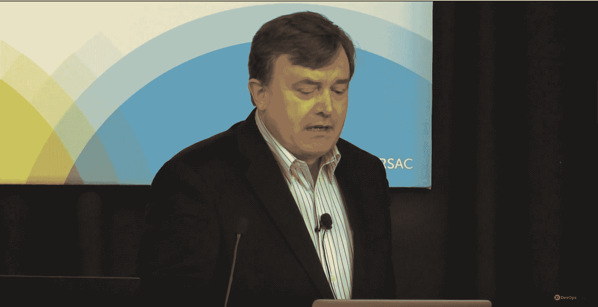](https://devops.com/wp-content/uploads/2017/02/Gryb.png)

**提高安全性**

*Oleg Gryb*

因此，您已经采用了敏捷软件开发生命周期，并且您的 DevOps 团队运行持续集成/持续部署。但是安全性呢？如果您还没有想出如何加速您的安全过程，它很容易成为一个瓶颈并减慢整个软件开发过程。Gryb 展示了如何避免这种情况。

Gryb 讨论了如何用新的流程替换旧的安全流程，以及如何添加更多利用现有质量保证测试用例的安全自动化工具。

你可以在这里看到这个演示[。](https://www.youtube.com/watch?v=A5hddsO2KOE&list=PLotLY1RC8HosrR60aQyafck5qWn2cteQq&t=1370s&index=6)

[/nextpage][nextpage title=”Scaling Rugged DevOps” ]

[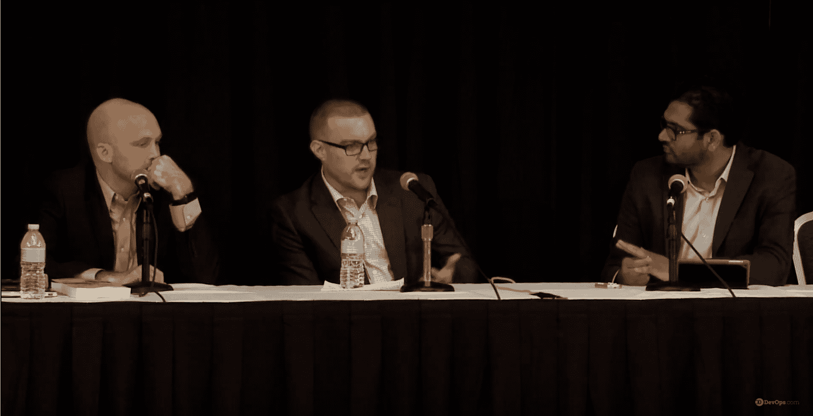](https://devops.com/wp-content/uploads/2017/02/Scaling.png)

**将加固的 DevOps 扩展到数千种应用**

蒂姆·蔡斯，亚伦·莱因哈特，杰夫·威廉姆斯

关于 rugged DevOps 的大部分谈话都是琐碎的。编写一个脚本，将您的扫描仪连接到 Jenkins，将您的 WAF 连接到 SIEM，通过 JIRA 将结果提供给开发人员，然后宣布胜利。如果您有多个工具，也许可以将结果推入 ThreadFix。但是很快你的杯子就会充满需要人工筛选的漏洞报告。如果你想扩大规模，你需要一辆自动倾卸卡车和一支军队。如果你想真正扩展坚固的 DevOps，你需要让人类离开关键路径。

在本次演讲中，这三位专家探讨了大型企业如何通过检测其应用程序组合、并行评估和保护应用程序以及支持直接向利益相关方发送即时通知的集成来应对这一挑战。其结果是在开发和运营期间提供持续的保护。

你可以在这里看到这个演示[。](https://www.youtube.com/watch?v=5fJ6GHkG53s&list=PLotLY1RC8HosrR60aQyafck5qWn2cteQq&t=477s&index=7)

[/nextpage][nextpage title=”Other articles” ]

**你可能喜欢的其他 DevOps.com 文章:**

[安全@速度 DevOps 调查:努力仍然滞后](https://devops.com/security-speed-devops-survey-efforts-still-lag/)

DevOps 的难以捉摸的定义

[2017 年 DevOps:从搭建到执行](https://devops.com/devops-2017-building-executing/)

[/nextpage]

— [乔治·v·休默](https://devops.com/author/george-hulme/)