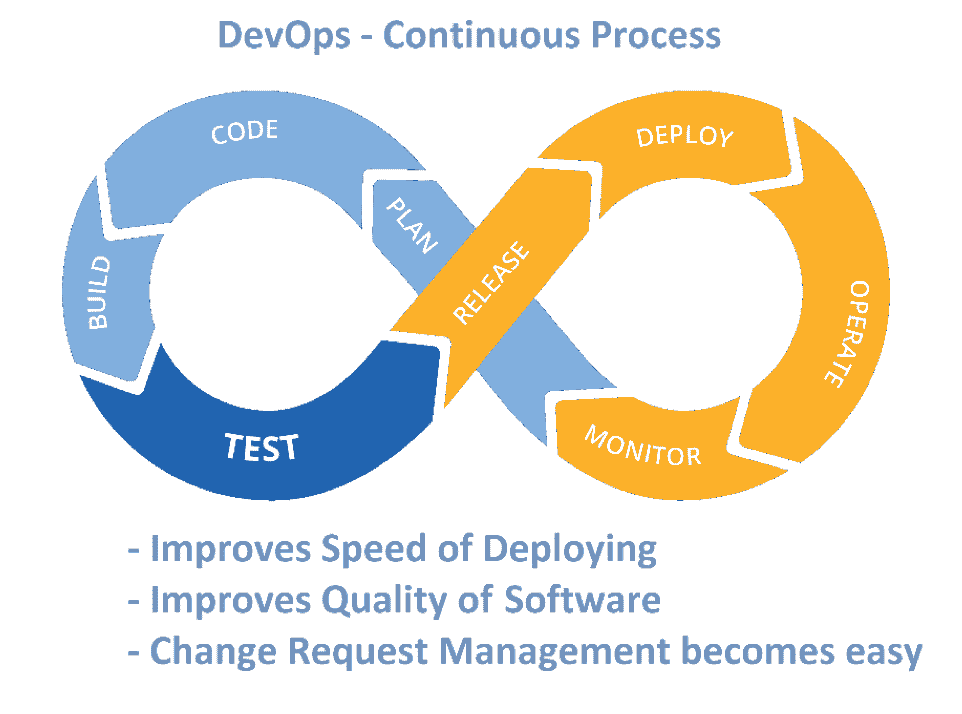
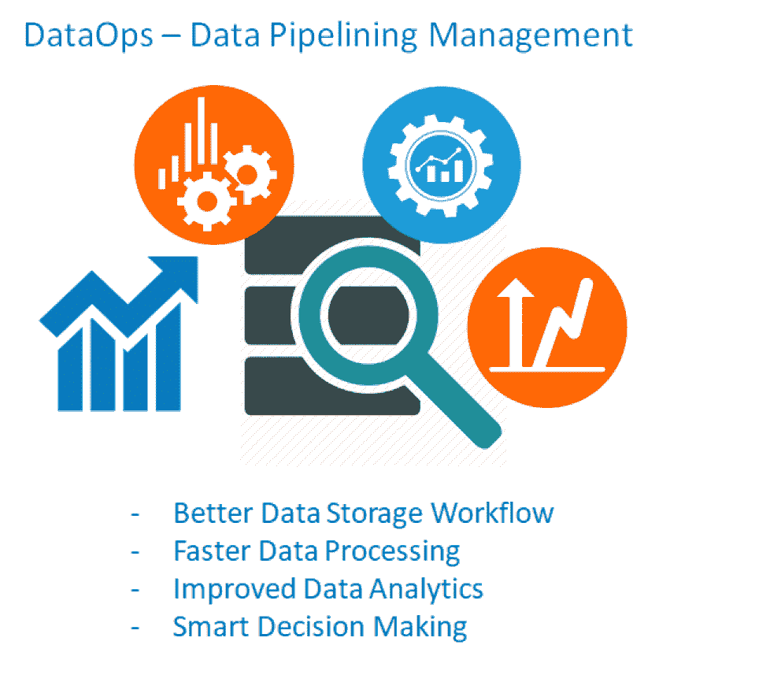

# 开发运维与数据运维:组织转型的催化剂

> 原文：<https://devops.com/devops-dataops-catalysts-for-organizational-transformation/>

在过去的几十年里，互联网的使用呈指数增长。如今，构建高质量的 web 应用程序并有效管理其庞大数据的需求是任何组织都非常关心的问题。因此，为了找到更好的软件开发和数据管理方法，一直在不断探索。

为了满足当今互联网用户的需求，许多技术公司已经加快步伐，并不断利用他们的资源来寻找更有效的方法，以更短的时间和更高的质量开发 web 应用程序，并寻找更有效的方法来管理和分析其数据。

为了在应用程序开发和数据流水线管理方面实现同样的目标，许多大型组织已经开始遵循一套实践—分别是 DevOps 和 DataOps。

在本文中，我们将了解什么是 DevOps 和 DataOps，然后我们将关注最终的问题:它们是否真的值得在组织中实施，以及遵循相同的[实践集是否真的能够改善应用程序开发](https://www.techrepublic.com/blog/10-things/10-things-you-can-do-to-improve-your-application-development/)和数据管理——以及组织的增长？

## DevOps 和 DataOps:简介

简而言之，DevOps 和 DataOps 分别是软件开发和数据管理的一套实践，用于特定的项目或在组织级别上遵循。

DevOps 强调各种团队(软件开发团队、质量保证团队和 IT 运营团队)流程的自动化，以便他们能够快速完成应用程序开发的相关任务(即计划、编码、构建、测试、发布、部署、操作和监控)。此外，这些团队将能够通过以更高的部署频率以更小的部分交付/发布软件来保持软件应用程序的更高质量，同时保持低成本，从而更加无缝地遵循敏捷方法。

相比之下，DataOps 可以定义为具有数据分析功能的 DevOps。

如前所述，我们知道 DevOps 强调软件开发团队(包括测试人员)与系统管理员(运营团队)的协作。同样，DataOps 也需要数据工程师、数据科学家和其他处理数据相关流程(即存储数据、分析数据、从数据中得出决策、归档数据或交付数据)的数据专业人员团队的协作。

这个概念强调同一个组织的不同团队之间的沟通和协作。合并后的团队可以更好地了解项目，并更快地得出结果。它还将通过证明这样一个事实来提高组织的士气，即当涉及到项目管理时，人们将总是凌驾于过程和工具之上。

| DevOps | 数据操作 |
| 软件开发的自动化和监控 | 数据管道/管理的自动化和监控 |
| Combination of–软件开发–质量保证–技术运营 | Combination of–数据工程–数据集成–数据质量–数据安全/隐私 |
| Collaboration of–软件工程师(开发人员)–系统管理员(运营团队)–测试人员 | Collaboration of–数据工程师–数据科学家–数据分析师–数据专业人员 |
| Typically aims at–更短的开发周期–增加部署频率–快速从开发到/从测试到生产–更可靠的版本 | Typically aims at–存储工作流的自动化–监控运营流程–优化数据分析–创建实施数据质量规则的基础设施 |

现在，我们已经了解了关于 DevOps 和 DataOps 的基本细节，以及它们分别为软件开发和数据管理做了什么，让我们来看看它们的一些潜在优势，看看它们是否真的能够促进组织转型。

## DevOps 和 DataOps 对适应组织的好处

在项目执行和组织运营中采用开发运维及数据运维的既定流程有诸多好处。以下是在组织中应用 DevOps 实践进行[应用程序开发的一些主要好处。](https://www.tatvasoft.com.au/services/application-development.php)

### DevOps 的优势

*   **透明的流程和跨组织的文化—**通过开发团队、QA 团队和 IT 运营团队在每个部署周期的持续沟通和协作，每个员工都将获得项目的最新信息，并更加了解其他部门的流程。
*   **更快、更高质量的部署周期—**通过应用 DevOps 的一套实践，尤其是更短的开发周期，将提高部署的频率。由于团队的关注点是有限的——例如，在一个部署周期中的小任务/模块，因此每次部署的质量都会提高。
*   **更快地解决 bug****——随着任务变小并持续部署在相关服务器上，开发团队将很快从 QA 团队获得反馈，从而使开发团队能够更快地解决任何不起作用的功能。应用程序稳定性将是这个过程的副产品，因为任何错误背后的原因都可以很容易地识别出来(因为错误的特定部署周期是已知的)。**
*   ****处理计划外工作的灵活性**–由于敏捷方法坚持处理提出的变更请求，使用 DevOps 简化的团队将能够更有效地处理此类计划外工作。**

### **数据运营的优势**

*   ****更快的数据处理速度**–随着各个团队的协作、持续沟通以及在微型数据库上工作，而不是一次性完成，各个流程阶段的数据处理速度大大加快。**

****

*   ****更快解决问题****—与 DevOps 类似，在 DataOps 中，数据是成批处理的，而不是一次处理。这种方法有助于更快地识别与大量数据相关的问题，并且可以更快地得出问题的解决方案，因为焦点是有限的。****
*   ******更好的数据安全性**–由于数据安全专业人员与数据集成商和数据分析师保持持续联系，在每个流程级别保护数据变得更加容易。****
*   ******提高资源产出**–当团队坚持数据运营的基本原则时，各个团队之间的无缝沟通和透明度将有助于每个团队成员的表现，并将带来更好的资源产出。****

## ****DevOps 和 DataOps 的实施程序****

****定义实施 DevOps 和 DataOps 的流程很简单，但实施相同的流程确实需要团队付出巨大的努力。让我们首先关注实施 DevOps 流程的一般步骤:****

*   ****以前孤立的团队(即软件开发团队、质量保证团队和 IT 运营团队)之间的协作、沟通/无缝集成****
*   ****将主要模块/大型开发任务分解成更小的任务****
*   ****每个部署周期/每个较小的任务都应遵循开发运维流程****
*   ****工具——市场上有各种各样的工具可以用来完成 DevOps 的过程，也有一些持续开发和执行敏捷操作的技术——比如看板、Scrum 等。，这是无缝应用程序部署应该遵循的。****

****对于 DataOps，市场上没有特定的软件工具可用于实施 DevOps。但是有一些框架及其支持工具可以帮助基于敏捷的项目管理的数据操作方法。****

*   ****应重新定义数据存储和分析基础架构，即建议采用基于集群或冗余的数据存储方法。还应该采用一些最新的数据分析技术。****
*   ****还建议使用基于微服务的架构和软件，以混合各种类型的数据，即结构化和非结构化数据****
*   ****实施“专门构建”的数据库引擎——通过这样做，访问和分析大量数据变得更加容易(这些是驱动谷歌搜索、YouTube 等的相同类型的数据库引擎)。)****
*   ****支持工具——应使用有助于项目敏捷性和团队间协作的工具，即 ETL/ELT 工具、数据管理和编目工具以及日志分析器。对于数据融合，可以使用 Map Reduce、HDFS、Kafka、Hive、Spark 等软件工具****

## ****结论****

****长期以来，所有 IT 组织都在管理软件应用程序开发及其相关数据。但是现在，我们正处于这样一个时代，用速度和质量管理同样的东西可以让你的组织站在其他同行公司之上。采用 DevOps 和 DataOps 需要团队的纯粹奉献和专注，但实施后的输出将非常积极，这样遵循的标准肯定会建设性地转变组织。****

****— [维卡什·库马尔](https://devops.com/author/vikash-kumar/)****