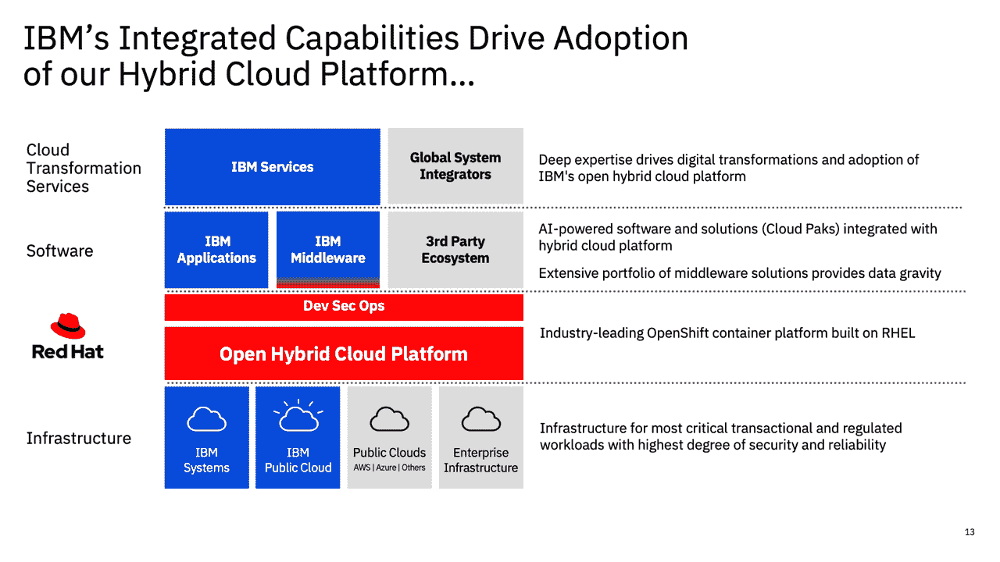

# DevOps 更深入的探讨:IBM 将“疯狂关注”混合云、人工智能

> 原文：<https://devops.com/devops-deeper-dive-ibm-to-manically-focus-on-hybrid-cloud-ai/>

IBM 本周宣布，它打算在明年成立一家新公司，主要专注于托管基础设施，作为更加关注混合云计算和人工智能(AI)计划的一部分。

IBM 正在将去年通过 340 亿美元收购获得的 Red Hat 资产与其对 Watson AI technologies 的投资相结合，而一家尚未命名的公司将控制 IBM 外包服务，目前这些服务由 IBM 全球技术服务部门的托管基础设施服务部门提供。

去年 4 月任命的 IBM 首席执行官 Arvind Krishna 在与分析师的电话会议上表示，IBM 将主要关注由 Red Hat OpenShift、Linux、Kubernetes、containers 和 DevSecOps 软件技术驱动的高增长机会，这些技术将推动价值万亿美元的混合云计算机会，而新公司将成为世界上最大的 IT 服务提供商，拥有超过 90，000 名员工，为超过 4，600 个客户提供服务，产生超过 190 亿美元的收入。今天，IBM 从这些服务中获得超过一半的收入，并声称有 600 亿美元的服务积压。

Krishna 说，新方法将使 IBM 能够“疯狂地专注于”混合云计算和人工智能机会。这种转变还将创造一家能够实现两位数增长的独立公司，在投资者向软件公司投入数十亿美元之际，这应该会导致更高的股票估值。IBM 本周披露，它拥有 2400 个混合云平台客户，由红帽软件推动的大型交易数量增加了两倍。

为了实现其金融工程目标，IBM 将承担多项费用，包括剥离新公司的 25 亿美元和建立新公司的 23 亿美元。

IBM 拥有分拆公司的悠久历史。克里希纳指出，在新的形式下，随着公司进行更多的收购，公司将同时实现有机和无机增长。

加速战略集团(ASG)首席执行官兼管理分析师 Mitch Ashley 说,“新的”IBM 看起来和感觉上更像 Red Hat，而不是收购 Red Hat 之前的 IBM。

“这开始变得更像红帽收购 IBM，”他说。

IBM 将能在多大程度上主导混合云计算还不清楚。IBM 正在通过在基于 Kubernetes 的 Red Hat OpenShift 平台上实现标准化来统一 IT 管理，Kubernetes 可以部署在任何公共云或内部 IT 环境上，包括那些也包含大型机和 x86 服务器的环境。随着新冠肺炎疫情带来的经济衰退，IT 组织通过集中管理云计算平台来降低成本的速度有望提高。

研究和咨询公司 Hurwitz and Associates 的总裁兼首席执行官 Judith Hurwitz 表示，在企业中采用多个云计算平台往往是被动的，任何集中管理这些平台的努力都仍处于规划阶段。

“这不容易，”她说。“这不像你可以出去买一架控制飞机。”

然而，最终，IT 团队将有多个选项可供选择，这些选项不一定要求他们采用 Red Hat OpenShift 平台。

类似地，IT 组织可以通过云服务访问各种开源人工智能框架，这些框架为 Watson 产品提供了替代方案。

与此同时，组织向混合云和人工智能平台过渡的速度正在加快。IBM 需要应对的问题是，在剥离过程中，确保它不会被自己的内部问题分心，剥离可能需要一年多的时间才能最终完成。