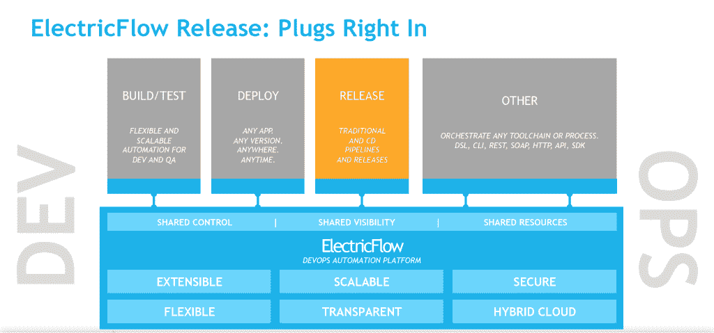

# DevOps 企业峰会 2015 拉开帷幕

> 原文：<https://devops.com/devops-enterprise-summit-2015-kicks-off/>

你要去旧金山吗？如果你是，你不必在头发上戴一朵花。但是，如果你对 DevOps 感兴趣，或者想成为 DevOps 的一员，并且本周在旧金山，你应该参加 2015 年 devo PS 企业峰会。会议由 Gene Kim 的 IT 革命和[电子云](http://electric-cloud.com/)制作和主办，为期 3 天，充满了采用 DevOps 的企业的成功故事。

此外，许多领先的 DevOps 公司赞助、参展或以其他方式参与。一些公司正在制作或宣传最近的公告。Electric Cloud 自己刚刚发布了一个重大公告，发布了 [ElectricFlow Release](http://electric-cloud.com/products/electricflow/release) ，据该公司称，它“通过将软件交付简化和自动化到高度组织和精心编排的发布管道中，帮助组织加速应用程序发布。对于采用 DevOps 和连续交付的软件团队来说，它用跨越传统和连续交付风格的应用程序版本的单一统一视图取代了清单和电子表格，从而提高了可靠性、透明度和可预测性，同时降低了风险。”

更多信息请见本周的另一篇文章。

IBM 也发布了一个关于 BlueMix Garage 方法的重要公告。我有机会与兰迪·纽维尔谈论这个新版本，你可以在这里收听和阅读对话的文字记录。IBM 是 DOES 的主要赞助商，并计划了几场会议和活动，包括周一晚上在镀锌大楼举行的 DevOps 车库活动。

DevOps.com 将广泛报道 2015 年的指定经营实体。Ericka Chickowski 和我将会在会议的三天时间里在博客上进行现场直播，此外，我还会为我们的读者提供最新消息。此外，我们正在大厅旁的大厅里设立一个视频摊位。我们正在视频采访会议上的每一位发言者，以及其他嘉宾。期待这些视频即将推出。

所以如果你在的话，请到我们的录像机前打个招呼。如果你不能来，DevOps.com 将尽我们所能让你了解 DOES 2015 的最新进展。