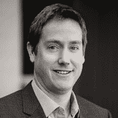

# Google Hangout:面向多速 IT 的 DevOps

> 原文：<https://devops.com/devops-for-bi-modal-it/>

无论您称之为双速 it、双模 IT 还是变速 IT，随着组织内的团队、项目和部门交付业务能力，这是一个现实。这些业务功能由服务和应用程序组成，当它们被编排时，向用户交付业务价值。需要这些功能的业务线并不关心这些单独的服务和应用程序是如何交付的，他们希望它们是高质量的，以获得最大的客户和业务价值，并且能够快速交付。这个小组将由 IBM 的专家和我们的几个客户组成。小组成员将讨论他们如何在双速 IT 模型中采用 DevOps:面临的挑战、取得的成功和吸取的教训。

### **日期:2016 年 2 月 3 日星期三**

### **时间:东部标准时间**下午 4 点

```
HANGOUT LINK:(NO REGISTRATION REQUIRED*) 
```

**Google Hangouts are FREE.  To participate in a Google Hangouts LIVE,
a Gmail or Google  Profile is required.* 

[//www.youtube.com/embed/23d3Re4Rduo](//www.youtube.com/embed/23d3Re4Rduo)

## 你的主持人

**Alan Shimel |主编| DevOps.com，**Alan 是安全和技术界经常被提及的人物，也是行业和政府活动中广受欢迎的演讲者，他将强大的商业背景与深厚的技术知识相结合，帮助建立了几家成功的技术公司。

## 我们的客人

**Carmen DeArdo, Technology Director | Nationwide Insurance**

Carmen 是 DevOps 的热心拥护者，也是 DevOps 和技术相关活动的主要发言人，她负责在移动、分布式和大型机以及其他技术中利用 DevOps、精益和敏捷技术推动持续交付。

**Brad Schick, CTO/VP of Engineering | Skytap**As Chief Technology Officer, Brad Schick leads Skytap’s overall architecture, technical direction, and IP strategy. Brad also ensures Skytap’s technology aligns with the company’s vision and key partnerships. As Vice President of Engineering, Brad runs Skytap’s engineering, quality assurance, and operations teams. Brad is a software industry veteran with proven team and corporate leadership skills. Most recently, Brad was founder at Wegos, Inc., an innovative gaming start-up. Prior to Wegos, he was the Vice President of Engineering at Vizrea, which was acquired by Microsoft in 2007\. Earlier in his career, Brad worked at Microsoft Corporation, where he led development teams on Windows and Internet Explorer. Brad has also been an instructor at the University of Washington and has a passion for hands-on problem solving and programming at all levels. Brad holds a B.S.E. in Mechanical Engineering from Tufts University and was recently the [winner of the Startup Technology Star award](http://www.bizjournals.com/seattle/print-edition/2013/12/13/brad-schick-winner-startup-tech-star.html) presented by Puget Sound Business Journal. **Sanjeev Sharma, IBM Distinguished Engineer| IBM** Sanjeev is an IBM Distinguished Engineer, and the CTO for DevOps Technical Sales and Adoption at IBM, leading the DevOps practice across IBM. Over the past three years Sanjeev has become the client facing Technical Sales SME and Solution Architect for DevOps and is recognized as a Thought Leader for DevOps within IBM, with IBM’s customers and across the broader DevOps solution space. Sanjeev is responsible for leading the worldwide technical sales community for DevOps offerings across IBM’sa portfolio of tools and services. Sanjeev speaks regularly at conferences around the world, including IBM InterConnectr, IBM Innovate, IBM Pulse. IBM Impact and IBM Connect.