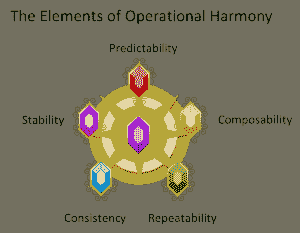

# 我的小操作:DevOps 是魔法

> 原文：<https://devops.com/devops-is-magic/>

忍耐一下，最终一切都会有意义的。

如果你不熟悉我的小马:友谊是神奇的(因为你没有一个孩子一遍又一遍地看着它……嗯，完了)让我给你总结一下:

有一匹小马知道可怕的事情要来了。她想阻止它。相反，她是被管理层派来交朋友的，面对一场迫在眉睫的灾难，这在她看来是荒谬的。当灾难发生时，她和她的新“朋友”(她的同事)出发去寻找和谐的元素——唯一能拯救世界的东西。但是你瞧，邪恶破坏了自然环境。至少看起来是这样。看，原来朋友是和谐元素的化身，通过他们的友谊，他们创造了最强大的元素:魔法。他们团结一致，足以战胜邪恶，恢复数据中心的和谐。呃，我是说，去小马世界。

如果我们将此应用到运营中，您应该会发现一些共同的主题。首先，你可能会注意到，像魔术一样，DevOps 的最终目标——敏捷性——只能通过运营和谐的其他元素的协作努力来“实现”,即可预测性、可重复性、可组合性、一致性和稳定性。它不是你能买到的有形的“东西”，它不是罐装的，也不能由亚马逊送货上门。

这些元素结合在一起，当合作实践时，就产生了一个新的元素:敏捷性。这是基于各种调查的 DevOps  的一个重要目标。哦，它总是以不同的方式陈述:我们希望缩短上市时间，增加部署频率，减少因错误导致的停机时间，等等…但总的来说，这些都属于在运营(和网络，但这是一个不同的讨论)中实现相同级别的“敏捷性”的需求，就像现在的应用程序开发一样。快速而频繁的变化以适应应用程序(和业务)的变化。敏捷。

但是敏捷就像魔法一样，只能通过友谊(或者我们称之为合作)来实现。这是因为敏捷性需要各种不同的关注点(质量)在实现之前聚集在一起:

敏捷性(DevOps)

*   可预测性(部署时间，对规划很重要)
*   (工艺对其他应用的)可重复性
*   可组合性(在其他流程中重用步骤)
*   一致性(对过程中的可维护性和信任很重要)
*   (整体基础设施的)稳定性

这就是为什么不把 DevOps 看作一套工具是很重要的。DevOps 有多个方面可以通过工具实现，通过工具增强，甚至通过工具监控，但 DevOps 本身并不是工具，就像和谐的元素是小马们寻找的宝石一样。DevOps 的真正魅力在于通过协作将每个元素带入运营而创造的敏捷性。没有稳定性，你实现敏捷了吗？还是真的乱了？

如果您不能重复这个过程(将它应用到其他应用程序)，那么您是否真的实现了敏捷性，或者仅仅是严格地编写了一个部署？如果过程不一致，并给出不同的结果，你意识到一个敏捷的环境还是无政府主义的环境？

这些要素对于实现真正的运营敏捷性是必要的，而这些要素只有在它们都协同工作的合作环境中才能实现。

DevOps，如此看来，终究是魔法。