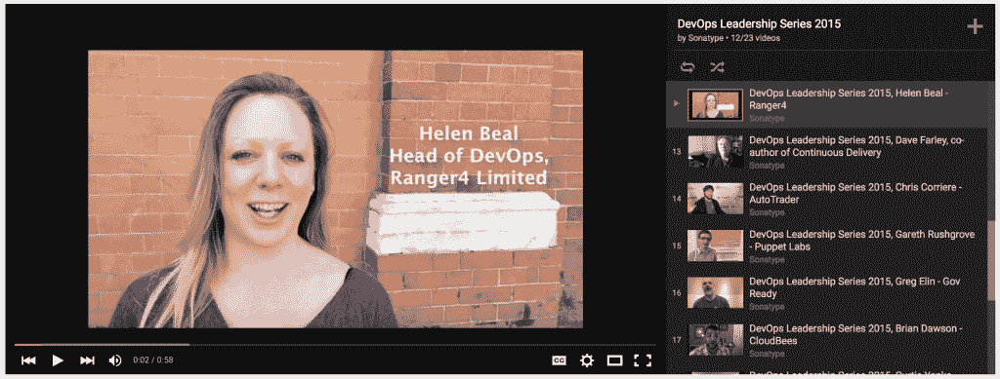

# DevOps 领导力系列 2015:女性与多样性——思想和贡献的多样性

> 原文：<https://devops.com/devops-leadership-series-2015-women-diversity-2/>

DevOps 运动的许多领导者和实践者都是女性。我希望这不会让你感到惊讶。DevOps 一直信奉多元化的思想和贡献。举个例子，在今年的 [DevOps Days Boston](http://www.devopsdays.org/events/2015-boston/) 活动中，近 50%的演讲者是女性。

在这一集的 DevOps 领导力系列中，我们赶上了 [詹妮弗·戴维斯](https://www.linkedin.com/in/sigje)[*有效 DevOps*](https://www.amazon.com/Effective-DevOps-Building-Collaboration-Affinity/dp/1491926309) (奥赖利 2015，$31)和软件工程师 at [厨师](https://www.chef.io/chef/) 。Jennifer 讨论了更多样化的 DevOps 的含义。她看到了将 DevOps 扩展到 QA、安全、DBA 和整个组织的其他职能团队的更明确的努力。Jennifer 还讨论了重新设定对某些词语(例如，敏捷、测试驱动开发、审计驱动开发)含义的期望的好处，以加快进度并消除障碍:

[https://www.youtube.com/embed/B-zONUI5KQ4?feature=oembed](https://www.youtube.com/embed/B-zONUI5KQ4?feature=oembed)

我们随后采访了 [詹姆斯·梅克尔](https://www.linkedin.com/in/eronarn) 、哈佛 [的现场可靠性工程师](http://www.harvard.edu/) 以及 DevOps Days Boston 的组委会成员。从规模和行业角度来看，詹姆斯见证了去年参展公司多样性的显著增长。James 还讨论了组织委员会在为活动进行规划时所坚持的多样性的重要性。如果你正在组织自己的 DevOps Days 活动，一定要听一听:

[https://www.youtube.com/embed/BZZCjw9YEps?feature=oembed](https://www.youtube.com/embed/BZZCjw9YEps?feature=oembed)

如果你错过了 DevOps Days Boston 系列的第一部分，请务必观看这些来自 [【持续接触】的本诺·查普曼](https://www.youtube.com/watch?v=nWQitydh904)[yield bot 的安东尼之春](https://www.youtube.com/watch?v=sQufvcFiRmo) 和 [木偶实验室的耶利米·沙利文](https://www.youtube.com/watch?v=KEcIeBIrQNI) 的采访。

想从 DevOps 的顶尖人物身上学到更多东西吗？你可以在 YouTube 上找到这个系列的[21 个视频的完整库。](https://www.youtube.com/watch?v=0IXrnhcRNUk&list=PLGB2s-U5FSWPjwib5ZQv8wUbZMkqTQNl5)

*特别感谢我的同事，* [*马克·米勒*](https://www.linkedin.com/in/seniorstoryteller) *在活动现场为我们拍摄了这些视频。*