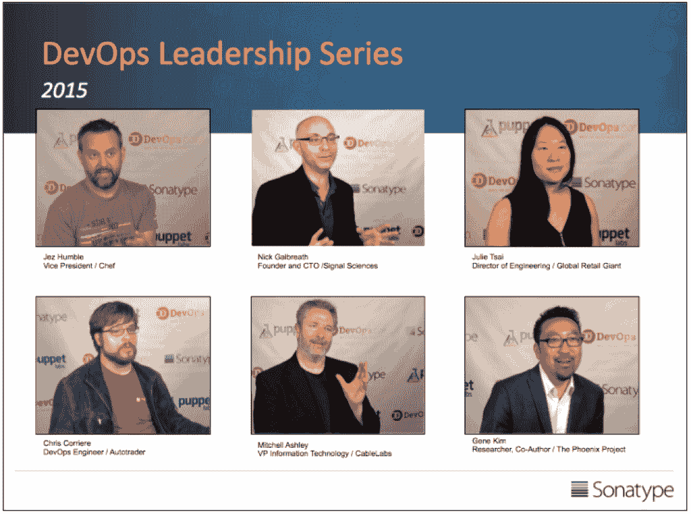

# DevOps 领导力系列 2015

> 原文：<https://devops.com/devops-leadership-series-2015/>

我们最近在旧金山举办了第二届年度“DevOps:喝酒，而不是抱怨”活动，汇集了 DevOps 领域的一些思想领袖和主要从业者。我们交换战壕里的故事，形成新的见解，并提供未来的愿景。

本周，我将分享从活动中捕捉到的视频，这些视频突出了我们对话中的关键主题。我们称之为 DevOps 领导力系列。

你会听到:

*   [Jez Humble](https://www.linkedin.com/pub/jez-humble/0/b73/2b) (厨师)、 [Julie Tsai](https://www.linkedin.com/in/julietsai) (零售业巨头)和 [Nick Galbreath](https://www.linkedin.com/pub/nick-galbreath/4/79/189) (信号科学)讨论软件供应链的重要性

*   Chris Corriere (Autotrader)和[Mitchell Ashley](https://www.linkedin.com/in/mitchellashley)(cable labs)将分享对开发和安全状况的看法

在接下来的几周内，我将在西海岸参加 **[速度大会](http://velocityconf.com/devops-web-performance-2015)** ，在东海岸参加 **[DevOps Days DC](http://www.devopsdays.org/events/2015-washington-dc/)** 。在这些活动中，我将从 DevOps 思想领袖那里获得更多见解。如果您计划参加这些活动中的一个，让我们为该系列捕捉您的 DevOps 视角。若要参与，请在下面留下评论或在[@ weeks weets](https://twitter.com/weekstweets)上联系我。

今天，我们将从 [Gene Kim](https://www.linkedin.com/in/realgenekim) 开始讨论 devo PS 2015 年的重要主题:

[youtube http://www.youtube.com/watch?v=0IXrnhcRNUk]

**该系列的第 2 部分现已在:**发布

https://devops.com/2015/05/19/devops-leadership-series-software-supply-chains/