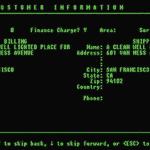

# 遗留系统中的开发运维:不可能完成的任务？

> 原文：<https://devops.com/devops-legacy-systems-mission-impossible/>

“遗产”这个词引起了 IT 和商业人群的不同反应。对于那些依赖 zSeries 和 iSeries 平台等遗留系统的人来说，这是一种将稳定可靠的应用程序交付到产品中的方法。可能不了解技术复杂性的业务涉众通常会认为，“当它还没坏的时候，为什么要修复它？”

###### 

另一方面，对于那些没有经历过遗留系统的快乐和痛苦的人来说，遗留世界将继续挑战他们的逻辑和假设，因为他们的世界观是由开放系统世界形成的，开放系统世界具有完全不同的特征:更易改变和易于维护等。因此，在旧世界和新世界之间存在着巨大的鸿沟。将敏捷和开发运维加入到增加发布频率和减少交付时间的崇高目标中，我们最终会有一个难以跨越的鸿沟。

###### 

像 Gartner 这样的公司已经提出了诸如双速交付这样的概念来帮助应对这一遗留挑战。在我看来，双速的想法有一个问题，因为它一开始就基于一个错误的类比——即根据你是在高速公路上还是在城市道路上，允许车辆以不同的速度行驶。这种类比适用于流量管理场景，但不适用于我们在企业中看到的复杂 IT 架构。企业环境中跨系统的依赖关系太复杂，耦合太紧密，无法用这样的二元逻辑来定义。根据我的经验，我发现许多敏捷和 DevOps 转换遇到了障碍，并且从未达到期望的生产力和有效性水平，因为对遗留和开放系统之间的这些复杂依赖关系的看法过于简单。

阻碍传统 DevOps 转型的三大挑战是心态问题、架构约束和工具限制。

## **心态问题**

“没有遗留系统，只有遗留思维。”这是我最近从一家试图在企业范围内采用 DevOps 的大型组织的工程师那里听到的一句名言。团队最初对采用 DevOps 方式的抵制是由于不愿意改变，从多年来(如果不是几十年的话)以某种方式做事情的惯性中产生的。心态问题对于传统世界之外的人和之内的人来说都是一个问题。“局外人”——通常是领导层、管理团队和顾问——倾向于将问题过于简单化，并且过于依赖开放系统世界的例子。这只会疏远现有的遗留团队，并使他们更加怀疑 DevOps 驱动的变更。局外人需要对遗留架构的挑战有一个真正的理解，并且如果他们真的想要改变他们的组织，需要与遗留团队合作。

## **架构限制**

遗留系统具有某些特征，例如静态的、紧密耦合的和整体的程序代码块。这些系统不是为关注增量和迭代交付的现代敏捷工作流而构建的。这些系统中的绝大多数都是以批处理模式运行的。测试系统需要在多个工作日中循环，这只会限制您想要在组织中引入的敏捷性级别。我目前正与金融服务领域的一个遗留工程团队合作，在这个领域，你必须至少花 20 个工作日来模拟 70%的测试场景。然而，有许多解决方案选项可以克服架构上的挑战；它们的范围从杀死应用程序到迁移到现代平台或重新设计遗留代码。毫不奇怪，正确的方法在很大程度上取决于您的背景。

## **工装**

在遗留世界中使用工具来支持 DevOps 交付方式一直是一个挑战。但现在它正在快速变化，这要归功于许多初创公司，甚至是老派的 it 产品公司对这一领域的投资。如果以 zSeries 为例，有更好的 ide(集成开发环境)，如 [RDz](https://www.ibm.com/developerworks/downloads/r/rdz/) ，可以取代传统的基于“绿屏”的代码编辑器。这些 ide 提供了很好的特性，比如更好的导航、调试、分割视图和对遗留代码的搜索。与我共事过的一位首席信息官向他的团队明确表示，他希望从 it 领域摆脱“绿色”屏幕。有像 SmartBear [Collaborator](https://smartbear.com/product/collaborator/overview/) 这样的工具支持很好的同行评审体验，并帮助将结对编程的原始 XP 实践之一带到遗留世界。有一些工具，比如来自 [CA](https://www.ca.com/us.html) 的 [endeavor](https://www.ca.com/us/products/ca-endevor-software-change-manager.html) ，承诺在 z 系列世界中自动构建和部署。类似地，有一些工具支持大型机应用程序的测试自动化，还有一些工具用于遗留编程语言(如 COBOL)上的代码覆盖和代码质量检查。XATester 看起来像是一个来自丹麦初创公司 [Xact](https://www.xact.dk) 的单元测试自动化的有前途的工具。

虽然这篇文章并不打算成为所有 DevOps 和工程工具的概要，但中心信息是，在遗留环境中出现了许多 DevOps 工具，它们可以帮助您的遗留交付团队踏上 DevOps 和敏捷之旅。

更重要的是，组织要认识到，在可预见的未来，许多遗留系统仍将是 IT 环境的一部分，现在是投资这些核心系统的时候了。它们可能看起来不像数字平台那样吸引人，但它们是企业的基础，在您的开发之旅中，您不能忽视它们。遗留世界的 DevOps 不会一帆风顺，但肯定不是不可能完成的任务！

——aditya vada ganda dam