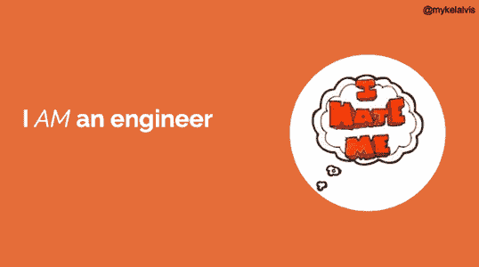
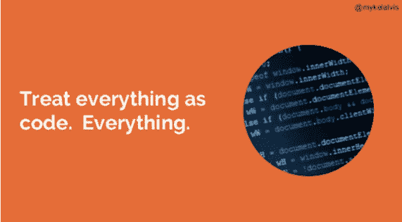
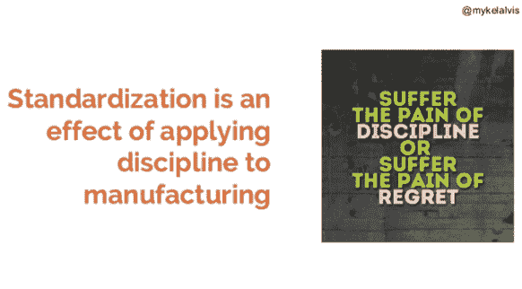

# DevOps:让无聊的事情保持无聊

> 原文：<https://devops.com/devops-making-boring-things-stay-boring/>

在 [2016 年全天 DevOps 大会](http://www.alldaydevops.com/)上，[米克尔·阿尔维斯](https://www.linkedin.com/in/mykelalvis)’([@米克尔·阿尔维斯](https://twitter.com/mykelalvis))环节的标题是“我，欢迎我们的新机器人霸主”。他没有试图讨好新的机器人统治者，而是在 DevOps 中宣传精确的重要性。

迈克是科蒂维蒂实验室的开发人员蔻驰，科蒂维蒂实验室是 T2 科蒂维蒂的开发部门。它每天都在处理医疗保健数据，正如您所知，这些数据恰好是最受监管和保护的数据。正如米克尔所说，“我们不在网上做猫的图片。”错误、漏洞、安全漏洞等。，可能意味着暴露数百万人的隐私和财务数据。但是，这是一个大型组织，需要对风险进行管理。它有 200 多个存储库，每天三到四个部署，15 个开发人员和 0 个操作员(差不多)。没有正确的纪律和严格性，可能会发生代价高昂的错误。

因此，米克尔需要机器人统治者。正如他在会议期间指出的，机器人“效用较低，但可预测性更高。”他们完全按照吩咐去做，而且每次都以同样的方式去做。相比之下，人类更擅长应对不可预测的事件。Mykel 的目标是利用两者的优势。Cotiviti 实验室拥有支持任务自动化的系统、政策、程序和文化，以尽可能确保将错误降至最低，并且人类可以专注于不可预测的事情。该公司正努力让无聊的事情保持无聊。Cotiviti 称之为“实验室的方式”,下面是它是如何做到的:

*   把一切都当成代码。一切。基础设施，数据，一切。例如，它执行 pull 请求来获取执行报告的状态更新。
*   **测试代码。**
*   执行正式发布。 Cotiviti 以非常特殊的方式构建代码，具有极其严格的把关流程。
*   **发布产生不可变的工件**。一旦某样东西被释放，它就永远不会改变。有可能，但是没有。
*   **保留一切。**不在庞大的、无组织的文件系统中。在一个有组织的仓库里。
*   失败的测试意味着失败的构建。
*   设计自动化的系统。科蒂维蒂不做不能自动完成的事情。
*   **处理那些系统** **只有** **通过自动化。这可能是它所做的最具挑战性的事情，因为很难说服开发人员编写他们的代码来做到这一点。**
*   **运营正在发展。**运营不是发展的水桶。运营是一项开发任务。你把它当成真正的代码。
*   因为一切都是代码。一切。
*   所有的缺陷都是代码的缺陷。

为了实现这一目标，Cotiviti:

1.  使标准化
2.  评价
3.  试验
4.  丢弃无用的东西
5.  拥有它

这些都来之不易。它挑战规范。它打破了界限。它要求纪律。(引用——“纪律是目标和成就之间的桥梁。”–吉米·罗恩)你的团队必须明白你有一种做事的方式，这是有原因的，它将降低风险并确保一切正常。它会保持无聊，无聊。

你可以在这里观看 Mykel 全天 DevOps 会议的完整演示(30 分钟)。全天 DevOps 会议的其他 56 个演示可在网上免费获得[点击](http://www.sonatype.com/all-day-devops-on-demand?__hstc=31049440.fff56b041308a66b74cf93c40ea2030a.1456347809383.1484258909413.1484315102822.542&__hssc=31049440.4.1484315102822&__hsfp=1394008546)。

****

**想要更多的阅读？**这是一个博客系列，回顾了自 11 月以来举办的全天 DevOps 会议，共有 13，500 多名注册与会者。上周我讨论了“[小型组织的 devo PS:Ed](http://blog.sonatype.com/devops-for-small-organizations-lessons-from-ed)*的教训”。*下周，请关注 Damien Coraboeuf 的《与 Jenkins 一起走出职场丛林》。

— [德里克·威克斯](https://devops.com/author/derek-e-weeks/)