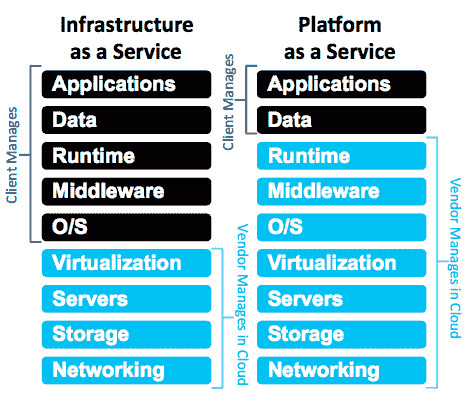
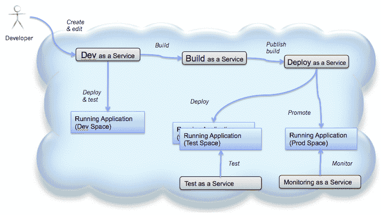

# DevOps 和 PaaS:‘给我一个平台。“让我们摇滚，让我们摇滚，今天”

> 原文：<https://devops.com/devops-paas-give-platform-lets-rock-lets-rock-today/>

> *给我一个平台。让我们摇滚，让我们摇滚，今天。*
> 
> *–杜威·芬恩，摇滚学院*

术语“平台即服务”( PaaS)已经被过度定义为向其用户提供“服务”的任何“平台”。NIST 对术语 PaaS 的正式定义是:

*“向消费者提供的功能是将消费者创建或购买的应用程序部署到云基础架构上，这些应用程序是使用提供商支持的编程语言、库、服务和工具创建的。消费者不管理或控制底层云基础架构，包括网络、服务器、操作系统或存储，但可以控制已部署的应用程序以及应用程序托管环境的配置设置。”*

–[云计算的 NIST 定义](http://csrc.nist.gov/publications/nistpubs/800-145/SP800-145.pdf "PaaS")，美国商务部，NIST，2011 年 9 月

像 IT 行业中的大多数术语一样(或者更概括地说，是被称为语言的人类交流媒介)，PaaS 被超载、过度使用和误解。快速的网络搜索，甚至访问 PaaS 上的[维基百科页面都证明了我的观点。](https://en.wikipedia.org/wiki/Platform_as_a_service)

我更喜欢在上下文中查看这些超载的术语。在这篇文章中，我将通过 DevOps 的镜头来看待 PaaS(对于本网站的读者来说，这并不奇怪)。我将探讨这对希望采用 DevOps 并利用 PaaS 平台提供的服务的组织意味着什么。我将探索和对比“构建您自己的”内部平台即服务或供应商提供的基于订阅的商业平台即服务。我将使用 IBM 的 PaaS 产品来说明我的观点。(披露——IBM 支付我的抵押贷款)。

我们开始吧。

**定义平台即服务:**

NISTs 对 PaaS 的定义中最关键的部分，将 PaaS 与云的“基础设施即服务”(IaaS)消费模式区分开来，是:

*“…消费者不管理或控制底层云基础架构，包括网络、服务器、操作系统或存储，但可以控制已部署的应用程序以及应用程序托管环境的配置设置。”*

这张图片更好地说明了差异。

如图所示，IaaS 和 PaaS 这两种云采用模式的区别在于用户(或客户端)管理了多少堆栈，而云平台提供商管理了多少堆栈。需要强调的是两件事:

1.  堆栈中的每项功能都可以作为托管服务提供，这将是一项可供用户使用的共享、多租户服务，底层实施从用户处抽象出来
2.  客户/用户只需关心管理他们自己的应用程序、数据和用户访问，利用平台上可用的服务，其余的由平台管理

平台即服务可能是公共的(IBM BlueMix、Pivotal 的 CloudFoundry、Google App Engine 等)或私有的(托管的 cloud foundry；自建和托管平台)。组织还可以利用多种技术在私有云上构建自己的托管和管理。当然，对于私有实例，在自己的数据中心托管它的组织将负责管理平台上托管的所有服务。在 IBM PureApplication 系统上构建一个 [PaaS 就是一个很好的例子。](http://expertintegratedsystemsblog.com/2014/04/impact-devops-pureapplication/ "DevOps on PureApplication")

**DevOps 和 PaaS:**

当考虑 PaaS 上的 DevOps 时，必须考虑需要在平台上托管的服务，以便实施 DevOps 服务平台。如果看一下 DevOps 管道和组成交付管道的核心组件，每个组件都需要作为服务提供，以便提供完整的“基于 PaaS 的 DevOps”解决方案。即:

*   开发工具即服务(和/或将平台上的服务连接到桌面 IDE 的能力)
*   构建为服务
*   作为服务部署
*   测试即服务
*   监控即服务

这就是我们所说的“DevOps 服务”。

在 IBM 的新 PaaS 产品中—[代号:BlueMix](https://ace.ng.bluemix.net/) (在公开测试中)，这些 DevOps 是平台固有的一部分。Bluemix 上的服务有:

*   Git 托管即服务
*   基于 Web 的 IDE
*   敏捷规划和跟踪，团队协作即服务(Jazz.net)
*   移动质量保证(MQA)即服务
*   持续集成即服务(Jenkins 即服务)
*   部署自动化即服务(由 UrbanCode Deploy 提供支持)
*   性能监控即服务

这些功能协同工作，在 IBM 代号:BlueMix 上提供了一个*连续交付管道*。

**开发运维即服务(DaaS？)**

所以总结一下。采用 PaaS 平台的价值主张不言而喻。如果您是一家提供软件的组织，并且希望采用 DevOps，那么包含 DevOps 服务的 PaaS 产品可以让您以非常低的入门成本采用 DevOps。您不需要精心设计一个交付管道并实现整个连续交付工具链。集成、托管、服务——不是你的问题。现收现付，并考虑规模。然而，这并不是所有组织都可行的选择，因为这是企业文化和潜在政策的重大转变。尤其是当你看到一个公共平台即服务时。如果您是一个诞生于 web 的组织，或者拥有诞生于 web 的应用程序的企业，那么您应该仔细看看。在 www.bluemix.net 的[看看代号:BlueMix。](https://www.bluemix.net "IBM BlueMix")