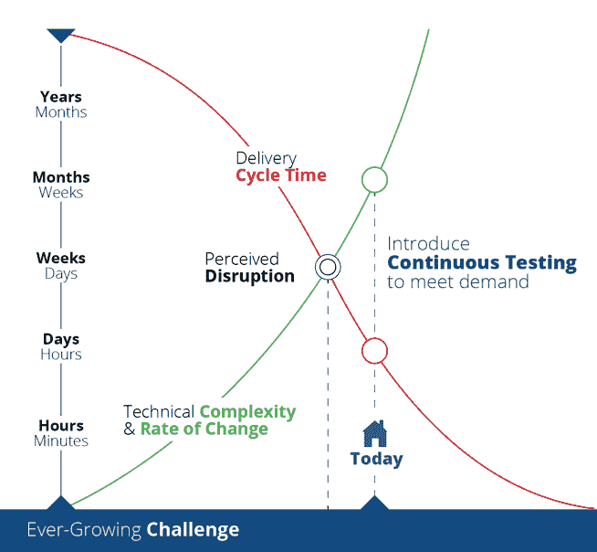
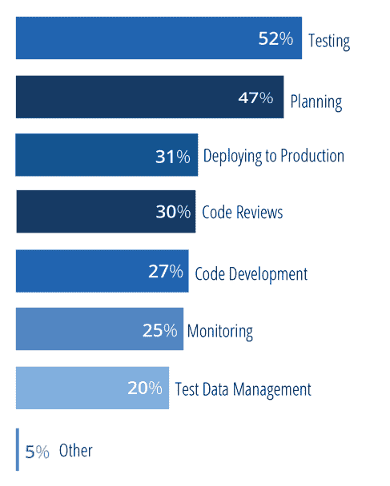
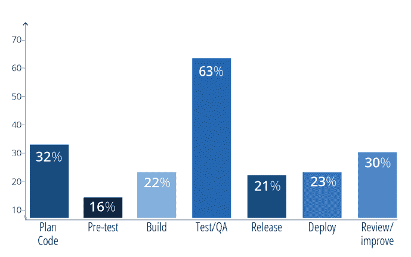

# DevOps 将软件测试置于十字路口

> 原文：<https://devops.com/devops-places-software-testing-in-the-crosshairs/>

***为了跟上创新的步伐，测试必须在软件开发生命周期中发挥更大的作用***

数字化转型的速度已经非常惊人，而且只会越来越快。用一些非常具体的术语来说，考虑一下:

*   世界上有 77 亿人。
*   15 亿人经常使用厕所。
*   50 亿人拥有手机。

突然间，大量的人从非常守旧的生活方式直接跳到了数字时代——创造了对更多、更具创新性的软件的巨大需求。

传统的软件开发和交付方式不足以满足这种新的需求。不久以前，大多数公司每年或每两年发布一次软件。现在，迭代通常持续两周或更短时间。虽然交付周期在缩短，但交付积极的用户体验和保持竞争优势所需的技术复杂性却在增加。

就软件测试而言，这将我们带到了一个转折点。在大多数组织中，当交付周期更长，应用程序复杂性更低时，测试人员已经在竞相跟上步伐。大约每个季度，开发团队都会将一个候选版本传递给 QA，然后 QA 会在规定的时间内尽可能彻底地验证它——主要是手工测试。

现在，敏捷和 DevOps 等数字化转型计划正将传统方法推向崩溃边缘。组织发布的频率越来越高，从低端的每月一次到高端的每小时多次。随着组织越来越倾向于使用自动化交付管道进行连续交付，中间质量关口和最终的通过/不通过决定都将取决于测试结果。

你的组织的测试过程能胜任这项任务吗？

## 我们有一个测试问题(实际上是两个)

在大多数组织中，测试延迟了应用程序的交付，同时对应用程序是否满足涉众的期望提供了有限的洞察力。当它是最佳的时候，它还不够快来帮助团队发现和修复缺陷。而且它报告的是低级错误(例如， *78%的测试通过)*而不是提供做出快速发布决策所需的以业务为中心的视角(例如，*只测试了 38%的业务风险…其中 25%不能正常工作*)。

让我们依次快速看一下这些问题。

### 速度问题

DevOps 就是要消除障碍，更快地交付创新软件。然而，虽然交付过程的其他方面得到了简化和加速，但测试一直是最大的限制因素。

GitLab 最近一项针对开发人员和工程师的调查发现,[测试比开发过程的任何其他部分都要对更多的延迟负责。](https://devops.com/devops-leaders-vs-laggards-continuous-testing-is-a-key-differentiator/)

**在开发过程中，您在哪里遇到的延迟最多？**

DevOps 审查调查也得出了相同的结论，该调查调查了实施 DevOps 的组织中更广泛的 IT 领导者。再一次，测试被认为是软件交付过程中最大的障碍。事实上，它在这里以相当大的优势“获胜”——63%的人报告测试是延迟的主要原因，而仅 32%的受访者提到了第二大延迟原因(计划)。

软件生产过程中的主要障碍在哪里？

为什么测试是一个如此可怕的瓶颈？这可能是一整本书的主题。现在，让我们总结一些要点:

*   绝大多数测试(超过 80%)仍然是手工执行的——在大型企业组织中甚至更多。
*   正在构建、维护和执行的测试用例中，大约 67%是多余的，没有为工作增加价值。
*   在具有重要的测试自动化的组织中，测试人员花费 17%的时间处理误报，另外 14%的时间用于额外的维护任务。
*   超过一半的测试人员每周花 5 到 15 个小时处理测试数据(数据的平均等待时间= 2 周)。
*   84%由于测试环境访问受限而经常延迟(测试环境的平均等待时间= 32 天)。
*   平均回归测试套件需要 16.5 天来执行，但是平均敏捷 sprint 是两个星期，从开始到结束——包括计划、实现和测试。
*   接受测试的普通应用程序现在与 52 个相关系统交互，这意味着单个端到端事务可以跨越从微服务和 API 到各种移动和浏览器界面、打包应用程序(SAP、Salesforce、Oracle、service now……)、定制/传统应用程序和大型机的所有内容。

即使在敏捷和 DevOps 出现之前，软件测试过程也并不完美。现在，我们要求团队“加快速度”,同时现代应用程序架构使过程变得更加复杂。有鉴于此，没有达到速度预期也就不足为奇了。

## 洞察力问题

只有 9%的公司对他们的需求/用户故事进行正式的风险评估。大多数人试图直观地覆盖他们的主要风险，这导致了平均 40%的业务风险覆盖率。戴着眼罩驾驶赛车你会觉得舒服吗？如果您正在快速交付软件，并且对总业务风险的了解还不到一半，那么这基本上就是您正在做的事情。

此外，大多数组织不能立即区分小问题的测试失败和必须立即解决的关键业务失败。大多数结果看起来像这样:

那真正提供了什么样的洞察力？很明显…

*   总共有 53，274 个测试用例。
*   几乎 80% (42，278)通过。
*   超过 19%失败。
*   大约 1%没有执行。

也许测试失败与一些琐碎的功能有关。也许它们源于最关键的功能:你系统的“引擎”。或者，也许最关键的功能根本没有经过测试。试图追踪这些信息将需要大量的手动调查工作，这些工作会产生延迟且往往不准确的答案。

当今的去/不去决策需要快速做出，甚至是自动和即时的。专注于测试用例数量的结果给你留下了一个巨大的盲点，当你以数字业务的速度前进时，这个盲点变得绝对关键，而且非常危险。

## 缩小差距

您如何从交付可疑结果的缓慢、繁重的测试发展到提供加速创新和交付所需的快速反馈的精简测试？这就是我在新书《企业持续测试:为敏捷和开发转型测试》中要解释的本书的目标读者是高级质量经理和业务主管，他们在交付驱动现代业务的软件时，需要在速度和质量之间达到最佳平衡。它为如何以高信心和低业务风险加速交付提供了路线图。

——[沃尔夫冈广场](https://devops.com/author/wolfgang-platz/)