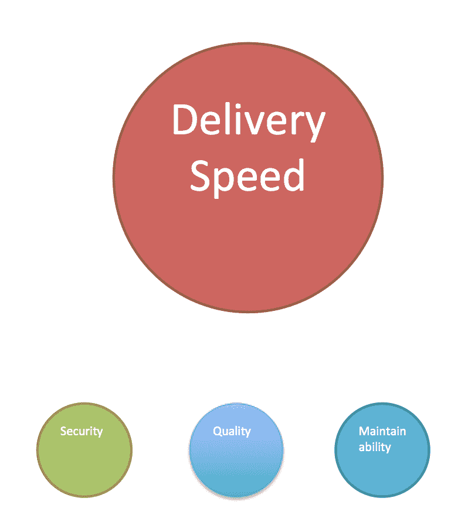

# 在 DevOps 中，速度并不总是重点

> 原文：<https://devops.com/devops-speed-isnt-always-point/>

高科技行业已经陷入了一个窠臼，似乎正在努力摆脱它。当谈到 DevOps 时，这种刻板印象最明显，但它是普遍存在的。

我们已经爱上了越快越好的想法。这种想法可以证明是错误的，所有东西都需要更快的假设也是错误的。

早期，上市时间和对用户需求的快速响应是敏捷开发、DevOps 和 DevOps 工具的主要市场差异。确实存在 IT 对业务需求响应不足的情况——我认为我们大多数人都敏锐地意识到了这个问题，因此在那里停留一段时间并不是一件可怕的事情。但是对业务需求的响应是一个更大的难题的一部分。我们似乎被卡住了，对 DevOps 的其他优势给予了一些口头上的支持…只要它昨天还在交付。

在我的职业生涯中，我曾在两个行业工作过，在这两个行业中，交付速度是核心业务系统的第三大关注点。坦率地说，当你在构建一个系统来管理预计将持续一百年或更长时间的合同时，你真的不会为它明天就发布和“足够好”而激动，你会担心它发布时是正确的，所以你不会为一个世纪后今天匆忙犯下的错误买单。

当然也有厂商不愿意听到我这种人说这些话。当然，有些产品的其他好处比交付速度更重要。但作为一个行业，我们仍然过于痴迷于速度。

How we too often see priorities

大多数行业甚至不属于要么全有要么全无的简单类别。对于大多数人来说，一些团队需要快速，使用敏捷、CI/CD 和全自动部署来快速推动变更(没有一些人说的那么快——大多数人甚至不需要每周一次，但还是很快),而其他团队需要更加彻底和谨慎，发布的节奏真的没有最终结果那么重要。

因此，我的建议与过去十年左右我就类似“热门”话题提供的建议相似:

你是摇滚明星。

没有哪个供应商、分析师、权威人士或作家像你一样了解你的垂直市场、组织、环境或团队。不要让他们代理他们对你的看法。是的，太多的人表现得好像，“如果你不做 X，你就落后了。”但是，你可以看看你所在的行业，比那些泛泛而谈的人更好地理解“背后”的定义。

知道你需要什么，知道什么是最重要的，知道如何得到你需要的。不要做“每个人”说你应该做的事。

但是也不要忽视这种需要。这些技术还有其他好处，我们最近才开始讨论。例如，如果重要的人发生了什么事情，作为代码的基础设施是传递知识的一种令人惊讶的方式。你只需要根据*正确的*理由选择技术，而正确的理由是什么取决于组织，而不是供应商 Y 今天在卖什么。

我们已经走了很长一段路，正处于一些非常酷的东西的尖端，但请确保您知道自己需要什么，以及如何获得它，然后继续施展您的魔法。

唐·麦克维蒂