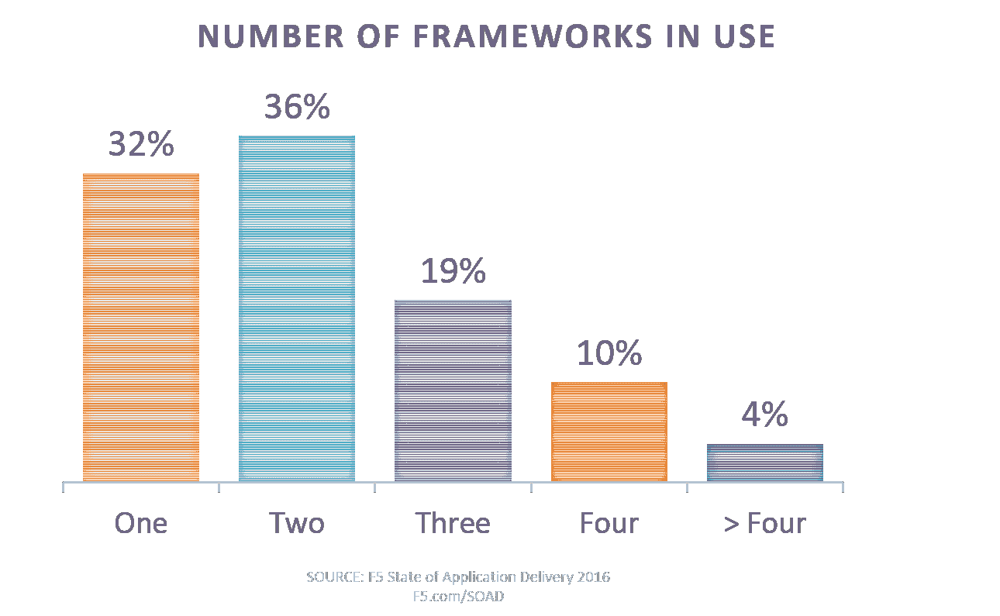

# 在 DevOps 中，标准化以最小化架构债务

> 原文：<https://devops.com/devops-standardization-helps-minimize-architectural-debt/>

最近，我阅读了 Etsy CTO John alls paw 关于 [The New Stack](http://thenewstack.io/etsy-cto-qa-need-software-engineers-not-developers/) 的精彩问答，其中包含了一些宝贵的好建议，随着我们继续采用 DevOps，这些建议变得越来越重要。特别值得注意的是关于引入“新”事物来解决问题的陈述。简而言之，Allspaw 强调了标准化作为减少架构债务的手段的重要性。

如果您不熟悉架构债务的概念，它类似于技术债务，在技术债务中，当引入未来的变化时，今天做出的选择会招致更长期的时间和金钱投资。例如，如果您决定采用 Redis 这样的缓存解决方案，那么就会涉及到技术和架构方面的问题。如果不对代码和基础设施进行重大修改，就不能简单地将 Redis 换成 memcached。

即使您今天选择的负载平衡器也意味着架构上的债务，因为可伸缩性越来越多地被包含在应用程序基础设施本身中。其结果是与自动化和流程编排系统的集成，如果您决定要一个不同的解决方案，这些系统不会轻易改变。您选择的服务注册风格是一个架构决策，会影响整个微服务架构中的客户端、服务器和系统。从客户端切换到服务器端以后会很昂贵。

这是建筑债务。

Allspaw 指出，在可能的情况下，需要*而不是*重新发明轮子，而是鼓励 DevOps 的协作方面，作为避免重新发明轮子和潜在增加组织的架构债务负担的一种手段。

这不是一个新概念。这就是为什么企业特别自豪地宣称自己是“Java 商店”或“微软商店”,并且主要要求用一种或两种语言进行开发，而不是更多。可维护性是技术债务的组成部分，就像中间件决策是架构债务的组成部分一样。

因此，随着我们继续看到更广泛的 DevOps 采用，我们必须仔细考虑我们的选择在实施连续交付和部署所需的自动化、流程编排和集成方面的影响，这一点很重要。一旦您在 Puppet 或 Chef、VMware 或 Cisco、OpenStack 或 SaltStack 上投入了时间和精力(可能还有预算),您就会发现在基础架构和网络团队的开发和生产中不可避免地会有大量的技术和架构债务。

这些系统、解决方案和框架都有自己的组件。它不仅仅是一种语言，它是一个包含管理、存储库、代理和报告组件的综合系统。所有这些都对组织提出了特定的架构要求，从需要特定的软件运行到必须实施的网络规范细节，以免系统崩溃。

我们已经开始在从事自动化和流程编排工作的企业中看到这种分裂。当被问及正在使用的自动化框架(Cisco、VMware、Python、OpenStack、Chef、Puppet 等)的数量时，三分之一的人表示使用了三个或更多。

这不一定是“坏的”，因为它可能表明跨孤岛的标准化(网络想要使用思科，基础架构已经在 VMware 上，并且 Python 正在被 ops 用来拼凑它)，但它也可能是导致技术和架构债务指数增长的那种碎片化的早期迹象。

当然，在早期还有实验的空间，但是我们应该保持对自动化和流程编排所使用的框架、系统和语言的警惕，以确保我们不会陷入技术和架构债务。

标准化，即使是松散地执行，也可以在债务失控之前帮助将债务的影响最小化。