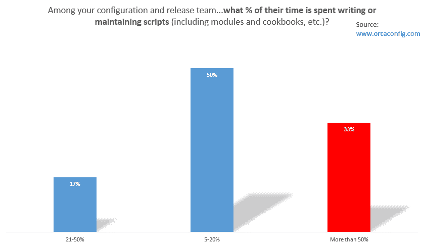
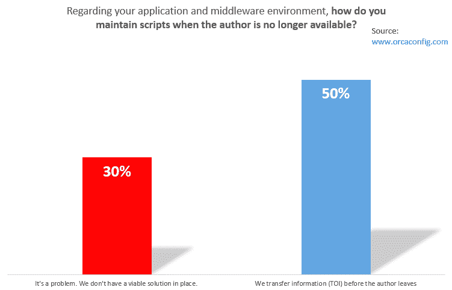
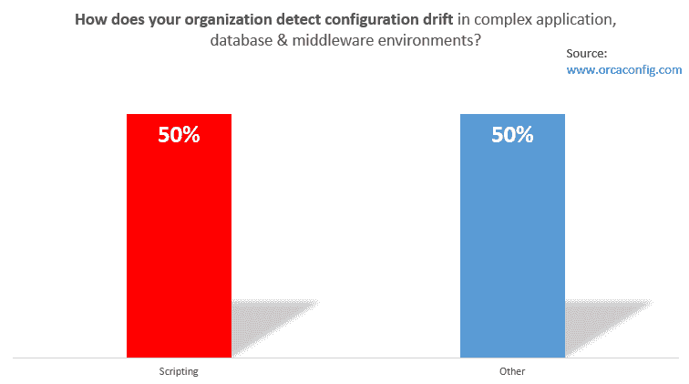
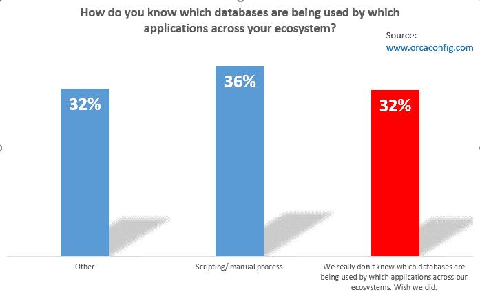
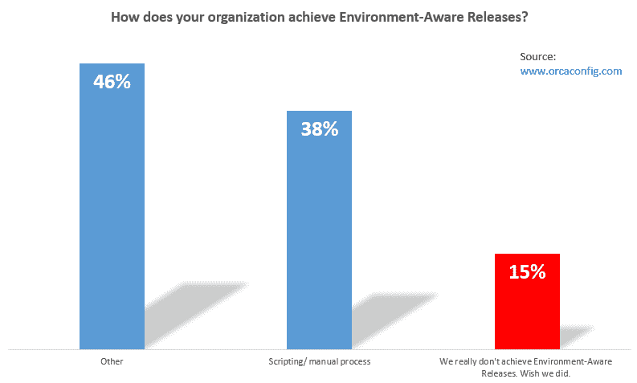
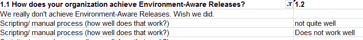

# DevOps 调查说！开发运营状况，对脚本和 IT 自动化的依赖

> 原文：<https://devops.com/devops-survey-says-state-devops-reliance-scripting-automation/>

### 我们的调查告诉我们关于开发运维的状态、对脚本和 IT 自动化的依赖

## DevOps 调查结果:脚本和 IT 自动化

**包括应用程序所有者、配置经理、中间件专家和数据库管理员在内的许多 IT 运营团队正在使用手动流程、电子表格和脚本来管理基础架构配置变更。他们花了**很多**时间编写和维护**很多**剧本。即使有了所有这些脚本、电子表格和流程以及它们消耗的资源，团队仍然没有获得他们需要的可见性、控制和防错。**

这是 Orcaconfig 最近在 IT 行业专业人士中进行的五项调查所传达的信息。也许这些结果并不令人惊讶。但是 DevOps 和 IT 自动化运动已经进行了几年，仍然有很大的改进空间。

| About one-third of respondents said they spent **more than half of their time** **writing and maintaining scripts.**在应用程序、数据库、中间件和操作系统之间存在多种关系和依赖关系的复杂应用程序环境中，“改变这一点可以很容易地(不知不觉地)改变那一点。”Gartner 将此称为多米诺骨牌效应。因此，编写脚本来部署变更变得越来越棘手，因此需要越来越多的时间来做、测试、重做和重新测试。 |  |

由于生产环境中与发布或配置相关的脚本错误所涉及的风险，一些组织将这些典型的操作责任交给了开发人员。这个问题值得一问:发布和配置发布的脚本是开发人员或运营人员时间的最佳利用吗？

|  | 所有这些脚本将关键配置组合在一起，如果关键员工离开，组织是否会面临“丢失配方”**的风险？显然如此。在我们的调查中，30%的受访者承认，**“这是一个问题，我们真的没有合适的解决方案，**”当被问及如果一些关键员工突然离开组织，如何维护这些错综复杂的脚本时。近一半的受访者表示，他们依赖于关键员工离职前的信息传递(TOI)。** |

员工离开公司有很多原因，有些人比其他人更急于离开。TOI 是否提供了企业所需的所有保障？

编写脚本可能会消耗大量的 IT 资源，并带来重要人才流失的巨大风险。但是它至少完成了团队需要的功能吗？接下来的几个图表提供了对脚本实现团队需要的可见性和防错自动化的深入了解。

## 生态系统可见性

| **Configuration Drift Detection**出于性能、安全性和审计方面的原因，组织一直需要维护其应用程序生态系统中的配置合规性。所以*检测*配置漂移是必不可少的。*自动检测* *目标是*配置漂移。尽管对该方法有所抱怨，但大约一半的受访者依赖脚本来完成漂移检测。 |  |

|  | **Mapping Databases to Applications:**有时，IT 运营人员会被问一些简单的*听起来*的问题，例如，“使用这个数据库的所有应用程序是什么？”反之亦然，“哪些数据库支持该应用程序？”再次，近三分之一的受访者承认，**“我们真的不知道哪些数据库被哪些应用程序使用。希望我们做到了。”**另外 36%的人依靠脚本或其他手动流程来获得答案。 |

是否合理(2017 年！)仍然依赖脚本来获得应用程序、数据库和中间件之间相互关系的基本信息？操作者、管理者和审计者没有这些信息是可以接受的吗？Visio 和类似的静态文件能否始终提供 IT 运营所需的最新信息？

## 自动化和防错

| **环境感知版本**
当应用通过预生产阶段并进入生产环境时，发布经理希望确保**新版本能够正常工作……按计划进行……无戏剧性**。这就要求

1.  Configuration is up to date, can be put into production, and
2.  Those business-critical applications are *upgraded* at the same time as their production-level configuration.

 |  |

38%的受访者表示，他们依赖脚本和其他手动流程来尝试完成环境感知发布。为了确保“每个人都在同一页面上”，许多组织使用多个规划会议，共享和更新电子表格和 SharePoint 文件，并(希望)使用最新的配置信息。即使在这个群体中，被调查者也评论说脚本并不适合他们。

尽管存在配置和发布问题的安全性、合规性和性能影响，但 15%的受访者承认他们“真的没有实现环境感知的发布”

## 脚本不是免费的；IT 运营需要更多

对于许多应用程序所有者和 IT 运营团队来说，编写脚本自然是首选方法。编写脚本或者发现并修复基于脚本的错误的成本很难在预算项目中清楚地显示出来。在那一刻，它能感觉到它是自由的。但是随着时间的推移，维护脚本和自主开发的工具可能会建立一个隐藏但昂贵的技术债务山。如果脚本能够有效地解决持续的运营需求，例如生态系统可见性和无戏剧性的部署，那么这些成本和风险可能是值得的。然而，我们的受访者一次又一次地表示，他们缺乏基本的功能，如配置漂移检测、将应用程序映射到数据库和中间件或确保环境感知软件版本。

— [斯科特·特纳](https://devops.com/author/sturner/)