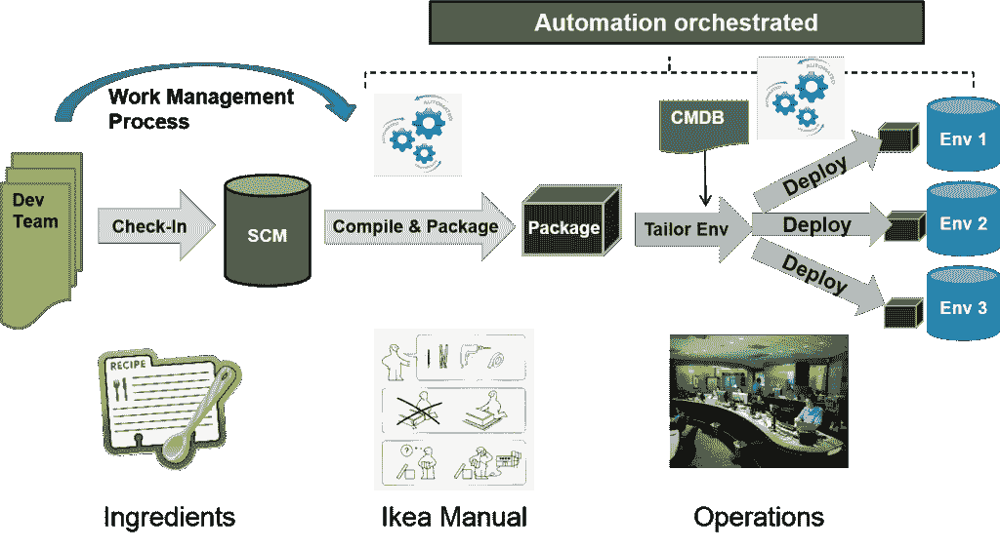
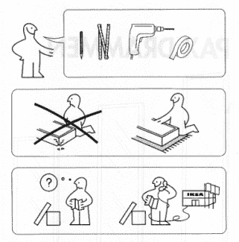

# 面向记录系统的 DevOps 新的希望(DOES talk 预览)

> 原文：<https://devops.com/devops-systems-record-new-hope-preview-talk/>

我将在本月晚些时候的 DevOps 企业峰会上发表演讲，我想我给了人们一个我将要谈论的话题的预告片，这样他们就知道会发生什么了。我期待着与你们中的许多人分享我的故事——一个逆境但也是希望的故事。(10 月 21 日星期三 11:15 在 Bayview B 见)

所以我们都听说过我们最喜欢的网络公司(谷歌、网飞……)的开发运维以及持续交付的故事。对于企业级的记录系统，很难找到成功的案例研究。虽然我无法为 SAP 提供每天 50 次的部署(目前还不行；-))，我想分享我迄今为止的故事和我在旅途中学到的东西(关于已解决和未解决的问题)。

希望这篇文章对那些正在寻找第一步的人有所帮助。但是我们为什么还要处理 COTS 和其他记录系统呢？最终对我来说，这又回到了我一直使用的两个齿轮的类比([两个齿轮博客文章](http://notafactoryanymore.com/2015/01/28/how-to-support-multi-speed-it-with-devops-and-agile/))。如果你可以完全抛弃你的“遗留”应用程序，那么恭喜你，你不必处理这个问题，也许你可以停止阅读这篇博文了。对于所有做不到这一点的人来说，你将面临这样一个现实:即使你的数字和定制应用程序能够以惊人的速度交付，你仍然会受到你的“遗留”应用程序的限制。因此，加快这些速度将有助于您实现交付组织的最终速度。那么，我该如何对待记录系统以及 DevOps 对它的采用呢？

**3 个关键步骤:**

1.  在引擎盖下寻找配料
2.  重新制作宜家手册
3.  了解生产/运营之路

**第一步。让我们打开引擎盖**

 最终，我一直在寻找的两样东西是应用程序的活动部分以及构建和部署应用程序的过程。听起来很简单，对吧？这通常不像你想的那么简单，尤其是 COTS 应用程序试图将这些过程抽象出来。看看 SAP，您在一个环境中进行配置更改，然后以某种方式转移到其他环境，但是您对底层流程几乎没有可见性(好吧，我的 SAP 经验已经有 10 年了，所以它可能已经发生了变化，但是您已经了解了要点)。

我们为什么要寻找运动部件？嗯，我们希望尽可能多地使用通用的软件工程实践，例如，不一定希望信任版本控制的内置特性。因此，我们寻找找到源代码文件的方法或以文本格式提取相关信息的方法(在我的世界观中，SQL、XML 等也算作文本)，这有时相对容易(Siebel。例如，sif 文件只是一种 XML ),有时这是非常困难或不可能的。这些底层文件是我们将存储在源代码控制中的，以确保我们在每个时间点都了解应用程序的配置。

一旦你找到了源代码，你将有 3 件事要做:
a)把它从专有解决方案中取出来
b)把它与你的 IDE
集成在一起 c)解决合并问题
(我将在后面的另一篇博客文章中进一步探讨)

**第二步。重新制作宜家手册**
 一旦你有了所有的活动部件，你需要理解它们是如何组合在一起的。定制应用程序通常需要显式指令，这使得定义和自动化指令集更加容易。对于记录系统，打包和部署通常是通过用户界面完成的，而且通常有多种方式。经验丰富的运营商已经找到了自己的捷径，系统的可靠性取决于运营中心是否有合适的人(我有一些关于在上线周末没有合适的人的故事要讲)。

你的目标应该是一本“宜家手册”,用我们之前确定的活动部件创建系统，而不需要人工操作者进行复杂的互动或决策。理想情况下，所有指令都从命令行或一些编程 API 工作，但是当所有其他方式都失败时，像 Selenium 这样的 UI 驱动程序可以解决在应用程序中创建和自动化手动用户输入的真正棘手的部分。每一个黑箱步骤都应该被钻开，这样你才能理解系统内部正在发生什么，才能理解可能给你带来麻烦的变化。

**第三步。了解生产路径**
 说到路径……当然，对于记录系统，同样的规则适用于任何其他系统。您应该在所有以前的环境中实践您将在生产中建立的系统，并最小化配置之间的差异。记录系统面临的挑战通常是与生产环境相关的成本，因此您可能需要寻找创造性的方法来最小化差异，并对配置进行参数化，以便至少可以自动处理差异。

那么在 Mirco 的土地上，所有的记录都是好的？
不幸的是没有，我仍在努力应对许多挑战。到目前为止，我们取得的进步使速度和可靠性发生了巨大的变化，但我仍希望在一些领域找到更好的解决方案:

*   单元测试自动化
*   不支持的活动或没有 API
*   表演
*   配置管理技能——配置器的诅咒
*   常见对象
*   运营–最后一英里…

我将在 DevOps 企业峰会上更详细地讲述我的经历，如果您正在参加，请过来打个招呼。我总是很乐意向你展示与记录系统一起工作的伤疤，并分享战争故事。

对于我已经为之做了大量工作的两个“遗留”技术栈(Siebel 和 Mainframe ),我承诺将来会写更多深入的博文。