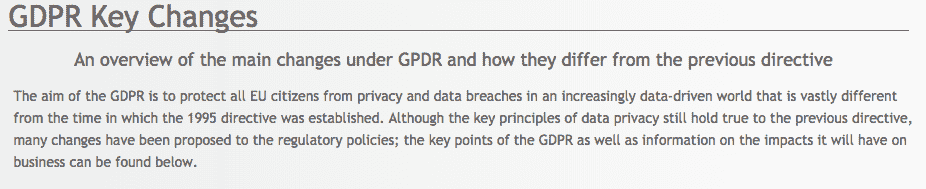

# 随着 GDPR 最后期限的临近，德沃普斯前来救援

> 原文：<https://devops.com/devops-to-the-rescue-as-gdpr-deadline-looms/>

风险很高:未能遵守欧盟(EU)严格的[通用数据保护条例(GDPR)](https://en.wikipedia.org/wiki/General_Data_Protection_Regulation) 的组织将面临高达其年收入 4%的罚款或 2000 万€(2500 万美元)，以较高者为准。

但是，如果组织忽视 5 月底生效的命令，将会发生什么的威胁是显而易见的，而开发团队将如何为遵守该命令奠定基础则不那么确定。

同时，DevOps 可以通过整合组织的利益相关者、IT 运营、QA、InfoSec 和开发团队的工作成果，让组织以敏捷和相对快速的方式满足法规要求。

[企业管理协会(EMA)](https://www.enterprisemanagement.com/) 的分析师[约翰·l·梅尔斯](https://www.linkedin.com/in/johnlmyers)说:“GDPR 是技术领域的新恶魔，有点像多年前的千年虫。"理想情况下，所有这些都将通过自动化和开发运维来处理."

## **消失的权利**

GDPR 的一项特别严格的规定是，任何个人用户都有权选择不让私人企业收集他们的数据，也有权被遗忘。所谓的“擦除权”条款赋予 EU-的个人要求删除其在组织服务器上的个人数据的权利，无论是在内部还是云端。个人“遗忘”个人数据的权利也适用于组织可能向第三方传达的个人信息。

“挑战在于跟踪跨多个平台传播的个人身份信息，包括第三方和 CRM、ERP、支付、订购等。，”迈尔斯说。“大多数组织没有那种级别的可见性和透明度。”

他说，因此，挑战在于理解一个人的所有实例在数据环境中的位置。如果欧盟中的某个人决定被遗忘并选择退出，组织必须知道该人在数据管理平台和文件(如电子表格)中的所有位置。对于存储数据的地方相对较少的组织来说，这个过程当然更容易。

然而，在被遗忘权条款中有一个重要的脚注:如果个人选择被遗忘，组织不必真的删除个人数据和记录，迈尔斯说。相反，DevOps 可以加密他们的信息，允许组织保存交易、客户计数、库存等。，但不指明个人。DevOps 还可以用于快速部署代码和流程，以验证被遗忘的请求，并“不忘记”后来选择加入的个人。

“通过加密，DevOps 为公司保留一个密钥，并为欧盟个人发送或存储另一个密钥，以防他们改变主意，”迈尔斯说。

然而，在某些情况下，使用 DevOps 来自动化合规性可能会延迟，因为组织可能首先需要改善他们的数据库存管理实践，以更好地可视化存储个人数据的不同位置，Myers 说。

迈尔斯说:“如果没有各种数据平台中可能列出的所有客户、合作伙伴或供应商数据的清单，就很难在 5 月甚至 6 月实现自动化。”“随着组织更好地了解其数据环境的清单，他们可以将 DevOps 自动化添加到流程中。但在早期阶段，它可能是一个受到监控、管理和标准化的手动流程，以便开发人员可以接管并将其变为现实。”

## **有好有坏**

关于 GDPR 的讨论往往集中在组织为满足要求而面临的相关难题和潜在成本上。但是每一个变化都伴随着机遇。例如，关于赋予个人被遗忘权的 GDPR 条款，DevOps 将拥有部署代码和流程的自由，以提高其组织内部和第三方访问的个人数据存储的透明度。

迈尔斯说:“拥有数据环境所有组成部分的清单或可见性是数字化转型的关键。“公司可以将它作为一个很好的理由或借口，转向一个更加标准化和透明的环境，以加速这些计划。”

一些 DevOps 团队成员可能还会引以为豪，因为他们知道实现 GDPR 法规遵从性也可能是朝着正确方向迈出的一步，从而为社会的共同利益改善数据保护。

“实际保护收集的数据以防止他人获取和利用数据是一个问题。由于身份盗窃是一个严重的问题，保护个人信息是最重要的，”EMA 分析师[大卫·莫纳汉](https://www.linkedin.com/in/securitymonahan/)说。“如果我们在美国有像 GDPR 一样可用的联邦立法，我们可能会看到 Equifax 因其糟糕的数据保护实践而被严厉罚款甚至关闭的结果。当涉及到数据时，征信机构是掠夺性的，因为个人没有权利拒绝收集，所以所有这些信息都是在未经我们同意的情况下买卖的。”

— [B .卡梅伦增益](https://devops.com/author/b-cameron-gain/)