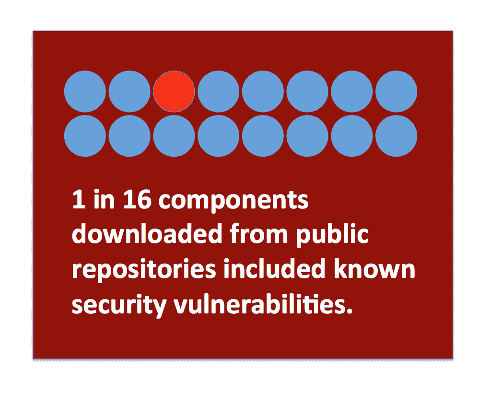
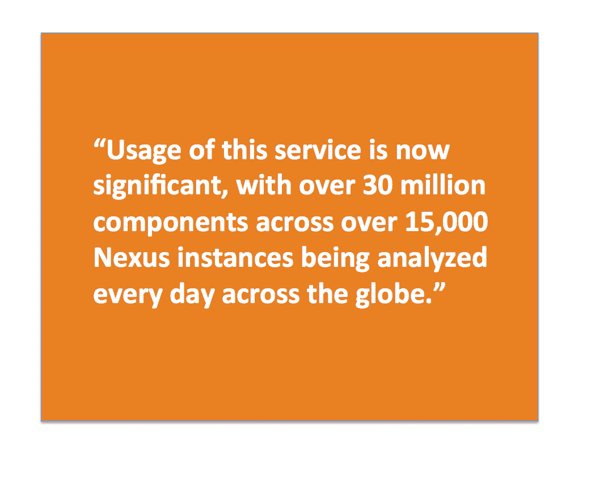
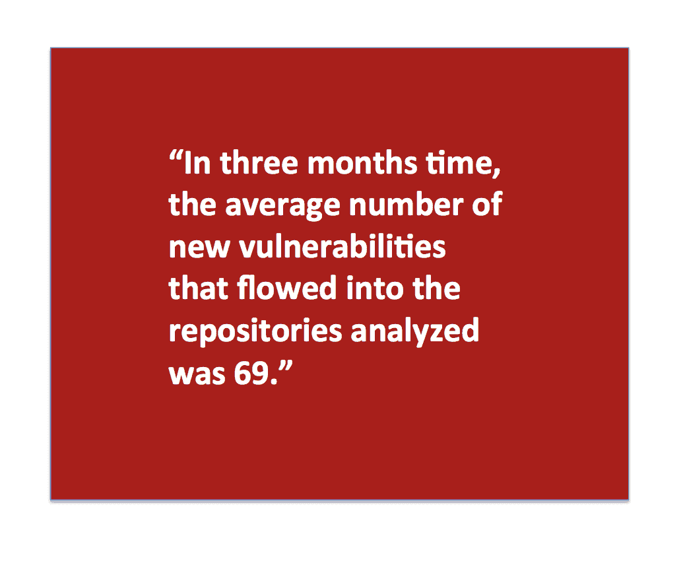
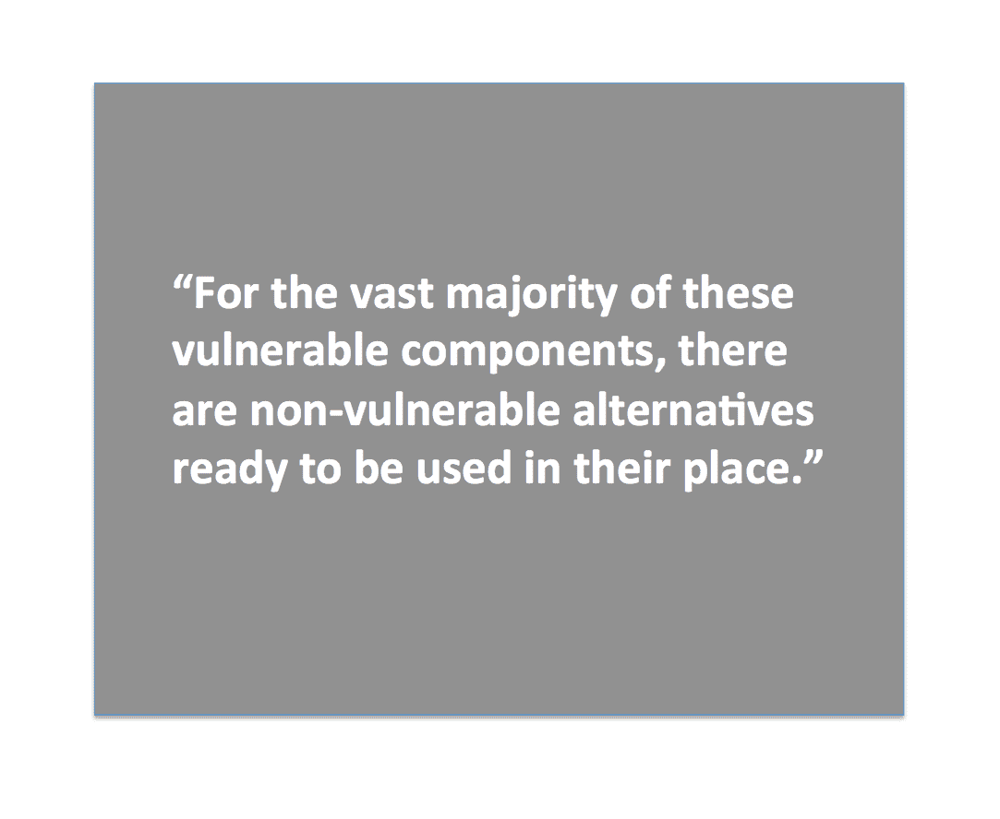
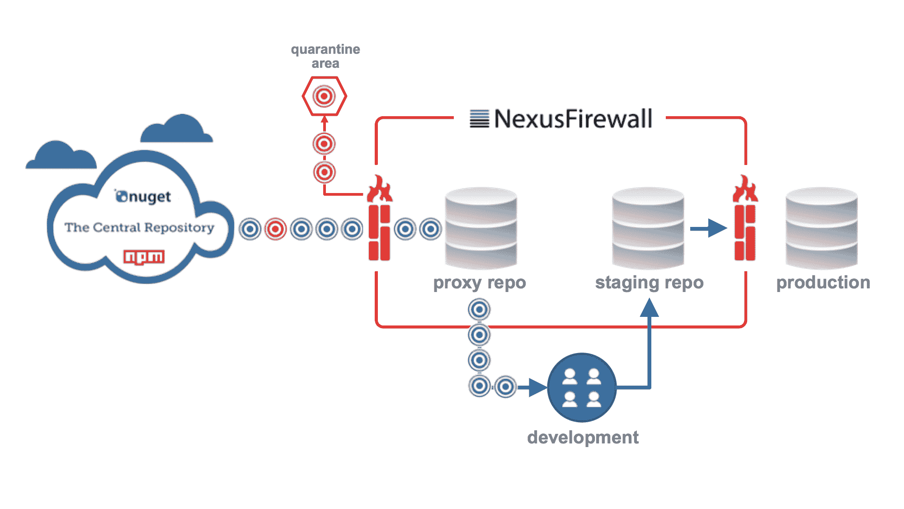
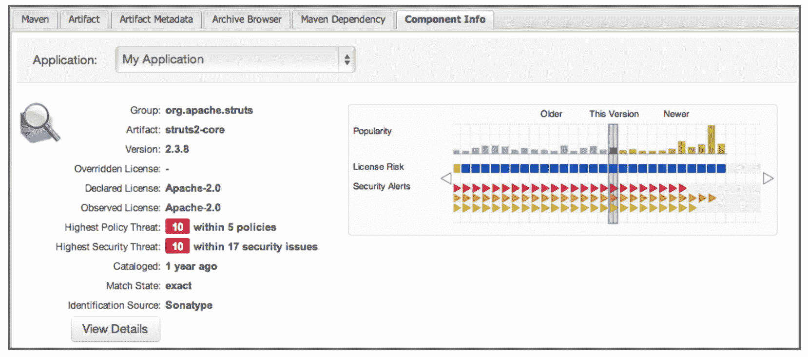

# DevOpsSec:16 分之一的机会

> 原文：<https://devops.com/devopssec-1-16-chances/>

***下面总结的定量研究覆盖了近 100 个国家的 7000 多个存储库，强调了现代开发速度下的一些质量挑战，对于 DevOpsSec 实践尤其重要。通过利用 repository manager 中的自动化，您可以提高应用程序的质量，减少计划外的工作，同时降低风险。虽然该实践支持 DevOpsSec 计划，但其核心仅仅是关注“构建质量”。***

*(写为我和 Sonatype 产品负责人 Mike Hansen 的合作；迈克写了更精彩的部分。)*

## 创新和风险

像 Nexus、Artifactory 和 Archiva 这样的库管理器已经为开发团队及其工具提供软件组件服务多年了。今天，我们可以测量全球超过 [70，000 个活动的 repository manager 安装](http://blog.sonatype.com/2015/11/why-nexus-rocketed-beyond-60000-installs/#.VlXScITmbKA)。使用存储库管理器提高了构建性能和可靠性，同时还提供了一个安全的私有位置来托管跨连续交付和 DevOps 工具链所需的开源、第三方和专有组件。

行业平均值显示，软件开发组织每年从公共互联网存储库中有选择地下载超过 240，000 个组件。虽然这些组件加速了开发并增加了创新，但绝大多数组件很少或根本没有经过审查过程来确定是否使用了已知的安全漏洞、有风险的许可证类型或过时/不受支持的许可证。

今年早些时候，研究人员发现 16 个下载中有 1 个包含一个已知的安全漏洞。这说明每个组织每年有超过 15，000 个已知安全漏洞组件的选择性下载。

## 为什么关注存储库管理人员？

像 Archiva、Artifactory 和 Nexus 这样的存储库管理器已经成为 DevOps 工具链的关键部分，并且通常在整个应用程序生命周期中使用。它实际上是应用程序的二进制部件仓库。考虑到这个仓库已经变得如此完整，软件供应链智能和自动化可以用来显著减少计划外工作并消除可避免的风险。

为了理解这个机会，让我们定量地看一下世界软件开发生态系统。

## 全球可见性

不久前，Sonatype 在其 Nexus Repository Manager 中引入了一项免费功能，为软件供应链的健康状况提供新数据。这一功能被称为 Nexus RHC ( [库健康检查](https://books.sonatype.com/nexus-book/reference/rhc.html))——提供了一种简单的方法，通过你的库管理器，基本了解开放源码软件流入开发的内容。RHC 提供了存储库中具有已知安全漏洞和危险许可证类型的组件的摘要。现在，这项服务的使用量非常大，全球每天都有超过 15，000 个 Nexus 实例中的超过 3，000 万个组件被分析。

还有大约一百万开发人员在使用这些库。有了大数定律为我们服务，我们可以获得现代软件开发生态系统行为的统计有效视图。这些发现很能说明问题。

## 数据

在过去的 90 天里，我们使用 RHC 服务分析了超过 7000 个包含 500 个或更多软件组件的存储库。这些存储库是大中型组织中开发团队使用的存储库的代表。问题很简单:**坏事情流入到什么程度，导致下游返工并产生可避免的风险场景？**

在三个月的时间里，流入被分析的库的新漏洞的平均数量是 69。也就是说，平均每月有 23 个漏洞，比每个工作日多一点。如果你只包括高风险漏洞——那些 CVSS 得分为 5 或更高的——平均数量为 48 个，或每月约 16 个。这比每个工作日少一点。对于这种高风险类别中的漏洞，Heartbleed bug 的得分为 5，是该分组中风险最低的。

这些都不是孤立的例子或异常值。在分析的一组存储库中，98.3%消耗了至少一个易受攻击的组件，97.7%消耗了至少一个高风险(CVSS > = 5)组件。在短短三个月的时间里，几乎每个存储库都消耗了运行它的组织不希望拥有的东西，而且这只是针对已知的漏洞。考虑到相应数据的可用性，还有许多其他属性值得考虑。

无论安全性是否是特别关注的问题，真正的问题是缺乏可见性和控制，加上供应充足，导致世界上的开发组织经常使用低质量的部件，增加了可避免的风险，拖了我们的后腿。

## (远远)超越安全

易受攻击组件的消耗是一个可量化的问题，我们用它来说明当前每个组织在开源组件选择方面所面临的挑战。然而，安全漏洞只是众多维度中的一个。

其他包括架构方面，如涵盖组件年龄和流行度的规则、与开源许可相关的知识产权覆盖范围以及与技术堆栈选择相关的技术债务控制。引入更正式的审查流程，加上软件供应链智能和自动化，将为组织带来显著的整体质量和效率优势，使其能够以更低的风险运营。

## 是的，存储库管理员的防火墙

11 月，Sonatype 成为第一家引入“防火墙”供存储库管理器使用的公司。该解决方案名为 [Nexus Firewall](http://www.sonatype.com/nexus/product-overview/nexus-firewall) ，为软件开发提供外围质量控制。类似于网络防火墙，它利用您定义的规则，自动保护组织免受不可接受的软件组件的进入，并阻止它们退出您的应用程序开发。基本概念是这样的:

为了从一开始就建立质量，这个解决方案代表了一种“向左(远)移动”的创新。Nexus 防火墙通过隔离具有已知漏洞的组件来提高速度并降低风险。有了存储库防火墙，组织可以通过自动阻止不可接受的软件组件入站并阻止包含此类组件的应用程序出站发布，来保护您的应用程序开发免受浪费和风险。每 16 个已知安全漏洞的下载中有 1 个可能会减少到 16 个中零个。

防火墙还超越了阻止，为组织提供了及早做出开源组件选择的理想决策所需的可见性和数据，从而显著减少了与返工相关的浪费并消除了可避免的风险。

## 对于 DevOpsSec，向左移动(远)以构建质量

不需要消耗这些不可接受的或者至少是劣质的部件。对于这些易受攻击的组件中的绝大多数，有现成的非易受攻击的替代品来代替它们。挑战在于，从历史上看，开发人员很难理解这些风险，甚至更难避免它们。很少有开发人员有无数的时间来研究他们所使用的组件中的漏洞，更少有人希望依靠安全、法律或审计团队中的同事花费数小时或数周来返回“通过”或“不通过”的审查决定。

我们今天看到的组件消耗的数量和速度证明了任何形式的手工审查过程或开发团队之外的自动化工作流都将很快被超越。DevOps 和持续交付过程需要依靠自动智能来帮助开发人员选择最高质量的组件，并避免那些具有已知风险的组件。当识别出已知的安全漏洞和其他风险时，将需要软件供应链智能来指导开发人员识别和选择更安全、更高质量的组件。

下面是一个可用信息的例子。

信息分为两个部分。左侧是组件数据，包括与组件本身相关的详细信息。在右边，有一个任何安全或许可问题的图形显示，以及所显示组件的每个版本的流行度数据。选择不同的版本会相应地更新此信息，包括特定版本是否通过了已建立的标准。

## DevOpsSec 的必备:速度下的质量

只需启用存储库防火墙，组织就可以立即提高质量，减少浪费和风险。所有这些都不以牺牲开发速度为代价。

存储库防火墙自动隔离没有通过您的规则的组件，防止质量问题进入正在开发的软件，立即降低风险并避免在以后的某个时间点进行浪费的返工。质量得以提高，效率得以提高，风险得以降低，这一切都是通过自动化和现代发展的速度实现的。

我最喜欢的参考书之一是 Jez Humble 和 Dave Farley 的 ***[连续交付](https://www.amazon.com/Continuous-Delivery-Deployment-Automation-Signature/dp/0321601912)*** 。让我分享他们的一些话，以帮助提醒我们创新和实践的重要性，使我们能够将痛苦向前推进。Jez 和 Dave 评论道:

我们在本书中描述的技术，例如持续集成、全面的自动化测试和自动化部署，都是为了在交付过程中尽可能早地发现缺陷而设计的(原则“提前带来痛苦”的应用)。下一步是修理它们，如果每个人都忽视它，火警是没有用的。交付团队必须遵守纪律，一旦发现缺陷就立即修复。”

戴夫和杰斯说得好。说得好。