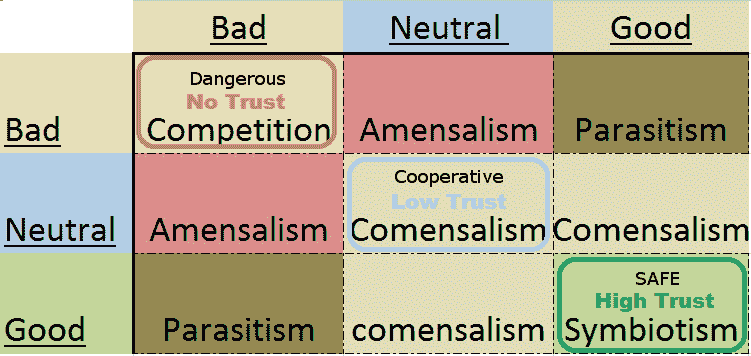

# devOpsSec 困境:社交网络的有效策略

> 原文：<https://devops.com/devopssec-dilemma-effective-strategies-social-networking/>

听到约翰·纳西和他的妻子艾丽西娅在这个周末去世的消息，我很难过。愿他们安息。作为一个博弈理论家，我熟悉他的工作，而且碰巧纳什均衡一直是我最近研究的中心。在他去世的时候，能够发扬他的思想，并希望将他的遗产传递给更多的观众，这是一种荣誉。鉴于[速度](http://velocityconf.com/devops-web-performance-2015)本周开始，我已经尽我所能通过仔细研究他过去一年的工作来表达我的敬意。

devOps 相信聪明的演员。安全假设最坏的意图。两者都有失去信任的风险。 [囚徒困境](https://en.wikipedia.org/wiki/Prisoner%27s_dilemma)和 devOpsSec 困境，在这里被定义为在高度竞争的环境中由于缺乏信任而导致的缺乏合作，有着相同的缺陷:因为疏忽或恶意，没有一个游戏位置对每个人都是安全的。我认为正在出现的是一种低信任度的合作博弈状态。在 devOps 的世界里，每个人都意味着内部和外部的每个人。这包括你的独特身份，你的同事，你工作的公司，让你继续做生意的顾客，甚至你[认为是你的竞争对手](https://www.inc.com/will-yakowicz/how-to-win-by-not-competing.html?cid=sf01001)的人。

对其他人和组织的无意识践踏和机会主义掠夺实际上是[互补的集合操作](https://en.wikipedia.org/wiki/Complement_%28set_theory%29),可以减轻与感知到的威胁相关的任何风险，这是安全性的最终目的。对于短期游戏来说，保持在风险最低、报酬最高的游戏状态是一种安全下注的体面定义，但随着时间的推移，这可能并不安全。如果这个策略损害了他人，你最终会在竞争中让自己消失。

我们这个行业存在骚扰问题。我希望人们参加活动并互动，努力与人们建立联系，因为当我们分享想法时，我们成长得更快。鉴于这种类型的互动产生的问题，我们似乎出现了一些错误的人。如果你对技术充满热情，并且能够**尊重他人和他们的技能组合**，我们的社区欢迎你。如果不是，就不要插手。这适用于每个人，包括咄咄逼人的招聘人员和供应商。

修正主义行为的问题在于，当它发生时，你并没有意识到你冒犯了某人。我和很多人谈过这个问题，肯定有误解的空间，而且通常是文化上的。当它变成骚扰行为，你开始看起来像一个寄生虫时，就是它反复出现的时候。这里的关键是关注人。当人们试图礼貌地为自己找借口时，注意非语言队列。如果你没有抓住暗示，人们会告诉你他们没有时间或精力去交谈，你真的需要接受不的回答。

我想特别说明的是，如果你正在寻找一个约会对象，你应该去别的地方看看。鉴于活动中的性别比例问题，你最好把时间花在别的地方。有合适的时间和地点，但专业的环境不是其中之一。大多数会议和活动都在大城市举行。如果你喜欢的话，你可以随时摘掉你的名牌，在活动之外找很多麻烦。这意味着没人会问你第二次。如果有人不得不告诉你三次，那么活动组织者就不会友好地拜访你。让我们明确一点，在我们的社区里，对不想要的身体接触也是零容忍的。没有人应该向任何人解释，也没有好的借口。

除了身体接触和其他公然冒犯的行为，我们还必须相信人们会犯错误，而不是自动假设最坏的意图。一个聪明的代理会纠正一个不好的行为，如果他们礼貌地意识到这一点。同样，如果尽管有人要求他们停止，但还是有一个典型的重复，他们的貌似合理的否认就会随之消失。最近，我注意到有人在一个会议前向一家脱衣舞俱乐部分发名片。我告诉他，虽然这里大部分是男人，但现在不是分发这些东西的时间和地点，如果他不离开，他会有问题。他道了歉就走了。同伴节制可以是有效的，而且不一定要伤害任何人。鉴于 Etsy 的 2014 年进度报告中对无可指责的问题解决方法的解释，我相信这是一种公平的方法:

> “犯错误是做创新工作不可避免的副产品。事故实际上可以成为宝贵而丰富的学习资源。我们努力创造一种无可指责的文化，在这种文化中，犯错误并大声说出来是安全的。这让我们能够从自己的经历中获得尽可能多的知识。”

我们需要摆脱不信任的干扰，更好地合作。这是从无信任安全到高信任安全的转变。这也是 devOps 和 security 的分裂。DevOps 相信聪明的演员。安全假设最坏的意图。我在 [DevOpsDaysNYC](http://www.devopsdays.org/events/2015-newyork/) 报道了这个材料。这个视频更详细，在图表上有一些关系的生态学例子，这是我在演讲后添加的。

[youtube http://www.youtube.com/watch?v=O9hgYtNlo3o][The Prisoner’s dilemma](https://en.wikipedia.org/wiki/Prisoner%27s_dilemma) is a Pareto inefficient Nash equilibrium because there’s no honor among thieves. Not defecting on the other prisoner leaves an opportunity for them to defect on you, walk out of jail, and leave you incarcerated for the longest period of time. Both prisoners defect and they both end up serving a longer sentence than if they had taken the risk of cooperating.

|  | 囚犯 B 保持沉默(*配合*) | 囚犯 B 背叛了(*缺陷* |
| 囚犯 A 保持沉默(*配合*) | 每人服刑一年 | 囚犯甲:三年
囚犯乙:自由了 |
| 囚犯 A 背叛了(*缺陷* | 囚犯甲:无罪释放囚犯乙:三年 | 每个人服刑两年 |

一个系统中的重大变化用一个不同的、适应的系统代替了原来的系统。在不固有地改变系统的情况下，可以适应最小数量的局部改变，但是在短时间内足够的局部改变等同于全局转变。devOpsSec 困境是一种需要系统性变革的系统性失败。所以我想出了一个新的游戏板。

在这里，我们从每个人都受到伤害的不信任竞争环境走向帕累托改进均衡。如果我们的对手不与我们建立更高的信任关系，那么试图脱离竞争就有被踩在脚下或被捕食的风险。对我们的游戏板来说，好消息是我不认为任何人必须死或进监狱。虽然这里有一些风险，但这通常是对一个人自我的打击，这是我可以为我关心的事情接受的风险。这里的解决方案是更多的外交同行节制，以及即使不舒服也能接受建设性反馈的能力。我们需要走出安全和危险，走向合作学习。当你远离学习，陷入危险时，我们最终会受到伤害，但这并不总是竞争性的。

合作是约翰·纳西工作的核心。信任是我们生存的基础，它是通过展示你所能贡献的来建立的，而不是在自行车棚里讨价还价和吐槽。我们越信任，我们学到的就越多，受到的伤害就越少，但这需要共同的努力。如果你作为个人或组织的模式没有随着时间的推移展现出这些品质，那么你就完了。正如戴明所说，“生存不是强制性的。”