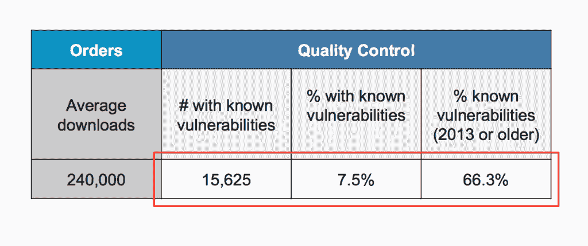
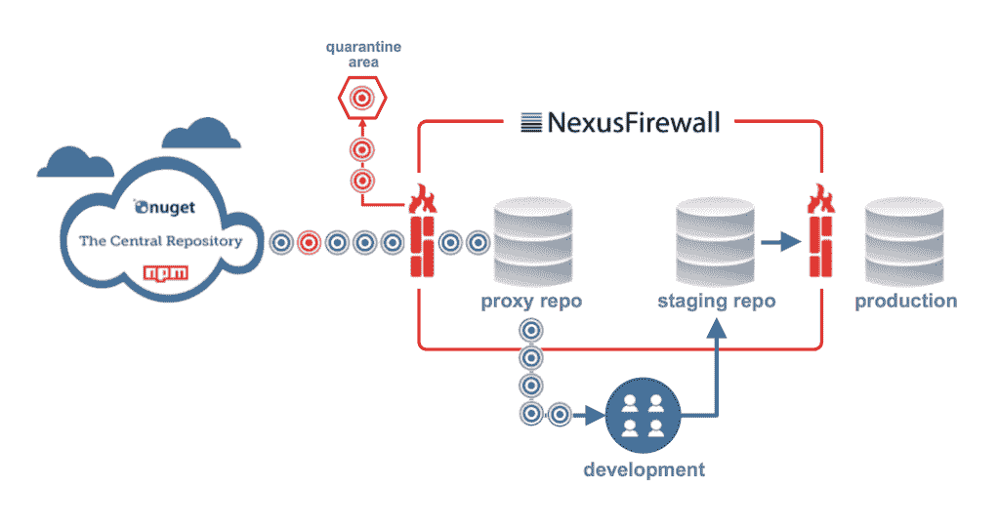

# 生存不是强制性的

> 原文：<https://devops.com/devopssec-survival-not-mandatory/>

德沃普斯的守护神戴明曾经建议，“没有必要改变。生存不是强制性的。”

为了生存，应用程序开发团队不断面临更快交付软件的压力。但是仅仅快是不够的。最好的组织意识到速度的安全性、质量和完整性是生存的必要条件。因此，DevOpsSec

我的目标是让你感到不舒服的惊讶。虽然开发的速度已经发生了很大的变化，但我们保护应用程序的流程却没有发生足够的变化。这就好像一场野火已经肆虐多年，但我们却没有注意到。

也许这听起来有点疯狂，但一旦我分享了一些正在发生的事情的背景，你就会明白为什么这个领域的创新对生存至关重要(当涉及到你的应用时)。如果你的目标是提高你自己的 DevOps 或 DevOpsSec 实践，这是重要的阅读材料。

## 使用率飙升，能见度直线下降

开源组件在开发中使用正在飞速增长，这是有充分理由的。 [去年，超过 170 亿个开源和第三方组件](https://img.en25.com/Web/SonatypeInc/{d995a41e-07bc-4b94-b8c4-613ce56bbc9c}_eBook-Hidden-Speed-Bumps-on-the-Road-to-Continuous-Final.pdf)——跨主要开发语言——被下载，帮助开发团队加快发布时间并向市场提供更多创新解决方案。为了更好地想象这种下载量的影响，您需要了解，据估计有 1100 万开发人员负责数十亿次下载。

虽然使用量惊人，但它掩盖了绝大多数风险。在去年记录的数十亿次下载中，16 个下载的组件中就有 1 个存在已知的安全漏洞。

在过去的七年里，我们看到下载请求增长了 30 倍，同时我们也看到越来越多的组织使用存储库管理器来提高消费速度和下载效率。

在我加入 Sonatype 的过去 18 个月里，我们看到像 Nexus、Artifactory 和 Archiva 这样的存储库管理器从 [的 40，000 个安装增长到超过 70，000 个安装](http://blog.sonatype.com/2015/11/why-nexus-rocketed-beyond-60000-installs/#.VlyLn4TmbKA) ，用户数以百万计——这也是有充分理由的。开发团队希望确保更快、更可靠的构建。他们还需要一个私密安全的地方来存放和共享他们自己的专有组件以及组装的应用程序、图像和其他二进制输出。存储库管理器已经成为软件开发的一个部件仓库。

## 不全是月光和玫瑰

16 分之一听起来并不多，除非你意识到许多组织每年下载超过 250，000 个组件…一些最大的组织消耗了数百万个组件。如果你脑子里还没算过这个:25 万/16 = 15625。

将这一事实与《2015 年威瑞森数据泄露和调查报告中的言论联系起来，该报告称应用程序是黑客最常利用的攻击媒介。作为一个开发者社区，我们有选择地采购已知易受攻击的组件用于我们的应用程序，这些应用程序现在更容易受到攻击。

## 您的存储库管理员应该服务和保护

如果坏组件进来了，为什么不直接在前门阻止它们呢？

说起来容易做起来难。当前防止这种行为的方法是无效的。对于一些人来说，“黄金库”被用来存放批准的组件——但是批准一次的组件很少会因为新发现的漏洞而被再次审查。对于其他组织，OSS 审查委员会要求对所有新组件进行审查和批准——但这些组织的人员配备不足，无法满足消费的数量和速度，导致开发团队采取变通办法。虽然开发人员自己在设计应用程序时更喜欢使用质量最好、完整性最高的组件，但他们从来没有分配足够的时间来调查最新版本所需的每个组件的漏洞状态。

## 激发创新

当当前的方法失败时，灵感往往会激发创新。

进入，一项新发明:存储库防火墙。可以把它想象成一个前门有警卫的仓库管理员。代理存储库下载的每个组件都会根据开发、治理和安全团队建立的参数进行自动评估。它是否拥有 AGPL 许可证，是否存在已知的安全漏洞，或者是否已经过时？存储库防火墙允许组织下载“好的”组件，同时阻止和隔离“坏的”组件下载。使用存储库防火墙可以保持您的存储库管理器和开发生命周期的安全——即时地、自动地。

同类的第一个仓库防火墙叫做 [Nexus 防火墙](http://www.sonatype.com/nexus/product-overview/nexus-firewall) 。它将关于组件质量、安全性和风险的软件供应链智能与针对批准或拒绝新下载的个性化策略的自动评估相结合。评估也可以在开发生命周期的后期应用，在这一阶段使用了分段存储库。

想象一下结果:16 次下载中的 16 次，或者 250，000 次下载中的 250，000 次现在是质量最好的。流入应用程序开发生命周期的所有东西都包含最高质量的组件。您立即遵从了既定的政策。您的应用程序不容易受到攻击。你在自动降低风险。

在本系列的下一篇文章中，我将分享关于 [存储库健康检查](https://books.sonatype.com/nexus-book/reference/rhc.html) 报告的见解(免费使用)。超过 15，000 个组织使用它们，它们可以为组织提供关于您的团队是否可以从存储库防火墙中受益的第一手线索。